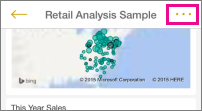

<properties 
   pageTitle="Share a dashboard from the iPhone app"
   description="Share a dashboard from the iPhone app (Power BI for iOS)"
   services="powerbi" 
   documentationCenter="" 
   authors="maggiesMSFT" 
   manager="mblythe" 
   editor=""
   tags=""
   qualityFocus="no"
   qualityDate=""/>
 
<tags
   ms.service="powerbi"
   ms.devlang="NA"
   ms.topic="article"
   ms.tgt_pltfrm="NA"
   ms.workload="powerbi"
   ms.date="02/01/2016"
   ms.author="maggies"/>
# Share a dashboard from the iPhone app (Power BI for iOS)

Invite colleagues to view your dashboards by sharing links from the iPhone app for Power BI. You can only share dashboards with colleagues in the same email domain as you.

## Share a dashboard

1.  In the upper-right corner of the dashboard, tap the ellipsis to open the dashboard menu.

    

3.  Tap **Invite**.

    

2.  Type names and a message to accompany your dashboard invitation.

3.  To allow resharing, leave **Allow recipients to share this dashboard** selected.

    >**Note**   Resharing allows your coworkers to forward the email invitation to others in your organization, either through the web or the mobile apps.

4.  Tap the green check mark in the upper-right corner to send the mail.

    Your colleagues get an email invitation with a direct link to the dashboard. The invitation expires after one month. When they open it, in a browser or in the iPhone or iPad app, it's added to their Power BI.

## Unshare a dashboard

You can only unshare a dashboard if you're the dashboard owner.

1.  In the upper-right corner of the dashboard, tap the ellipsis to open the dashboard menu.

    

3.  Tap **Invite**.

    

    You see the list of colleagues with whom you've shared this dashboard. Below their names are these words:

    -   **Pending**: They haven't viewed the dashboard yet.

    -   **Can View**: They can view the dashboard but not share it.

    -   **Can View & Invite**: They can view the dashboard and share it with other colleagues.

2.  Tap **Edit**.

3.  To unshare, tap the red circle next to a name and tap **Delete**.

## Notes about sharing dashboards

You and your colleagues see the same data in the dashboard. Thus, if you have permissions to see more data than they do, they'll be able to see all your data in your dashboard.

-   If your colleagues haven't signed up for Power BI yet, they need to do so to see your dashboard.

-   You can only share dashboards with colleagues in the same email domain as you. For example, if your email address is nancy@contoso.com, you can share with bill@contoso.com but not with joe@ca.contoso.com or sally@fabrikam.com.

-   Your colleagues can see your dashboard and even see the changes you make in the Power BI service online, after you save those changes.

-   You can [share snapshots of tiles](powerbi-mobile-annotate-and-share-a-tile-from-the-iphone-app.md) with anyone, in or out of your email domain.

-   You can share with users who have the same email domain as you, and with users whose domain is different but registered within the tenant. For example, say you have the domains contoso.com and contoso2.com registered in the tenant. If your email address is konrads@contoso.com, you can share with ravali@contoso.com, and also with gustav@contoso2.com.

### See also

[Annotate and share a tile from the iPhone app for Power BI](powerbi-mobile-annotate-and-share-a-tile-from-the-iphone-app.md)

[Get started with the iPhone app for Power BI](powerbi-mobile-ipad-app-get-started.md)

[Share a dashboard in Power BI](powerbi-service-share-unshare-dashboard.md)

