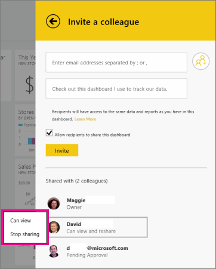

<properties pageTitle="Share dashboards from the Power BI for Windows app" description="Share dashboards from the Power BI for Windows app" services="powerbi" documentationCenter="" authors="v-anpasi" manager="mblythe" editor=""/>
<tags ms.service="powerbi" ms.devlang="NA" ms.topic="article" ms.tgt_pltfrm="NA" ms.workload="powerbi" ms.date="06/26/2015" ms.author="v-anpasi"/>
# Share dashboards from the Power BI for Windows app

[← Power BI app for Windows](https://support.powerbi.com/knowledgebase/topics/75729-power-bi-app-for-windows)

Invite colleagues by sharing links to dashboards and [snapshots of tiles](http://support.powerbi.com/knowledgebase/articles/535432-share-a-snapshot-of-a-tile-from-the-power-bi-for-w) from the Power BI app for Windows. The people you share it with need to [sign up for Power BI](http://powerbi.com/), too. 

1.  Tap the Share  icon in the upper-right corner of your dashboard, or swipe up or down to show the app bars \> tap **Invite a colleague**.
    
2.  In the **Invite a colleague** pane, type email names or tap  to search for contacts in your People app. Then type a message to accompany your dashboard invitation, if you want.
3.  To allow resharing, leave Allow recipients to share this dashboard selected.

    > Note   If you allow resharing, your colleagues can share the dashboard with other colleagues in your organization, either through [Power BI](http://powerbi.com/) or the mobile apps.

4.  Tap **Invite**.

Your colleagues get an email invitation with a direct link to the dashboard. When they open it, in a browser or one of the mobile apps, it's added to their Power BI. The invitation expires after one month. 

## Set dashboard permissions

If you're the owner of a dashboard and you share it with your colleagues, you can control their level of permissions to the dashboard. 

1.  Tap the **Share**  icon in the upper-right corner of your dashboard.  

    Under **Shared with**, you see the list of colleagues with whom you've shared this dashboard. Below their names are these words:

    -   **Pending Approval**: They haven't viewed the dashboard yet.

    -   **Can view**: They can view the dashboard but not share it.

    -   **Can view and reshare**: They can view the dashboard and share it with other colleagues.

2.  Tap a name.  
    If they haven't viewed it yet, tap **Cancel Invite**.  
    If they have viewed it, you can switch from **Can view** to **Can view and reshare**, and vice versa, or **Stop sharing** altogether.

    

## Notes about sharing dashboards

You and your colleagues see the same data in the dashboard. Thus, if you have permissions to see more data than they do, they'll be able to see all your data in your dashboard.

-   If your colleagues haven't [signed up for Power BI](http://powerbi.com/) yet, they need to do so to see your dashboard.

-   Your colleagues can see your dashboard and even see changes you make in the Power BI service online, after you save those changes.

-   You can share snapshots of tiles with anyone, in or out of your email domain.You can share with users who have the same email domain as you, and with users whose domain is different but registered within the tenant. For example, say you have the domains contoso.com and contoso2.com registered in the tenant. If your email address is konrads@contoso.com, you can share with ravali@contoso.com, and also with gustav@contoso2.com.

## See Also

More about the [Power BI for Windows app](http://support.powerbi.com/knowledgebase/articles/510917-get-started-with-the-power-bi-for-windows-app).