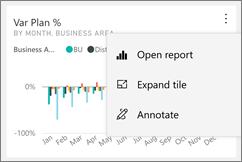
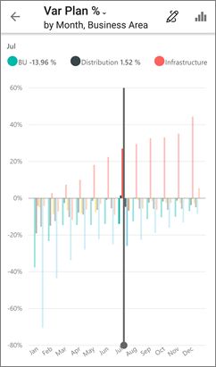

<properties 
   pageTitle="Tiles in the mobile apps"
   description="You create tiles on a dashboard in the Power BI service. Read about opening tiles and interacting with them in the Power BI mobile apps."
   services="powerbi" 
   documentationCenter="" 
   authors="maggiesMSFT" 
   manager="erikre" 
   backup=""
   editor=""
   tags=""
   qualityFocus="no"
   qualityDate=""/>
 
<tags
   ms.service="powerbi"
   ms.devlang="NA"
   ms.topic="article"
   ms.tgt_pltfrm="NA"
   ms.workload="powerbi"
   ms.date="03/03/2017"
   ms.author="maggies"/>

# Tiles in the mobile apps 

Applies to:

|  |  |  |  |  |
|:------------------------|:----------------------------|:----------------------------|:----------------------------------------|:-----------------|
| iPhones | iPads | Android phones | Android tablets | Windows 10 devices |

Tiles are live snapshots of your data, displayed on a dashboard. Their values change as the data changes. You create tiles on a dashboard on the [Power BI](http://powerbi.com/) service. Then you see and interact with the tiles in the [Microsoft Power BI apps for mobile devices](powerbi-power-bi-apps-for-mobile-devices/.md).

## Tiles in the Android app

1.  Open a [dashboard in the mobile app](powerbi-mobile-create-dashboard.md) for Power BI.

2. Tap the vertical ellipsis (**...**) on the tile.  

    

    From here, you can:

    Tap Annotate to [annotate and share the tile](powerbi-mobile-annotate-and-share-a-tile-from-the-android-app.md).

    Tap **Open report** to [view the report](powerbi-mobile-reports-in-the-android-app.md) in the mobile app.

    Tap **Expand tile** to open it in *focus mode*, where it's easier to view and explore the tile data. In this mode you can:

    -   Tap the chart to move the bar in a line, bar, column, or bubble chart, to view the values for a specific point in the visualization.  

    

     -    Tap the annotate icon  to [annotate and share the tile](powerbi-mobile-annotate-and-share-a-tile-from-the-android-app.md) with others.

         If the tile is a live report page tile, when you tap **Expand tile** it opens the report page in landscape mode in the Android app.

6. Sometimes the dashboard creator has added a link to a tile. If so, when you tap the vertical ellipsis (**...**) you see **Open link** :

    

    Links can go to other Power BI dashboards or to an external URL. You can [tap the link](powerbi-service-edit-a-tile-in-a-dashboard.md#hyperlink) to open it inside the Power BI app. If it's an external site, Power BI asks you to allow it.
    
    

    After you open the link in the Power BI app, you can copy the link and open it in a browser window instead.

5.   Tap the arrow in the upper-left corner to close the tile and return to the dashboard.

### See also  
[Download the Android app](http://go.microsoft.com/fwlink/?LinkID=544867) from Google play  
[Get started with the Android app for Power BI](powerbi-mobile-android-app-get-started.md)  
[Get started with Power BI](powerbi-service-get-started.md)  