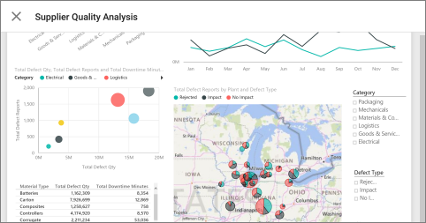

<properties 
   pageTitle="Tiles in the Android app"
   description="Tiles in the Android app for Power BI"
   services="powerbi" 
   documentationCenter="" 
   authors="maggiesMSFT" 
   manager="mblythe" 
   editor=""
   tags=""/>
 
<tags
   ms.service="powerbi"
   ms.devlang="NA"
   ms.topic="article"
   ms.tgt_pltfrm="NA"
   ms.workload="powerbi"
   ms.date="01/25/2016"
   ms.author="maggies"/>

# Tiles in the Android app for Power BI  

Tiles are live snapshots of your data, displayed on a dashboard. Their values change as the data changes. You create tiles on a dashboard on your [Power BI](http://powerbi.com/) site. Then you see and interact with the tiles in your [Android app for Microsoft Power BI](powerbi-mobile-android-app-get-started.md).

1.  Open a [dashboard in the Android app](powerbi-mobile-dashboards-in-the-android-app.md) for Power BI.

    Need to [download the Android app](http://go.microsoft.com/fwlink/?LinkID=544867) first?

2. Tap the vertical ellipsis on the tile. From here, you can: 

    

    [Annotate and share the tile](powerbi-mobile-annotate-and-share-a-tile-from-the-android-app.md).

    [Open the link](powerbi-service-edit-a-tile-in-a-dashboard.md#hyperlink) inside the Power BI app, if it has a link. Links can go to Power BI dashboards, or to an external URL. If it's an external site, Power BI asks you to allow it.
    
    

    After you open the link in the Power BI app, you can copy the link or open it in a browser window instead.

3.    Tap **Expand tile** to open it in focus mode.

    >**Note**: In the Power BI service, you can now [pin a whole report page to a dashboard](http://blogs.msdn.com/b/powerbi/archive/2015/12/10/power-bi-weekly-service-update-1210.aspx#reportpin) as a live tile. In the Power BI app when you expand a report page tile, it opens in landscape mode so you can see more of it at once.
    >
    >

3.   Tap the chart to move the bar in a line, bar, column, or bubble chart, to view the values for a specific point in the visualization.  
    

    In this line chart, the values of the green and black lines are listed under the month, April, where the vertical bar intersects them.

4.   Tap the share snapshot icon  to [annotate and share a tile](powerbi-mobile-annotate-and-share-a-tile-from-the-android-app.md) with others.

-   Tap the **X** in the upper-left corner to close the tile and return to the dashboard.

### See also  
[Download the Android app](http://go.microsoft.com/fwlink/?LinkID=544867) from Google play  
[Get started with the Android app for Power BI](powerbi-mobile-android-app-get-started.md)  
[Get started with Power BI](powerbi-service-get-started.md)  