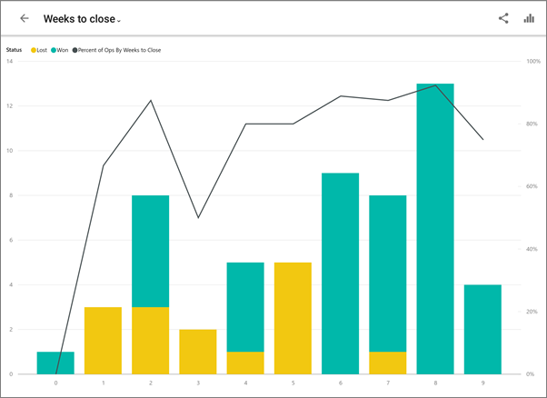
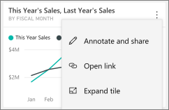

<properties 
   pageTitle="Tiles in the Android app"
   description="You create tiles on a dashboard in the Power BI service. Read about opening tiles and interacting with them in the Power BI mobile app for Android tablets."
   services="powerbi" 
   documentationCenter="" 
   authors="maggiesMSFT" 
   manager="erikre" 
   backup=""
   editor=""
   tags=""
   qualityFocus="no"
   qualityDate=""/>
 
<tags
   ms.service="powerbi"
   ms.devlang="NA"
   ms.topic="article"
   ms.tgt_pltfrm="NA"
   ms.workload="powerbi"
   ms.date="11/17/2016"
   ms.author="maggies"/>

# Tiles in the Power BI app for Android tablets

Tiles are live snapshots of your data, displayed on a dashboard. Their values change as the data changes. You create tiles on a dashboard on your [Power BI](http://powerbi.com/) site. Then you see and interact with the tiles in your [Android app for Microsoft Power BI](powerbi-mobile-android-tablet-app-get-started.md).

1.  Open a [dashboard in the Android app](powerbi-mobile-dashboards-in-the-android-tablet-app.md) for Power BI.

    Need to [download the Android app](http://go.microsoft.com/fwlink/?LinkID=544867) first?

2. Tap the vertical ellipsis (**...**) on the tile.  

    

    From here, you can:

3.   [Annotate and share the tile](powerbi-mobile-annotate-and-share-a-tile-from-the-android-tablet-app.md).

4.    Tap **Expand tile**. It opens in focus mode, where it's easier to view and explore the tile data.

    

     Tap the share snapshot icon  to [annotate and share the tile](powerbi-mobile-annotate-and-share-a-tile-from-the-android-tablet-app.md) with others.

     If the tile is a [live report page tile](powerbi-mobile-report-page-tiles-in-the-android-tablet-app.md), when you tap **Expand tile** it opens the report page in the Android app.

5. Tap **Open report** to [view the report](powerbi-mobile-reports-in-the-android-tablet-app.md) in the mobile app.

6. Sometimes the report creator has added a link to a tile. If so, when you tap the ellipsis you see **Open link**:

    

    Links can go to other Power BI dashboards or to an external URL. You can [tap the link](powerbi-service-edit-a-tile-in-a-dashboard.md#hyperlink) to open it inside the Power BI app. If it's an external site, Power BI asks you to allow it.
    
    

    After you open the link in the Power BI app, you can copy the link and open it in a browser window instead.

5.   Tap the **X** in the upper-left corner to close the tile and return to the dashboard.

## See also  
[Download the Android app](http://go.microsoft.com/fwlink/?LinkID=544867) from Google play  
[Get started with the Android app for Power BI](powerbi-mobile-android-tablet-app-get-started.md)  
[Get started with Power BI](powerbi-service-get-started.md)  