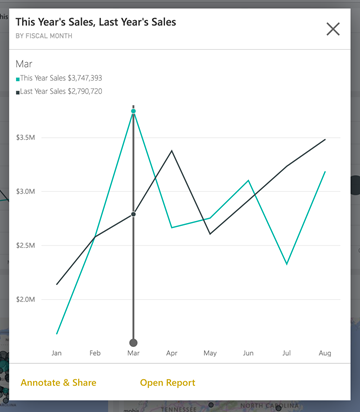
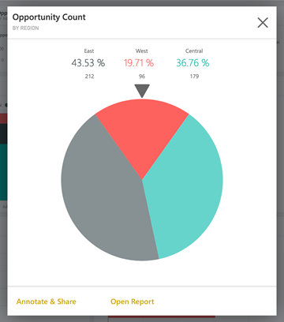

<properties 
   pageTitle="Interact with tiles in the Power BI mobile app on the iPad"
   description="You create tiles on a dashboard in the Power BI service. Read about opening tiles and interacting with them in the Power BI mobile app for iOS on the iPad."
   services="powerbi" 
   documentationCenter="" 
   authors="maggiesMSFT" 
   manager="mblythe" 
   backup=""
   editor=""
   tags=""
   qualityFocus="no"
   qualityDate=""/>
 
<tags
   ms.service="powerbi"
   ms.devlang="NA"
   ms.topic="article"
   ms.tgt_pltfrm="NA"
   ms.workload="powerbi"
   ms.date="06/24/2016"
   ms.author="maggies"/>

# Interact with tiles in the Power BI mobile app for iOS on the iPad

Tiles are live snapshots of your data, pinned to a dashboard. Their values change as the data changes. You [create tiles on a dashboard in the Power BI service](powerbi-service-dashboard-tiles.md).

Then in [the iPad app](http://go.microsoft.com/fwlink/?LinkId=522062), you open tiles in focus mode and interact with them. You can open tiles with all kinds of visuals, including tiles based on Bing and R.

1.  Open a [dashboard in the iPad app](powerbi-mobile-dashboards-on-the-ipad-app.md).

2.  Tap a tile. It opens in focus mode, where it's easier to view and explore the tile data. In this mode you can:

   -   In a line, bar, or column chart, drag the bar to view the values for specific parts of the visualization.  
      

        In this line chart, the values of the lines are listed for March, where the vertical bar intersects them.

  -   In a pie chart, tap a slice of the pie to show the value of the slice at the top of the pie.  
      

  -   [Share a snapshot of the tile](powerbi-mobile-share-dashboards-from-the-ipad-app.md) with others.

  -   [Open the report](powerbi-mobile-reports-on-the-ipad-app.md) that the tile is based on.

More about [the iPad app](powerbi-mobile-iphone-app-get-started.md) for Power BI.