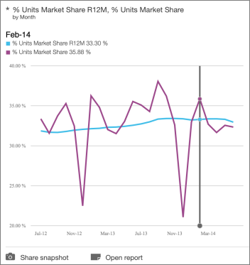
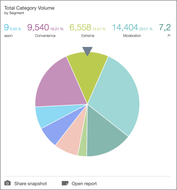

<properties pageTitle="Tiles in the iPad app (Power BI for iOS)" description="Tiles in the iPad app (Power BI for iOS)" services="powerbi" documentationCenter="" authors="v-anpasi" manager="mblythe" editor=""/>
<tags ms.service="powerbi" ms.devlang="NA" ms.topic="article" ms.tgt_pltfrm="NA" ms.workload="powerbi" ms.date="06/26/2015" ms.author="v-anpasi"/>
#Tiles in the iPad app (Power BI for iOS)
[← iPad app (Power BI for iOS)](https://support.powerbi.com/knowledgebase/topics/77999-ipad-app-power-bi-for-ios-preview)

Tiles are live snapshots of your data, pinned to a dashboard. Their values change as the data changes. You [create tiles on a dashboard in Power BI](http://support.powerbi.com/knowledgebase/articles/425669-tiles-in-power-bi).

Then you see and interact with the tiles in [the iPad app](http://go.microsoft.com/fwlink/?LinkId=522062) for Microsoft Power BI for iOS.

##Interact with tiles on a dashboard

1.  Open a [dashboard in the iPad app](http://support.powerbi.com/knowledgebase/articles/467176-dashboards-on-the-ipad-app-power-bi-for-ios-previ).
2.  Tap a tile. It opens in focus mode, where it's easier to view and explore the tile data. In this mode you can:

-   In a line, bar, or column chart, drag the bar to view the values for specific parts of the visualization.

    

    In this line chart, the values of the blue and purple lines are listed under the date, Feb-14, where the vertical bar intersects them.
-   In a pie chart, spin the pie to show the values of the slice at the top of the pie.

    
    
-   [Share a snapshot of the tile](http://support.powerbi.com/knowledgebase/articles/467181-share-dashboards-and-tiles-from-the-ipad-app-for-p) with others.
-   [Open the report](http://support.powerbi.com/knowledgebase/articles/467180-reports-on-the-ipad-app-for-power-bi) that the tile is based on.

More about [the iPad app](http://support.powerbi.com/knowledgebase/articles/467172-the-ipad-app-for-power-bi-preview) for Power BI.