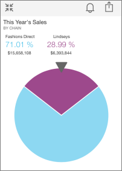

<properties 
   pageTitle="Tiles in the iPhone app (Power BI for iOS)"
   description="Tiles in the iPhone app (Power BI for iOS)"
   services="powerbi" 
   documentationCenter="" 
   authors="v-aljenk" 
   manager="mblythe" 
   editor=""
   tags=""/>
 
<tags
   ms.service="powerbi"
   ms.devlang="NA"
   ms.topic="article"
   ms.tgt_pltfrm="NA"
   ms.workload="powerbi"
   ms.date="10/14/2015"
   ms.author="v-aljenk"/>

# Tiles in the iPhone app (Power BI for iOS)

Tiles are live snapshots of your data, pinned to a dashboard. Their values change as the data changes. You create tiles on a dashboard in Power BI. Then you see and interact with the tiles in your iPhone app for Microsoft Power BI for iOS.

## Interact with tiles on a dashboard

1.  Open a [dashboard in the iPhone app](http://support.powerbi.com/knowledgebase/articles/527051-dashboards-in-the-iphone-app-power-bi-for-ios-pre).

2.  Tap a tile. It opens in focus mode, where it's easier to view and explore the tile data. In this mode you can:

-   In a line, bar, or column chart, drag the bar to view the values for specific parts of the visualization.

    

    In this line chart, the values of the blue and purple lines are listed under the month, April, where the vertical bar intersects them.

-   In a pie chart, spin the pie to show the values of the slice at the top of the pie.

    

-   Tap the share icon  to [annotate and share a tile](http://support.powerbi.com/knowledgebase/articles/527099-annotate-and-share-a-tile-from-the-iphone-app-pow) with others.

-   Tap the close icon  to close the tile and return to the dashboard.

### See Also

[Get started with the iPhone app for Power BI](http://support.powerbi.com/knowledgebase/articles/527036-get-started-with-the-iphone-app-power-bi-for-ios)

[Get started with Power BI](http://support.powerbi.com/knowledgebase/articles/430814-get-started-with-power-bi-preview)
