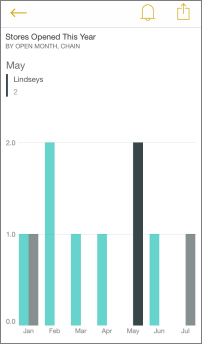

<properties 
   pageTitle="Interact with tiles in the iPhone app"
   description="Interact with tiles in the iPhone app (Power BI for iOS)"
   services="powerbi" 
   documentationCenter="" 
   authors="maggiesMSFT" 
   manager="mblythe" 
   editor=""
   tags=""
   qualityFocus="no"
   qualityDate=""/>
 
<tags
   ms.service="powerbi"
   ms.devlang="NA"
   ms.topic="article"
   ms.tgt_pltfrm="NA"
   ms.workload="powerbi"
   ms.date="03/31/2016"
   ms.author="maggies"/>

# Interact with tiles in the iPhone app (Power BI for iOS)

Tiles are live snapshots of your data, pinned to a dashboard. Their values change as the data changes. You [create tiles on a dashboard in the Power BI service](powerbi-service-dashboard-tiles.md). 

Then in [the iPhone app](http://go.microsoft.com/fwlink/?LinkId=522062), you open tiles in focus mode and interact with them. You can open tiles with all kinds of visuals, including tiles based on Bing and R.

>**Note**: You can also [create picture tiles with your iPhone app](powerbi-mobile-picture-tiles-in-the-iphone-app.md) and save them to your dashboards.

1.  Open a [dashboard in the iPhone app](powerbi-mobile-dashboards-in-the-iphone-app.md).

2.  Tap a tile. It opens in focus mode, where it's easier to view and explore the tile data. In this mode you can:

   -   In a line, bar, or column chart, tap to view the values for specific parts of the visualization.

        

        In this column chart, the value of the selected black bar is listed for Lindseys under the month, May.  

  -   In a pie chart, spin the pie to show the values of the slice at the top of the pie.

        

   -   Tap the share icon  to [annotate and share a tile](powerbi-mobile-annotate-and-share-a-tile-from-the-iphone-app.md) with others.

   -   [Interact with a report page tile](powerbi-mobile-report-page-tiles-in-the-iphone-app.md) in the iPhone app.

-   Tap the back arrow  to close the tile and return to the dashboard.

### See also

[Get started with the iPhone app for Power BI](powerbi-mobile-ipad-app-get-started.md)

[Get started with Power BI](powerbi-service-get-started.md)
