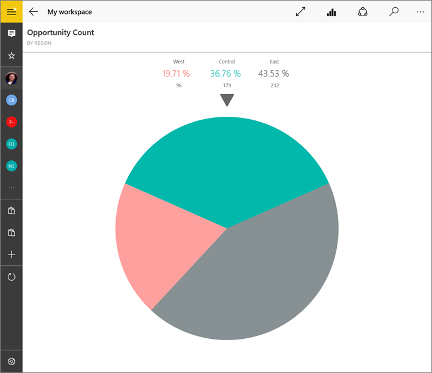

<properties 
   pageTitle="Tiles in the Power BI mobile app for Windows 10"
   description="You create tiles on a dashboard in the Power BI service. Read about opening tiles and interacting with them in the Power BI mobile app for Windows 10."
   services="powerbi" 
   documentationCenter="" 
   authors="maggiesMSFT" 
   manager="erikre" 
   backup=""
   editor=""
   tags=""
   qualityFocus="no"
   qualityDate=""/>
 
<tags
   ms.service="powerbi"
   ms.devlang="NA"
   ms.topic="article"
   ms.tgt_pltfrm="NA"
   ms.workload="powerbi"
   ms.date="04/04/2017"
   ms.author="maggies"/>

# Tiles in the Power BI mobile app for Windows 10  

Tiles are live snapshots of your data, displayed on a dashboard. Their values change as the data changes. You [create tiles on a dashboard in the Power BI service](powerbi-service-dashboard-tiles.md). 

Then in [Power BI mobile app for Windows 10](powerbi-mobile-win10phone-app-get-started.md), you open tiles in focus mode and interact with them. You can open tiles with all kinds of visuals, including tiles based on Bing and R.

1.  Open a [dashboard in the Power BI mobile app](powerbi-mobile-create-dashboard.md) for Windows 10.

2. Tap the vertical ellipsis on the tile. From here, you can: 

    

    [Share a snapshot of the tile](powerbi-mobile-share-a-tile-from-the-win10phone-app.md).

    Tap **Open Report**  to [view the underlying report](powerbi-mobile-reports-in-the-windows-app.md).

    [Open the link](powerbi-service-edit-a-tile-in-a-dashboard.md#hyperlink), if it has a link. Links can go to Power BI dashboards or to an external URL.

3.    Tap **Expand Tile** . It opens in focus mode, where it's easier to view and explore the tile data. In this mode you can:

    Spin a pie chart to show the values of the slice at the top of the pie.  

    

     Tap the chart to move the bar in a line, bar, column, or bubble chart, to view the values for a specific point in the visualization.  

     In this bar chart, the values for the **Decor** bar are shown at the top of the chart.
   
     

    Tap the **Full screen** icon  to open the tile in full-screen mode, without the navigation and menu bars.

    >**Note**: You can also [view dashboards and reports in full-screen mode](powerbi-mobile-win10-app-presentation-mode.md) in the Power BI mobile app for Windows 10.

    In a map, tap the **Center Map** icon  to center the map to your current location.

    

     Tap the Share Snapshot icon  to [share a tile](powerbi-mobile-share-a-tile-from-the-win10phone-app.md) with others.   

    Tap the Open Report icon  to [view the report](powerbi-mobile-reports-in-the-windows-app.md) that the tile is based on. 

4.   Tap the back arrow or the back button to close the tile and return to the dashboard.

## See also  
[Download the Power BI mobile app for Windows 10](http://go.microsoft.com/fwlink/?LinkID=526478) from the Windows Store  
[Get started with the Power BI mobile app](powerbi-mobile-win10phone-app-get-started.md) for Windows 10  
[Get started with Power BI](powerbi-service-get-started.md)  
- Questions? [Try asking the Power BI Community](http://community.powerbi.com/)

