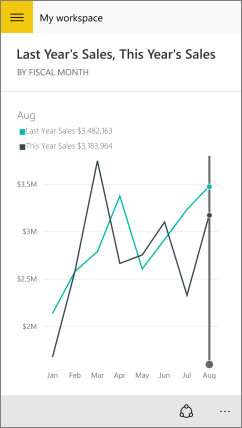

<properties 
   pageTitle="Tiles in the Windows 10 phone app"
   description="Tiles in the Windows 10 phone app for Power BI"
   services="powerbi" 
   documentationCenter="" 
   authors="maggiesMSFT" 
   manager="mblythe" 
   editor=""
   tags=""/>
 
<tags
   ms.service="powerbi"
   ms.devlang="NA"
   ms.topic="article"
   ms.tgt_pltfrm="NA"
   ms.workload="powerbi"
   ms.date="12/09/2015"
   ms.author="maggies"/>

# Tiles in the Windows 10 phone app for Power BI  

Tiles are live snapshots of your data, displayed on a dashboard. Their values change as the data changes. You create tiles on your dashboards in the [Power BI](http://powerbi.com/) service. Then you see and interact with the tiles in your [Windows 10 phone app for Microsoft Power BI](powerbi-mobile-win10phone-app-get-started.md).

1.  Open a [dashboard in the Windows 10 phone app](powerbi-mobile-dashboards-in-the-win10phone-app.md) for Power BI.

    Need to [download the Windows 10 phone app](http://go.microsoft.com/fwlink/?LinkID=544867) first?

2.  Tap a tile. It opens in focus mode, where it's easier to view and explore the tile data. In this mode you can:

  -   Tap the chart to move the bar in a line, bar, column, or bubble chart, to view the values for a specific point in the visualization. 
   
     

       In this line chart, the values of the blue and purple lines are listed under the month, August, where the vertical bar intersects them.

  -   Spin a pie chart to show the values of the slice at the top of the pie.  

 -   Tap the share snapshot icon  to [share a tile](powerbi-mobile-share-a-tile-from-the-win10phone-app.md) with others.   

3.   Tap the back button in the upper-left corner to close the tile and return to the dashboard.

### See also  
[Download the Windows 10 phone app](http://go.microsoft.com/fwlink/?LinkID=544867) from the Windows Store  
[Get started with the Windows 10 phone app for Power BI](powerbi-mobile-win10phone-app-get-started.md)  
[Get started with Power BI](powerbi-service-get-started.md)  