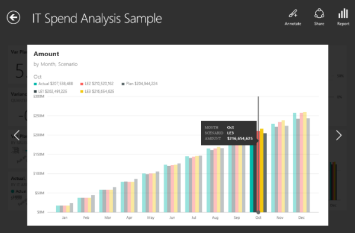
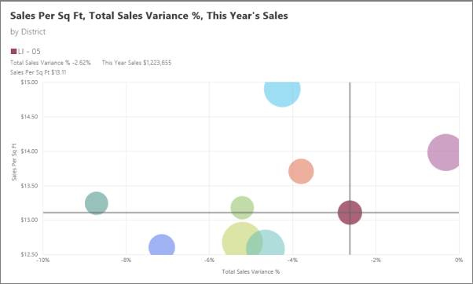
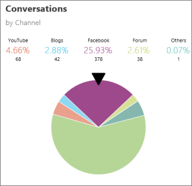
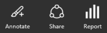
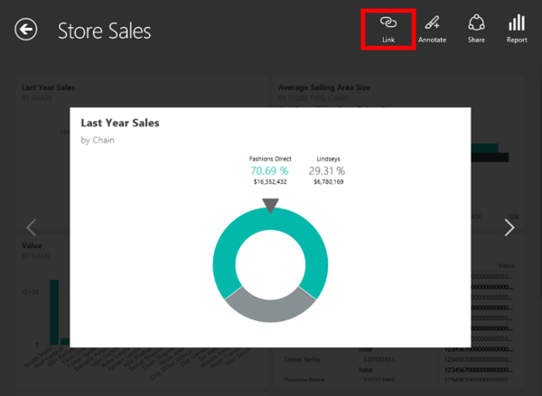

<properties 
   pageTitle="Tiles in the Power BI for Windows app"
   description="Tiles in the Power BI for Windows app"
   services="powerbi" 
   documentationCenter="" 
   authors="maggiesMSFT" 
   manager="mblythe" 
   backup=""
   editor=""
   tags=""
   qualityFocus="no"
   qualityDate=""/>
 
<tags
   ms.service="powerbi"
   ms.devlang="NA"
   ms.topic="article"
   ms.tgt_pltfrm="NA"
   ms.workload="powerbi"
   ms.date="02/18/2016"
   ms.author="maggies"/>

# Tiles in the Power BI for Windows app  

Tiles are live snapshots of your data, pinned to a dashboard. Their values change as the data changes. You [create tiles on a dashboard in Power BI](powerbi-service-dashboard-tiles.md).

Then you see and interact with the tiles in the Microsoft [Power BI for Windows app](powerbi-service-windows-app-get-started.md). 

## Interact with tiles on a dashboard

1.  Open a [dashboard](powerbi-mobile-dashboards-in-the-windows-app.md) in the Windows app.

2.  Tap a tile. It opens in focus mode, where it's easier to view and explore the tile data.  
  
    

In this mode you can:

-   In a line, bar, column, scatter, or bubble chart, drag the bar to view the values for specific parts of the visualization.   
    

    In this bubble chart, the horizontal and vertical bars intersect the maroon dot, whose values are listed in the upper-left corner.

-   In a pie chart, tap a slice to see its values, or spin the pie to show the values of the slice at the top of the pie.  
    

-   Annotate the tile...   
    

    ... and then share a [snapshot of the tile](powerbi-mobile-annotate-and-share-a-snapshot-from-the-windows-app.md) with others.

-   [Open the report](powerbi-mobile-reports-in-the-windows-app.md) that the tile is based on.

-   If you've added a link to a tile, you can navigate directly from that tile in your Windows app to a specific URL or to another dashboard. You [add links to tiles](powerbi-service-edit-a-tile-in-a-dashboard.md#hyperlink) while in the Power BI service. Then you can follow them while viewing the tiles in the Windows app.

    

### See also
[Power BI for Windows app](powerbi-service-windows-app-get-started.md)