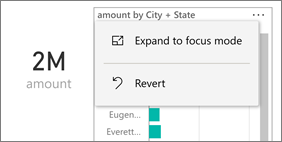
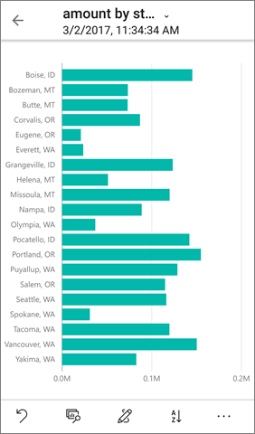

<properties 
   pageTitle="View and engage with reports optimized for your phone"
   description="Read about interacting with report pages optimized for viewing in the Power BI phone apps."
   services="powerbi" 
   documentationCenter="" 
   authors="maggiesMSFT" 
   manager="erikre" 
   backup=""
   editor=""
   tags=""
   qualityFocus="no"
   qualityDate=""/>
 
<tags
   ms.service="powerbi"
   ms.devlang="NA"
   ms.topic="article"
   ms.tgt_pltfrm="NA"
   ms.workload="powerbi"
   ms.date="03/02/2017"
   ms.author="maggies"/>

# View and engage with reports optimized for your phone 

When you create a Power BI report in Power BI Desktop, you can also create a version of that [report optimized for viewing in the Power BI app on a phone](powerbi-desktop-create-phone-report.md).

Then, when you open a Power BI report on a phone, Power BI automatically detects if the report has been optimized for phones. If a phone-optimized report exists, the Power BI phone app automatically opens the optimized report.

If a phone-optimized report doesn’t exist, you can still open the report in the non-optimized landscape view by changing the phone’s orientation.  

Even in a phone-optimized report, if you change your phone to landscape, the report will open in the non-optimized view with the original report layout.

If only some pages are optimized, you see a message in portrait view, indicating the report is available in landscape.

all the other features of Power BI reports still work in phone-optimized reports. Read more about what you can do in:

*   [Reports on iPhones](powerbi-mobile-reports-in-the-iphone-app.md). 
*   [Reports on Android phones](powerbi-mobile-reports-in-the-android-app.md).

## View other pages in the report

- View other pages in the report by swiping from the side or tapping the pages icon .

## Cross-highlight visuals
Cross highlighting visuals in phone reports works the same as it does in the Power BI service and in reports on phones in landscape view: When you select data in one visual, it highlights related data in the other visuals on that page.

Read more about [filtering and highlighting in Power BI](powerbi-service-about-filters-and-highlighting-in-reports.md).

## Select visuals
In phone reports when you select a visual, the phone report highlights that visual and focuses on it, neutralizing canvas gestures.

With the visual selected, you can do things like scroll within the visual. To de-select a visual, just touch anywhere outside the visual area.

## Open visuals in focus mode
Phone reports offer a focus mode, so you can focus on a single visual to get a bigger view of the visual and explore the visual and the report.

- In a phone report, tap the ellipsis (**...**) in the upper-right corner of a visual  > **Expand to focus mode**.

    

What you do in focus mode carries over to the report canvas and vice versa, for a seamless exploration experience. For example, if you highlight a value in a visual, then return to the whole report, the report as a whole will be filtered to the value you highlighted in the visual.

Some actions are only possible in focus mode, due to screen size constraints:

- **Drill down** into the information displayed in a visual. Read more about [drilling down and up](powerbi-mobile-view-phone-report.md#drill-down-in-a-visual) in a phone report, below.
- **Sort** the values in the visual.
- **Revert**: Clear exploration steps you've taken on a visual and revert to the definition set when the report was created.

    To clear all exploration from a visual, tap the ellipsis (**...**) > **Revert**.

    

    Revert is available at the report level, clear all exploration from all visuals, or at the visual level, clearing all exploration from the specific visual selected.   

## Drill down in a visual

If hierarchy levels are defined in a visual, you can drill down into the detailed information displayed in a visual, then back up. You add drill-down to a visual either in the Power BI service or in Power BI Desktop. Read more about [adding drill-down](powerbi-service-drill-down-in-a-visualization.md).

1. In a report on a phone, tap the ellipsis (**...**) in the upper-right corner > **Expand to focus mode**.

    

    In this example, the bars show the values for states.

2. Tap the explore icon  in the lower-left.

    

3. Tap **Show next level** or **Expand to next level**.

    

    Now the bars show the values for cities.

    

4. If you tap the arrow in the upper-left corner, you return to the phone report with the values still expanded to the lower level.

    

5. To go back up to the original level, tap the ellipsis (**...**) again > **Revert**.

    

## See also
- [Create reports optimized for the Power BI phone apps](powerbi-desktop-create-phone-report.md)
- [Create a phone view of a dashboard in Power BI](powerbi-service-create-dashboard-phone-view.md)
- More questions? [Try asking the Power BI Community](http://community.powerbi.com/)
