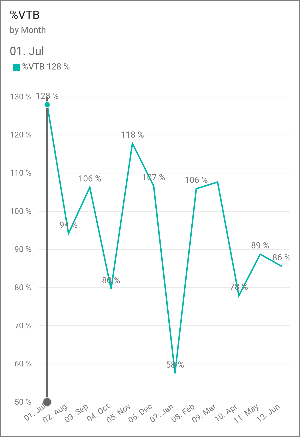

<properties 
   pageTitle="What's new in the mobile apps for Power BI"
   description="What's new in the mobile apps for Power BI"
   services="powerbi" 
   documentationCenter="" 
   authors="maggiesMSFT" 
   manager="erikre" 
   backup=""
   editor=""
   tags=""
   qualityFocus="no"
   qualityDate=""/>
 
<tags
   ms.service="powerbi"
   ms.devlang="NA"
   ms.topic="get-started-article"
   ms.tgt_pltfrm="NA"
   ms.workload="powerbi"
   ms.date="12/09/2016"
   ms.author="maggies"/>

# What's new in the mobile apps for Power BI  

## September/October 2016

### All devices

**Favorites as landing page**
If you’ve marked any of your dashboards as favorites, then your landing page will be your Favorites entry. 

**Improved navigation**
The main navigation has a new look, and groups navigation has moved to the groups catalog. 
 
**Report and dashboard performance improvements**
Improved the experience of loading reports and dashboards in the Power BI mobile apps
 
**Enhanced alert notifications**
Notifications for your data-driven alerts now contain more information on what triggered the alert and why.

### iOS on iPhones

**Apple Watch refresh improvements**
The Apple Watch mobile app has been improved for Watch OS3

### Android phones

**Added manual tile refresh**
You can now manually refresh your dashboard tiles. For tiles based on DirectQuery, this will retrieve the latest data from the dataset.
 

### Windows 10 phones

**Geographic filtering**
On your Windows 10 phone you can now filter your report based on your current location, and see only the data you need.

**SandDance visualization on Surface Hub**

## August 2016

### All phones

**Favorites** 
View your favorite dashboards from all Power BI mobile apps, and manage the list of favorites from the Power BI mobile apps for iOS and Windows 10 devices. Read more about [favorites in the Power BI mobile apps](powerbi-mobile-favorites.md).

**Dashboard data classification** See the data classifications that dashboard owners have assigned their dashboards. Read more about [classifying dashboards](powerbi-service-data-classification.md).

**Data-driven alerts**
Get notified by an alert when your data changes in pre-set ways for KPI, gauge, and card tiles. Learn more about:

* [Alerts on the Power BI app for Android phones](powerbi-mobile-set-data-alerts-in-the-android-app.md). 
* [Alerts on the Power BI apps for iOS](powerbi-mobile-set-data-alerts-in-the-iphone-app.md). 
* [Alerts on the Power BI app for Windows 10 devices](powerbi-mobile-set-data-alerts-in-the-windows-10-mobile-app.md).

### iOS on iPhones and iPads
  
**Tiles full-screen in focus mode on iPad**
When you tap a tile on your iPad, the tile will now open full-screen in focus mode, taking advantage of the entire iPad screen size.

**Manually refresh tiles**
Manually refresh your tiles by opening the dashboard in the Power BI mobile app for iOS and pulling down from the top of the screen. 

**Support for Intune MAM**
Added support for Microsoft Intune mobile application management (MAM) capabilities.

Read more about [Microsoft Intune on Power BI mobile apps](powerbi-admin-mobile-intune.md).

### Windows 10 devices

**Full-screen and presentation modes**
Display reports in presentation mode on Surface Hub, and display dashboards, reports, and tiles in full-screen mode on Windows 10 devices.

## July 2016

### All phones

In the Power BI service you can now [create a view of a dashboard specifically for phones](powerbi-service-create-dashboard-phone-view.md) in portrait mode. 

### Android phones
 
**Favorites tab**
Access all your favorite dashboards from a single location.
 
**Improved security management**
Select a risk classification for the business data presented in a specific dashboard.
 
**Improved warning and banners**
We’ve improved warnings and banners for the mobile app.
 
**QR codes for report pages**
A QR code generated in the service will link to a specific page rather than the entire report.
 
**Improved alerts**
Data-driven alerts are now formatted based on your device’s locale.
 
### iOS on iPhones and iPads
  
**Improved security management**
Select a risk classification for the business data presented in a specific dashboard.
 
**Mobile insights**
View summary data (max, min, and all) on clustered column chart tiles.
 
**Improved manual refresh**
You can now manually refresh your dashboard tiles. For tiles based on Direct Query, this retrieves the latest data from the data model.
 
**Improved warning and banners**
We’ve improved warnings and banners for the mobile app.

**QR codes for report pages**
A QR code generated in the service will link to a specific page rather than the entire report.

**General improvements**
We’ve improved error messages for tiles in the mobile app.

### Windows 10 devices
 
**Improved security management**
Select a risk classification for the business data presented in a specific dashboard.

**Improved warning and banners**
We’ve improved warnings and banners for the mobile app.

## June 2016

See the [June Power BI mobile apps blog post](https://powerbi.microsoft.com/blog/power-bi-mobile-apps-update-june-2016/) for more details.

### QR codes now display in augmented reality (iOS)
Now when you scan a QR code generated by the Power BI service, the tile renders in augmented reality. 

More about [connecting to data in the real world](powerbi-mobile-data-in-real-world-context.md).

### Filter data with barcodes (iPhone)
Now you can scan barcodes printed on products or shelves at your store to display related Power BI reports filtered by the scanned value. 

More about [filtering your data with barcodes](powerbi-mobile-scan-barcode-for-report.md).

### SQL Server 2016 Reporting Services mobile reports
Now you can drill through from a Reporting Services KPI or a mobile report to another mobile report or to any custom URL.

### Notification center
The notification center in your Power BI mobile app shows new data or dashboards that are shared with you, or changes to groups you belong to.

## May 2016

### iOS devices and Android phones

-  **QR codes** are now available **for reports**, too. Scan the code with your Power BI app to go directly to a related report, with no navigation or search needed.
-  **Improved data management** for SQL Server 2016 Reporting Services: Reduced load times and data consumption on your device.
-  **SQL Server 2016 themed mobile reports**: See themes for mobile reports on your device.
-  **Geofiltering**: Filter reports by your current location.

## April 2016

See the [April Power BI Mobile Apps blog](https://powerbi.microsoft.com/blog/power-bi-mobile-apps-update-april-2016/) for more details.

### All apps

-   Select more than one option in a report slicer.

### Android mobile app

-   **SQL Server 2016 [Reporting Services mobile reports](powerbi-mobile-android-kpis-mobile-reports.md)** now on Android phones.
-   **Report gallery** Open your reports directly in the report gallery.​
-   **NTLM authentication** support for mobile reports in SQL Server 2016 Reporting Services.

### Power BI app for Windows 10 devices

-   **Presentation mode** Display Power BI dashboards and reports in presentation mode from the Power BI app.
-   **SQL Server 2016 [Reporting Services mobile reports](powerbi-mobile-win10-kpis-mobile-reports.md)** now on Windows 10 devices.
-   See **data tooltips** when you hover your mouse over a dashboard tile.

## March 2016

Read the [Power BI Mobile Apps blog for March 2016](https://powerbi.microsoft.com/blog/power-bi-mobile-apps-update-march-2016/).

### iPhone mobile app

**Apple Watch** View your Power BI tiles and KPIs on your [Apple Watch](powerbi-mobile-apple-watch.md).

**iOS 9.0 and later** To accommodate the best possible experience and new features for Power BI, we are now supporting only devices running iOS 9.0 and later.​

**Global search** Added a new “recently viewed” list and global search so you can find the data you need quickly.

**Report gallery** Open your reports directly in the report gallery.​

**Fresh data offline** New background refresh automatically updates your cached data when you’re online, so you have the freshest data [even when you're offline](powerbi-mobile-offline-android.md). 

**Bing and R tiles** Open Bing and R tiles in focus mode.​

### Android mobile app

**SQL Server 2016 mobile reports and KPIs** [View SQL Server 2016 mobile reports and KPIs](powerbi-mobile-android-kpis-mobile-reports.md), and navigate between SSRS folders.​

**View reports** Open reports from tiles on your dashboards.​

**Fresh data offline** New background refresh automatically updates your cached data when you’re online, so you have the freshest data [even when you're offline](powerbi-mobile-offline-android.md). 

### Power BI app for Windows 10 devices

**Quick access** Access your dashboards, reports, and groups quickly with a new “recently viewed” list and global search so you can find the data you need.

**Bing and R tiles** Open Bing and R tiles in focus mode.​

**More live tiles on your Start screen** [Pin KPIs and row cards to your Start screen](powerbi-mobile-pin-dashboard-from-win10phone-app.md) as live tiles, so you can see all of your critical metrics at a glance.

**Pinch to zoom** Use pinch-to-zoom on your tablet to examine dashboards in greater detail.

**Notifications** Get notified when your datasets, reports, and dashboards update with new data.

**Report gallery** Open your reports directly in the report gallery.​

## February 2016

### Android
View dashboards in [landscape mode on Android phones](powerbi-mobile-dashboards-in-the-android-app.md#view-dashboards-horizontally). 

### Power BI app for Windows 10 devices
View dashboards in [landscape mode in Windows 10 phones](powerbi-mobile-dashboards-in-the-win10phone-app.md#view-dashboards-horizontally).

View [reports on your Windows 10 phone](powerbi-mobile-reports-in-the-windows-app.md).

Faster time to [insights on your Windows 10 mobile dashboards](powerbi-mobile-tiles-in-the-win10phone-app.md): Share a tile snapshot or open a report directly from the dashboard.

## January 2016
All of the January improvements are already in the new [Power BI app for Windows 10 phones](powerbi-mobile-win10phone-app-get-started.md), released in December 2015. Now they're rolling out to the other Power BI apps for mobile devices. Read the blog post about these improvements.

**Real-time data support** Dashboards refresh in real time, so you don't need to refresh them manually.

**Offline indicators** When you don't have signal, you see an offline indicator at the top of your dashboard.

**Access cached data** Cached data no longer expires, so you have access to your cached data indefinitely while offline.

**R tiles and web widgets** View these new tile types in dashboards on your mobile device.

**Bing dashboards** In the Power BI service, you can now create [dashboards with Bing search results](powerbi-content-pack-bing.md), and view them on your mobile device.

**Report pages pinned as tiles to dashboards** Now that you can pin a whole report page to a dashboard in the Power BI service, you can view report pages in the:

-  [Power BI app on your iPhone](powerbi-mobile-report-page-tiles-in-the-iphone-app.md).
-  [Power BI app on your Android phone](powerbi-mobile-report-page-tiles-in-the-android-app.md).

## December 2015
The Power BI team ended 2015 strong, with several major additions and updates.

### SQL Server 2016 Reporting Services mobile reports in iOS
Now you can view your SQL Server mobile reports in the Power BI app on your iOS device, be it iPad or iPhone. Read more:

-   [SQL 16 SSRS on Power BI app for iOS](http://blogs.msdn.com/b/powerbi/archive/2015/12/30/sql-16-ssrs-on-power-bi-app-for-ios.aspx) blog post
-   View [SQL Server mobile reports and KPIs in the iPad app](powerbi-mobile-ipad-kpis-mobile-reports.md) documentation
-   View [SQL Server mobile reports and KPIs in the iPhone app](powerbi-mobile-iphone-kpis-mobile-reports.md) documentation

### Power BI app for Windows 10 phones
The new Power BI app for Windows 10 phones is optimized for touch and mobile productivity. Explore dashboards and reports, invite colleagues to view data, and share insights over email to engage your team. Plus you can [pin Power BI dashboards to your Windows phone Start screen](powerbi-mobile-pin-dashboard-from-win10phone-app.md).

-   Read the [Power BI app for Windows 10 phones blog post](http://blogs.msdn.com/b/powerbi/archive/2015/12/30/announcing-the-power-bi-app-for-windows-10-mobile.aspx).
-   [Get started with the Power BI app for Windows 10 phones](powerbi-mobile-win10phone-app-get-started.md).

### Other additions
Read the [Power BI mobile apps December blog post](http://blogs.msdn.com/b/powerbi/archive/2015/12/30/power-bi-mobile-apps-update-_2d00_-december-2015.aspx) for more details.

-   Receive notifications when a colleague shares a dashboard with you. (iOS)
-   View entire [pinned report pages in your dashboards](powerbi-mobile-report-page-tiles-in-the-iphone-app.md). (iOS and Android)
-   [Scan a QR code](http://blogs.msdn.com/b/powerbi/archive/2015/12/08/bridge-the-gap-between-your-physical-world-and-your-bi-using-qr-codes.aspx) and go directly to a relevant tile on your Android phone.

## November 2015

Read the [November 2015 Power BI mobile blog post](http://blogs.msdn.com/b/powerbi/archive/2015/11/24/power-bi-mobile-apps-update-_2d00_-november-2015.aspx).

### All Power BI mobile apps

- A new welcome experience.
- Improved chart data capacity.

### iOS and Android mobile apps

-  Enterprises can now [configure Power BI mobile apps for iOS and Android with Microsoft Intune](powerbi-admin-mobile-intune.md) to manage devices and applications.

### iPhone mobile app

- [Add a picture tile to a dashboard](powerbi-mobile-picture-tiles-in-the-iphone-app.md) directly from your iPhone.
- [Create QR codes in the Power BI service](powerbi-service-qr-code-for-tile.md), then scan them from your iPhone to open the Power BI app to a specific tile.

### The Power BI app for Windows devices

- [Link directly from a tile to a specific URL](powerbi-service-edit-a-tile-in-a-dashboard.md#hyperlink).

## October 2015

Read the [mid-October Power BI mobile blog post](http://blogs.msdn.com/b/powerbi/archive/2015/10/21/power-bi-mobile-mid-october-updates-are-here.aspx).

### All Power BI mobile apps 

- Line charts with a percentage-based Y-axis now calculate the visual range according to your actual data. The graph now starts from the lowest data point in the chart, instead of from a default value.

- Line, column, and bar charts can now have data labels. 

    

### iPhone
- Stay up to date with your groups' newest dashboards -- receive notifications on your iPhone each time a team member adds a dashboard to one of your groups.

    

- You can now view dashboards horizontally, just by turning your phone. Read more about [landscape mode in the iPhone app](http://blogs.msdn.com/b/powerbi/archive/2015/11/02/enjoy-the-landscape-with-the-power-bi-iphone-app.aspx).

    

## September 2015  
Improvements in the Power BI mobile apps -- Android, iOS (iPhone and iPad), and Windows. Read the [mid-September Power BI mobile blog post](http://blogs.msdn.com/b/powerbi/archive/2015/09/23/power-bi-mobile-mid-september-updates-are-here.aspx).

### Android  
-   Support for group workspaces: Collaborate with colleagues in group workspaces. 

-   Support for non-authenticated users:  For the few scenarios when users fail or can’t sign in to the app, we added a fast, convenient way to contact support and send feedback.

-   Improved user experience when accessing dashboards using role-based security.          

-   Improved data formatting of charts and alignment of all dashboard tiles. 

### iOS (iPhone and iPad)  
-   New & improved navigation: New drawer navigation maximizes screen real estate and improves navigation throughout the app. 

-   Group workspaces: Collaborate with colleagues in group workspaces. 

-   Authentication process upgrade Quality, performance, and functionality improvements enhance the app authentication process, including support for SSO (Single Sign-On). 

-   Improved data representation of line chart tiles to better compress the x-axis.

-   Improved user experience when using with role-based security.

-   Touch-optimized improvements for matrix chart tiles: Now you can easily scroll through your matrix data and view all its data easily and intuitively.

-   Improved data formatting of charts and alignments of dashboard tiles. 

-   Removal of iOS 7 support: To maintain highest security standards for Power BI, we will no longer support iOS 7 installed devices. iOS 8 and above is required. 

-   Send feedback and rating added in app: Added in-app capability to send feedback and provide ratings so that we can increase the community’s influence on our roadmap and promote issues easily and directly from the app.

### Windows   
-   Improved map tile rendering in in-focus mode to maximize screen real estate.

-   Improved user experience when accessing dashboards using role-based security. 

-   A new capability allows you to browse back and forth through dashboard tiles exploring them directly in in-focus mode without the need to return to the dashboard to select the next tile.

-   Additional stability and performance improvements. 