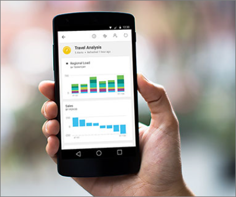

<properties
   pageTitle="Power BI apps for mobile devices"
   description="The Power BI mobile apps keep you connected to your data anywhere, anytime. View Power BI dashboards and reports on your mobile device. "
   services="powerbi"
   documentationCenter=""
   authors="maggiesMSFT"
   manager="mblythe"
   backup=""
   editor=""
   tags=""
   qualityFocus="no"
   qualityDate=""/>

<tags
   ms.service="powerbi"
   ms.devlang="NA"
   ms.topic="get-started-article"
   ms.tgt_pltfrm="NA"
   ms.workload="powerbi"
   ms.date="01/04/2017"
   ms.author="maggies"/>

# Power BI apps for mobile devices  

You've created Power BI reports in Power BI Desktop, and Power BI dashboards in the Power BI service. Now it's time to connect to your data anywhere and anytime with the Power BI mobile apps. Try viewing and interacting with your Power BI dashboards and reports on your mobile device &#151; be it iOS (iPad, iPhone, iPod Touch, or Apple Watch), Android phone or tablet, or Windows 10 device.

## See what's new in the Power BI mobile apps

- Read the [Microsoft Power BI blog](https://powerbi.microsoft.com/blog/tag/mobile/) for new features in the mobile apps.
- See the list of [what's new in the Power BI mobile apps](powerbi-mobile-whats-new-in-the-mobile-apps.md).

## The Power BI apps

| **Device** | **Highlights** |
|---|---|
|| The **Power BI service** is the online software service where users spend most of their time. Here you'll find [dashboards](powerbi-service-dashboards.md), [content packs](powerbi-content-packs-services.md), and all sorts of [visualizations](powerbi-service-visualizations-for-reports.md). If you're new to the Power BI service, start with its [Getting Started](powerbi-service-get-started.md) topic. |
|| With **Power BI Desktop**, you get a powerful [report-creating](powerbi-desktop-report-view.md) Windows desktop app that jump-starts your analytics. You can [import Excel workbooks](powerbi-desktop-import-excel-workbooks.md), upload reports to the service, and much more. Begin with the [Getting Started Guide](powerbi-desktop-getting-started.md).|

## The iPhone and iPod Touch app (Power BI for iOS)
- [Get started with the iPhone app](powerbi-mobile-iphone-app-get-started.md) (Power BI for iOS).
- Download the [iPhone app](http://go.microsoft.com/fwlink/?LinkId=522062) (Power BI for iOS).
- View your [Power BI dashboards](powerbi-mobile-dashboards-in-the-iphone-app.md).
- View Power BI on your [Apple Watch](powerbi-mobile-apple-watch.md).
- [View Reporting Services mobile reports and KPIs](powerbi-mobile-iphone-kpis-mobile-reports.md) on your iPhone.

## The iPad app (Power BI for iOS)
- [Get started with the iPad app](powerbi-mobile-ipad-app-get-started.md) (Power BI for iOS).
-   Download the [iPad app](http://go.microsoft.com/fwlink/?LinkId=522062) (Power BI for iOS).
-   View your [Power BI dashboards](powerbi-mobile-dashboards-on-the-ipad-app.md).
- [View Reporting Services mobile reports and KPIs](powerbi-mobile-ipad-kpis-mobile-reports.md) on your iPad.

## The Power BI app for Android phones
- [Get started with the Power BI app for Android phones](powerbi-mobile-android-app-get-started.md).
-   Download the [Power BI app for Android phones](http://go.microsoft.com/fwlink/?LinkID=544867).
-  View your [Power BI dashboards](powerbi-mobile-dashboards-in-the-android-app.md).
- [View Reporting Services mobile reports and KPIs](powerbi-mobile-android-kpis-mobile-reports.md) on your Android phone.

## The Power BI app for Android tablets
- [Get started with the Power BI app for Android tablets](powerbi-mobile-android-tablet-app-get-started.md).
-   Download the [Power BI app for Android tablets](http://go.microsoft.com/fwlink/?LinkID=544867).
-  View your [Power BI dashboards](powerbi-mobile-dashboards-in-the-android-tablet-app.md).
- [View Reporting Services mobile reports and KPIs](powerbi-mobile-android-tablet-kpis-mobile-reports.md) on your Android tablet.

## The Power BI mobile app for Windows 10 devices
- [Get started with the Power BI mobile app for Windows 10](powerbi-mobile-win10phone-app-get-started.md).
-  Download the [Power BI app for Windows 10 devices](http://go.microsoft.com/fwlink/?LinkId=526478)
-   View your [Power BI dashboards](powerbi-mobile-dashboards-in-the-win10phone-app.md).
- [View Reporting Services mobile reports and KPIs](powerbi-mobile-win10-kpis-mobile-reports.md) on your Windows 10 device.

## Enterprise support for the Power BI mobile apps

Organizations can use Microsoft Intune to manage devices and applications, including Power BI mobile apps for Android and iOS.

Microsoft Intune lets organizations control items like requiring an access pin, controlling how data is handled by the application, and even encrypting application data when the app isn't in use.

Read more about [configuring Power BI mobile apps for Android with Microsoft Intune](powerbi-admin-mobile-intune.md). 

## See also

- Questions? [Try asking the Power BI Community](http://community.powerbi.com/)

