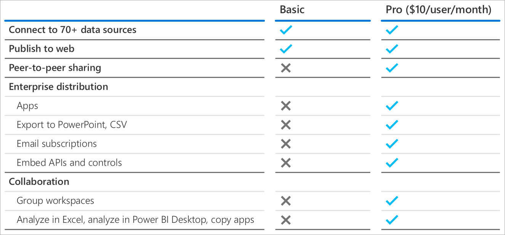

<properties
   pageTitle="Power BI Pro content - what is it?"
   description="Power BI Premium is dedicated capacity for your organization or team, giving you enhanced performance and larger data volumes, without requiring you to purchase per-user licenses."
   services="powerbi"
   documentationCenter=""
   authors="guyinacube"
   manager="erikre"
   backup=""
   editor=""
   tags=""
   qualityFocus="no"
   qualityDate=""/>
<tags
   ms.service="powerbi"
   ms.devlang="NA"
   ms.topic="get-started-article"
   ms.tgt_pltfrm="NA"
   ms.workload="powerbi"
   ms.date="05/11/2017"
   ms.author="asaxton"/>

# Power BI Premium - what is it?

Power BI Premium is dedicated capacity for your organization or team, giving you enhanced performance and larger data volumes, without requiring you to purchase per-user licenses. 

You can take advantage of Premium by assigning workspaces to a premium capacity. This is also referred to as dedicated capacity. For workspaces that are not assigned to a premium capacity, these will be in a shared capacity.

## Shared capacity

By default, your workspace will be in shared capacity. This includes your personal *My workspace* along with App workspaces. Within shared capacity, Power BI Basic and Power BI Pro users will have the same capabilities with the exception of sharing.

## Dedicated capacity (Premium)

You can assign workspaces to your dedicated capacity. When a workspace is backed by dedicated capacity, you enjoy the benefits of Power BI Premium

- Noisy neighbors isolation
- Huge dataset storage with no user quotas
- Higher dataset refresh rates

If an App workspace is backed by dedicated capacity, the published app can then be used by any user in your organization regardless of the license they are assigned. This means that even Power BI Basic users can use those published apps.

Here is a look at some

- Large datasets
- Incremental refresh
- Pinning datsets to memory
- Dedicated data refresh nodes
- Read-only replicas
- Geographic distribution

### Capacity nodes

Power BI Premium is available in node configurations with different v-cor capacities. For more information about specific SKU offereings and cost, see [Power BI pricing](https://powerbi.microsoft.com/pricing/). A [cost calculator](https://powerbi.microsoft.com/calculator/) is also available.

- P nodes can be used for embedded (Platform as a Service - PaaS) or service (Software as a Service - SaaS) deployments
- EM nodes can only be used for embedded deployments and do not allow for App distribution to Basic users.

## Power BI Report Server

Power BI Premium includes the right to run Power BI Report Server on-premises. For more infomation, see Get started with Power BI Report Server.

## Next steps

[How to purchase Power BI Premium](powerbi-admin-premium-purchase.md)  
[Managing Power BI Premium](powerbi-admin-premium-manage.md)  
[Administering Power BI in your organization](powerbi-admin-administering-power-bi-in-your-organization.md)  

More questions? [Try asking the Power BI Community](https://community.powerbi.com/)