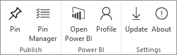
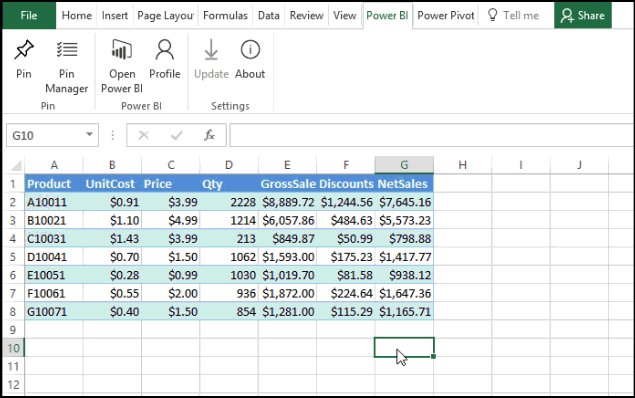
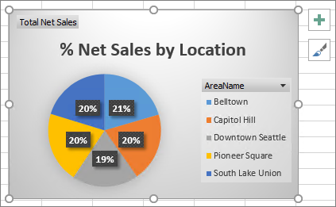

<properties
   pageTitle="Power BI publisher for Excel"
   description="Learn how to use the Power BI publisher for Excel"
   services="powerbi"
   documentationCenter=""
   authors="Minewiskan"
   manager="mblythe"
   editor=""
   tags=""
   qualityFocus="no"
   qualityDate=""/>

<tags
   ms.service="powerbi"
   ms.devlang="NA"
   ms.topic="article"
   ms.tgt_pltfrm="NA"
   ms.workload="powerbi"
   ms.date="03/21/2016"
   ms.author="owend"/>

# Power BI publisher for Excel

With Microsoft Power BI publisher for Excel, you can take snapshots of your most important insights in Excel, like PivotTables, Charts, and ranges and pin them to dashboards in Power BI.

What can you pin? Just about anything in an Excel worksheet. You can select a range of cells from a simple sheet or table, a PivotTable or PivotChart, illustrations and images, text.
What you can't pin: You cannot pin 3D Maps or visualizations in Power View sheets. There are also some elements you can pin, but it wouldn't make much sense to, like a Slicer or Timeline filter.

When you pin an element from Excel, a new tile is added to a new or existing dashboard in Power BI. The new tile is a snapshot, so it's not dynamic, but you can still update it. For example, if you make a change to a PivotTable or Chart you've already pinned, the dashboard tile in Power BI isn't updated automatically, but you can still update your pinned elements by using Pin Manager. You'll learn more about Pin Manager below.

## Download and install
Power BI publisher for Excel is an add-in you can download and install on desktop versions of Microsoft Excel 2007 and later.

[Download Power BI publisher for Excel](http://go.microsoft.com/fwlink/?LinkId=715729)

Once you have the publisher installed, you'll see a new **Power BI**
ribbon in Excel, where you can sign-in and out of Power BI, pin elements to dashboards, and manage elements you've already pinned.

The Power BI publisher for Excel add-in is enabled by default, but if for some reason you don't see the Power BI ribbon tab in Excel, you'll need to enable it. Click **File** > **Options** > **Add-ins** > **COM Add-ins**. Select **Microsoft Power BI publisher for Excel**.

## Pin a range to a dashboard
You can select any range of cells from your worksheet and pin a snapshot to any number of existing or new dashboards in Power BI.

1. In Excel, click on the **Power BI** tab to see the Pin ribbon.
2. In your worksheet, select a range.
3. Select a workspace in the **Workspace** dropdown list. If you want to pin to your own dashboard, verify **My Workspace** is selected. If you want to pin to a dashboard in a group workspace, select the group from the drop-down list.
4. Click **Pin**. If you're not already signed into Power BI, you'll be prompted to.
5. In **Pin to dashboard**, select an existing dashboard in the workspace or create a new one, and then click **Pin**.

    

## Pin a Chart to a dashboard
Just click on the chart, and then click Pin .

## Manage pinned elements
With Pin Manager, you can update (refresh) a pinned element's associated tile in Power BI. You can also remove the pin between an element you've already pinned to dashboards in Power BI.

To update tiles in your dashboard, in **Pin Manager**, select one or more elements and then click **Update**.

To remove the mapping between a pinned element in Excel and the associated tile in a dashboard, click **Remove**. When you click Remove, you're not removing the element from your worksheet in Excel or deleting the associated tile in the dashboard. You are removing the pin, or mapping, between them. The element will no longer appear in Pin Manager. If you pin the element again, it will appear as a new tile.

To remove a pinned element (a tile) from a dashboard, you'll need to do that in Power BI. In the tile you want to delete, click the **Open menu** icon 
and then click **Delete tile**   .
