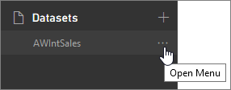
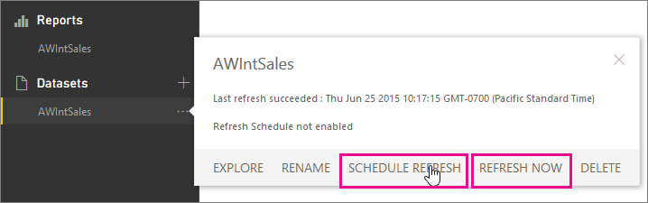
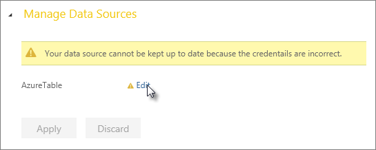
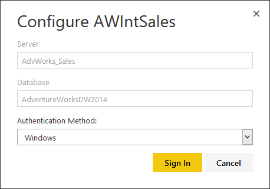
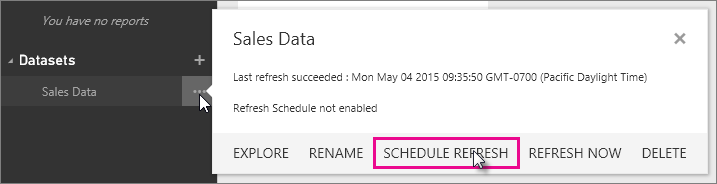
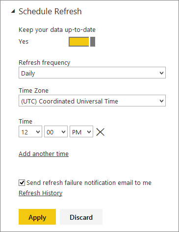
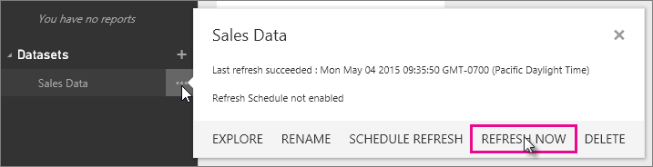

<properties 
   pageTitle="Refresh data in Power BI" 
   description="Refresh data in Power BI" 
   services="powerbi" 
   documentationCenter="" 
   authors="v-anpasi" 
   manager="mblythe" 
   editor=""
   tags=""/>
 
<tags
   ms.service="powerbi"
   ms.devlang="NA"
   ms.topic="article"
   ms.tgt_pltfrm="NA"
   ms.workload="powerbi"
   ms.date="06/18/2015"
   ms.author="v-anpasi"/>

#Refresh data in Power BI
[← Get data](https://support.powerbi.com/knowledgebase/topics/63369-get-data)

Whenever you’re reporting on data that’s changing, it’s important the data behind your reports is up-to-date. Power BI supports scheduled and manual refresh for a limited number of data sources. Additional data sources will support refresh in upcoming releases.

##Data sources that support refresh in Power BI

Schedule Refresh and Refresh Now in Power BI are ***only*** supported for Excel workbooks where Power Query is used to connect to and query data from the following data sources:  

|Data source|Authentication type|
|---|---|
|SQL Azure*|Basic|
|Blob store|Account key|
|Table store|Account key
|HD Insight|Account key|
|Azure Marketplace|Marketplace key|
|Facebook|OAuth|
|Salesforce|OAuth|
|ODATA|Anonymous, Basic, OAuth|
|Web|Anonymous, Basic|
|Blank Query (Query that is not accessing any data source)|

 **Important**

- Make sure you've downloaded the latest version of Power Query before saving and uploading your workbook to Power BI.

- Connecting to SQL Server Analysis Services Tabular models by using the Power BI Analysis Services connector creates a live connection to model data, so there's no need to schedule refresh. Model data you see in Power BI is automatically refreshed about every ten minutes.

- Besides the data source and authentication type, there are other restrictions that may impact whether or not the workbook can be scheduled for refresh:

	-   If you've manually entered a SQL statement to execute, this cannot be scheduled for refresh. The alternative is to build the query by selecting the tables or views through the UI.
	-   If you've created a direct connection to data through Power Pivot, it cannot be scheduled for refresh. The alternative is to connect directly through Power Query.
	-   If you've loaded the data to a worksheet, it cannot be scheduled for refresh. The alternative is to load the query directly into the data model by changing the query’s load settings.

##Refreshing your data

There are two ways you can refresh a dataset, Schedule Refresh and Refresh Now. Either way, you’ll first need to specify credentials so Power BI can connect to the data source. Once specified, they are retained in that dataset’s settings and you won’t have to enter them again.
### To specify credentials

1. In Power BI navigator, in **Datasets**, select a dataset \> **Open Menu**.  
 

2. Click **SCHEDULE REFRESH** or **REFRESH NOW**.  

3. In **Edit Credentials**, click **Edit**.  
	

4. Select the type of **Authentication Method**, and enter account credentials. The type of authentication and credentials depend on the type of data source being connected to.  

### To setup a refresh schedule

1. In Power BI navigation pane, in **Datasets**, select a dataset \> Open Menu \> **SCHEDULE REFRESH**.

2. In **Settings for…** \> **Schedule Refresh**, set **Keep your data up-to-date** to **Yes**.
  

3. Select **Refresh frequency**, **Refresh between**, and **Time zone settings**, then click **Apply**.

### To refresh now

In Power BI navigator, in Datasets, select a dataset \> **Open Menu** \> **REFRESH NOW**.
  

##More about refreshing your data
In Power BI, you refresh datasets, because this is where the data behind your reports is. You might be thinking ‘but, I connected to an Excel worksheet, and SalesForce as my data sources’. Well, that’s true, but when you connected to those Excel workbooks in Power BI, the data or connections from them are imported into Power BI. Once in Power BI, the data is stored in a model that keeps it in-memory and in a structure that makes it easy for visualizations in your reports and dashboards to change and recalculate metrics quickly.
### When to refresh data

You will want to refresh your dataset as often as that data is updated at the source. For most data sources, data is updated daily, usually during the evening. If you schedule refresh, select days and times that will reflect the latest update from the source, but also provide an updated view of that data in Power BI when you need it most. For example, if your dataset connects to a SQLAzure database, and that database is updated every night at midnight, you'll want to schedule your dataset refresh between 12:00am and 6:00am. That way, when you get it in the morning and check your dashboards, they’ll reflect the most up-to-date data from the SQLAzure database. You can always check the last time a refresh happened, or when the next refresh is scheduled by clicking the **Open Menu** icon next to a dataset.
### Authentication

In order for Power BI to refresh your dataset, you will need to provide credentials for that particular data source. The type of credentials required depend on the data source your dataset is connecting to. You will be required to enter credentials the first time you use Schedule Refresh or Refresh Now. Once entered, those credentials will be retained as part of refresh settings for that dataset. If you get data from another workbook that uses the same data source in a dataset you've already configured authentication credentials for, you won't need to configure credentials again for your new dataset****.
### Troubleshooting

If you're having trouble scheduling refresh, be sure check out these articles:

- [Troubleshooting scheduled refresh for Azure SQL databases in Power BI](https://support.powerbi.com/knowledgebase/articles/527228-troublehooting-scheduled-refresh-for-azure-sql-dat)
