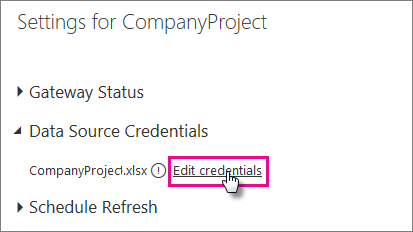

<properties 
   pageTitle="Refresh a dataset created from a Power BI Desktop file on OneDrive"
   description="Refresh a dataset created from a Power BI Desktop file on OneDrive"
   services="powerbi" 
   documentationCenter="" 
   authors="jastru" 
   manager="mblythe" 
   editor=""
   tags=""/>
 
<tags
   ms.service="powerbi"
   ms.devlang="NA"
   ms.topic="article"
   ms.tgt_pltfrm="NA"
   ms.workload="powerbi"
   ms.date="10/27/2015"
   ms.author="v-jastru"/>

# Refresh a dataset created from a Power BI Desktop file on OneDrive  
[← Data refresh](https://support.powerbi.com/knowledgebase/topics/107925-data-refresh)

## What are the advantages?  
Importing files from OneDrive is a great way to make sure the work you’re doing in Power BI Desktop stays in-sync with your Power BI site. Any data you’ve loaded into your file’s model is imported into the dataset and any reports you’ve created in the file are loaded into Reports in Power BI. If you make changes to your file on OneDrive, like add new measures, change column names, or edit visualizations, once you save, those changes will be updated in Power BI too, usually within about an hour.

In Power BI Desktop, any data you load into the file’s model must come from an external data source. You can perform a one-time, manual refresh of data in the model right in Power BI Desktop by clicking Refresh on the Home ribbon. When you click Refresh here, a connection is made, data sources are queried for updates, and the data in the file’s model is refreshed with updated data. This kind of refresh, entirely from within the Power BI Desktop application itself, is different from manual or scheduled refresh in Power BI, and it’s important to understand the distinction.

When you import your Power BI Desktop file from OneDrive, data, along with other information about the model is loaded into a dataset in Power BI. In Power BI (not Power BI Desktop) you want to refresh data in the dataset because that is what your reports in your Power BI site are based on. Because the data sources are external, you can manually refresh the dataset by using Refresh Now or you can setup a refresh schedule by using Schedule Refresh.

When you refresh the dataset, Power BI does not connect to the file on OneDrive to query for updated data. It uses information in the dataset to connect directly to the data sources to query for updated data it then loads into the dataset. This refreshed data in the dataset is not synchronized back to the file on OneDrive.

## What’s supported?  
Once a dataset is created in Power BI, Refresh Now and Schedule Refresh is supported for:  
-   All online data sources shown in Power BI Desktop’s Get Data and Query Editor.
-   All on-premises data sources shown in Power BI Desktop’s Get Data and Query Editor except for Hadoop file (HDFS), Active Directory, Microsoft Exchange.

>**Note:**  
>A [Power BI Personal Gateway](https://support.powerbi.com/knowledgebase/articles/649846-power-bi-personal-gateway) must be installed in order for Power BI to connect to on-premises data sources and refresh the dataset.

## One Drive – Personal or OneDrive for Business. What’s the difference?  
If you have both a personal OneDrive and OneDrive for Business, it’s recommended you keep any files you want to import into Power BI in OneDrive for Business. Here’s why: You likely use two different accounts to sign into them.

Connecting to OneDrive for Business in Power BI is typically seamless because the same account you use to sign into Power BI with is often the same account used to sign into OneDrive for Business. But, with personal OneDrive, you likely sign in with a different [Microsoft account](http://www.microsoft.com/account/default.aspx).

When you sign in with your Microsoft account, be sure to select Keep me signed in. Power BI can then synchronize any updates you make in the file in Power BI Desktop with datasets in Power BI  
	

If you make changes to your file on OneDrive that cannot be synchronized with the dataset or reports in Power BI, because your Microsoft account credentials might have changed, you’ll need to connect to and import your file again from your personal OneDrive.

## How do I schedule refresh?  
When you setup a refresh schedule, Power BI will connect directly to the data sources using connection information and credentials in the dataset to query for updated data. It then loads the updated data into the dataset. Any visualizations in reports and dashboards based on the dataset are also updated. Before you can setup a refresh schedule, you’ll need to do a couple of things first:

### Make sure your gateway is online (if required)  
If your dataset connects to on-premises data sources, a [Power BI Personal Gateway](https://support.powerbi.com/knowledgebase/articles/649846-power-bi-personal-gateway) must be installed and online before you can setup a refresh schedule.

In **My Workspace** &gt; **Datasets** &gt; **dataset** &gt;  **SCHEDULE REFRESH** or **REFRESH NOW** to open the Settings page, then expand **Gateway Status**. Make sure your gateway is online before trying to setup a refresh schedule.  
	

## Sign into data sources  
In Power BI, when you import your file from OneDrive, Power BI does not copy the credentials you used when you connected to and loaded data into the Power BI Desktop file, so you’ll need to sign into the data sources again in Power BI. You only need to do this once. After that, Power BI retains those credentials as part of the dataset’s settings and uses them to sign into the data sources to query for updated data.

1.  In **My Workspace** &gt; **Datasets** &gt; **dataset** &gt;  **SCHEDULE REFRESH** or **REFRESH NOW** to open the Settings page.  
	

2. Expand **Data Source Credentials**, and then click **Edit Credentials**  
	

3. Select the **Authentication Method**, and enter account credentials if needed, then click Sign In. The type of authentication and credentials depend on the type of data source being connected to. In most cases, you won’t need to specify a different Authentication Method. It will be automatically selected for you based on the data source.  
	

>**Note:**  
>If your dataset has more than one data source, you’ll have to sign into each one.

## Setup a refresh schedule  
In **Schedule Refresh** &gt; **Keep your data up-to-date** &gt; **Yes**. Select a Refresh frequency, Time zone, and Time, and then click **Apply**.  
	

## When things go wrong  
When things go wrong, it’s usually because Power BI can’t sign into data sources, or if the dataset connects to an on-premises data source, the Power BI Personal Gateway is offline. Make sure Power BI can sign into data sources. If a password you use to sign into a data source changes, or Power BI gets signed out from a data source, be sure to try signing into your data sources again in Data Source Credentials.

If you’re making changes to the Power BI Desktop file on OneDrive and saving, and those changes aren’t being reflected in Power BI within an hour or so, it could be because Power BI cannot connect to your OneDrive. Try connecting to the file on OneDrive again. If you’re prompted to sign in, make sure you select Keep me signed in. Because Power BI was not able to connect to your OneDrive to synchronize with the file, you’ll need to import your file again.

Be sure to leave the **Send refresh failure notification email to me** checked. You’ll want to know right away if a scheduled refresh fails.

To learn more about how to troubleshoot refresh issues, see [Troubleshooting refresh.scenarios](https://support.powerbi.com/knowledgebase/articles/742209-troubleshooting-refresh-scenarios)and [Tools for troubleshooting refresh issues](https://support.powerbi.com/knowledgebase/articles/742023-tools-for-troubleshooting-refresh-issues).