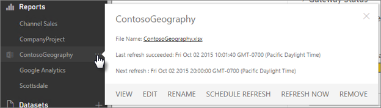
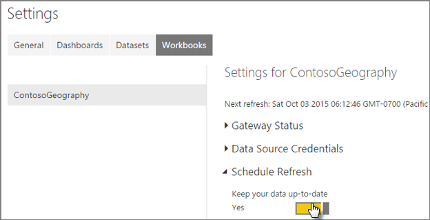

<properties
   pageTitle="Refresh a dataset created from an Excel workbook on OneDrive"
   description="Refresh a dataset created from an Excel workbook on OneDrive"
   services="powerbi"
   documentationCenter=""
   authors="guyinacube"
   manager="mblythe"
   editor=""
   tags=""/>

<tags
   ms.service="powerbi"
   ms.devlang="NA"
   ms.topic="article"
   ms.tgt_pltfrm="NA"
   ms.workload="powerbi"
   ms.date="12/02/2015"
   ms.author="asaxton"/>

# Refresh a dataset created from an Excel workbook on OneDrive  

## What are the advantages?  
Importing your workbooks from OneDrive is a great way to make sure the work you’re doing in Excel stays in-sync with your Power BI site. With OneDrive, you have quite a few options. How data refresh works with each of those options is a little different. We’ll start with where you keep your workbooks; on a personal OneDrive or OneDrive for Business. If you keep your workbooks on OneDrive for Business, you have a couple different ways you can explore your data in Power BI. We’ll describe how data is refreshed using both. We’ll then go into how you can make sure your data from external sources is always up to date by setting up a refresh schedule.

## One Drive - Personal  
When you import an Excel workbook from your personal OneDrive, any data in the workbook, like tables in worksheets and/or data that is loaded into the Excel data model and the structure of the data model are imported into a new dataset in Power BI. Any Power View visualizations are re-created in Reports. Power BI automatically connects to the workbook on OneDrive about every hour to check for updates. If the workbook has changed, Power BI will refresh the dataset and reports in Power BI.

If your workbook connects to external data sources to query and load data into the Excel data model, you cannot schedule refresh on that data from within Excel. You can, however, schedule refresh on the dataset in Power BI. When you manually refresh or schedule refresh on the dataset, Power BI connects directly to the external data sources to query for updated data it then loads into the dataset. Refreshing a dataset from within Power BI does not refresh the data in the workbook on OneDrive. 

Once a dataset is created in Power BI, Refresh Now and Schedule Refresh Refresh is supported for:  
-   All online data sources shown in Power Query (Get & Transform Data in Excel 2016).
-   All on-premises data sources shown in Power Query (Get & Transform Data in Excel 2016) except for Hadoop file (HDFS), Active Directory, Microsoft Exchange.
-   All online data sources shown in Power Pivot. \*
-   All on-premises data sources shown in Power Pivot except for Hadoop file (HDFS), Active Directory, Microsoft Exchange.

>**Notes:**  
>- A [Power BI Personal Gateway](powerbi-personal-gateway.md) must be installed in order for Power BI to connect to on-premises data sources and refresh the dataset.
>
>- When using Excel 2013, make sure you’ve updated Power Query to the latest version.

### Signing into your personal OneDrive  
Connecting to OneDrive for Business in Power BI is typically seamless because the same account you use to sign into Power BI with is often the same account used to sign into OneDrive for Business. But, with personal OneDrive, you likely sign in with a different [Microsoft account](http://www.microsoft.com/account/default.aspx).

When you sign in with your Microsoft account, be sure to select **Keep me signed in**. Power BI can then synchronize any updates you make in the file in Power BI Desktop with datasets in Power BI

If you make changes to your file on OneDrive that cannot be synchronized with the dataset or reports in Power BI because your Microsoft account credentials might have changed, you’ll need to connect to the file and upload it again from your personal OneDrive.

If you have both a personal OneDrive and OneDrive for Business, it’s recommended you keep any files you want to connect to and import into Power BI in OneDrive for Business. By using OneDrive for Business, you can avoid having to signing into your personal OneDrive from Power BI. You can also share your workbooks with other users in your organization.

## OneDrive - Business  
When you connect to an Excel workbook in OneDrive for Business, you’ll have two options on how to get what’s in your workbook into Power BI.

[**Import Excel data into Power BI**](powerbi-desktop-import-excel-workbooks.md) – When you import an Excel workbook from your OneDrive for Business, any data in the workbook, like tables in worksheets and/or data that is loaded into the Excel data model and the structure of the data model are imported into a new dataset in Power BI. Any Power View visualizations are re-created in Reports. Power BI automatically connects to the workbook on OneDrive about every hour to check for updates. If the workbook has changed, Power BI will refresh the dataset and reports in Power BI.

If your workbook on OneDrive connects to external data sources to query and load data into the Excel data model, you cannot schedule refresh on that data from within Excel. You can, however, schedule refresh on the dataset in Power BI. When you manually refresh or schedule refresh on the dataset, Power BI connects directly to the external data sources to query for updated data it then loads into the dataset. Refreshing a dataset from within Power BI does not refresh the data in the workbook on OneDrive. 

Once a dataset is created in Power BI, Refresh Now and Schedule Refresh is supported for:  
-   All online data sources shown in Power Query (Get & Transform Data in Excel 2016).
-   All on-premises data sources shown in Power Query (Get & Transform Data in Excel 2016) except for Hadoop file (HDFS), Active Directory, Microsoft Exchange.
-   All online data sources shown in Power Pivot. \*
-   All on-premises data sources shown in Power Pivot except for Hadoop file (HDFS), Active Directory, Microsoft Exchange.

>**Notes:**  
>- A [Power BI Personal Gateway](powerbi-personal-gateway.md) must be installed in order for Power BI to connect to on-premises data sources and refresh the dataset.
>
>- When using Excel 2013, make sure you’ve updated Power Query to the latest version.

[**Connect, Manage, and View Excel in Power BI**](powerbi-bring-in-whole-excel-files.md) – When using this option, you create a connection from Power BI right to your workbook on OneDrive for Business.

When you connect to an Excel workbook this way, a dataset is not created in Power BI. However, the workbook will appear in your Power BI site in My Workspace &gt; Reports with an Excel icon next to the name. Unlike with Excel Online, when you connect to your workbook from Power BI, if your workbook has connections to external data sources that load data into the Excel data model, you can setup a refresh schedule by clicking the Open Menu icon next to the workbook’s name

When you setup a refresh schedule this way, the only difference is refreshed data goes into the workbook’s data model on OneDrive rather than a dataset in Power BI.

## How do I make sure data is loaded into the Excel data model?  
In Excel, you use Power Query (Get & Transform data in Excel 2016) to connect to a data source and query data. You’ll have several options where to load the data. To make sure you load data into the data model, you must select the Add this data to the Data Model option in the Load To dialog box.

>**Note:**  
>The images here show Excel 2016.

In **Navigator**, click **Load To…**

**
**

Or, If you click **Edit** in Navigator, you’ll open the Query Editor. There you can click **Close & Load To…**.

Then in **Load To**, make sure you select **Add this data to the Data Model**.

### What if I use Get External Data in Power Pivot?  
No problem. Whenever you use Power Pivot to connect to and query data from an on-premises or online data source, the data is automatically loaded to the data model.

## How do I schedule refresh?  
If you imported your workbook from your personal OneDrive or OneDrive for Business, when you setup a refresh schedule, Power BI will connect directly to the data sources using connection information and credentials in the dataset to query for updated data. It then loads the updated data into the dataset. Any visualizations in reports and dashboards based on the dataset are also updated.

If you connect to your workbook on OneDrive for Business by using Connect, Manage, and View Excel in Power BI, when you setup a refresh schedule, Power BI will connect directly to the data sources using connection information and credentials in the workbook to query for updated data. It then loads the updated data into the workbook’s data model on OneDrive. Any PivotTables, PivotCharts, or Power View reports based on that data are also updated. You can edit settings in My Workspace &gt; Reports &gt; workbook name. Other than that, everything below is the same.

Before you can setup a refresh schedule, you’ll need to do a couple of things first:

### Make sure your gateway is online (if required)  
If your dataset connects to on-premises data sources, a [Power BI Personal Gateway](powerbi-personal-gateway.md) must be installed and online before you can setup a refresh schedule.

In My **Workspace** &gt; **Datasets** &gt; **dataset** &gt;  **SCHEDULE REFRESH** or **REFRESH NOW** to open the Settings page, then expand **Gateway Status**. Make sure your gateway is online before trying to setup a refresh schedule.

## Sign into data sources  
In Power BI, when you import your workbook from a local drive, Power BI does not copy the credentials you used when you connected to and loaded data into the data model, so you’ll need to sign into the data sources again in Power BI. You only need to do this once. After that, Power BI retains those credentials as part of the dataset’s settings and uses them to sign into the data sources to query for updated data.

1. In **My Workspace** &gt; **Datasets** &gt; **dataset** &gt;  **SCHEDULE REFRESH** or **REFRESH NOW** to open the Settings page.  
	

2. Expand **Data Source Credentials**, and then click **Edit Credentials**.  
	

3. Select the **Authentication Method**, and enter account credentials if needed, then click Sign In. The type of authentication and credentials depend on the type of data source being connected to. In most cases, you won’t need to specify a different Authentication Method. It will be automatically selected for you based on the data source.  
	

>**Note:**  
>If your dataset has more than one data source, you’ll have to sign into each one.

## Setup a refresh schedule  
In **Schedule Refresh** &gt; **Keep your data up-to-date** &gt; **Yes**. Select a Refresh frequency, Time zone, and Time, and then click **Apply**.  
	

## When things go wrong  
When things go wrong, it’s usually because Power BI can’t sign into data sources, or if the dataset or workbook connects to an on-premises data source, the Power BI Personal Gateway is offline. Make sure Power BI can sign into data sources. If a password you use to sign into a data source changes, or Power BI gets signed out from a data source, be sure to try signing into your data sources again in Data Source Credentials.

Be sure to leave the **Send refresh failure notification email to me checked**. You’ll want to know right away if a scheduled refresh fails.

To learn more about how to troubleshoot refresh issues, see [Troubleshooting refresh.scenarios](powerbi-refresh-troubleshooting-refresh-scenarios.md)and [Tools for troubleshooting refresh issues](powerbi-refresh-tools-for-troubleshooting-issues.md).

## Important notes  
\* Refresh is not supported for OData feeds connected to and queried from Power Pivot. When using an OData feed as a data source, use Power Query.
