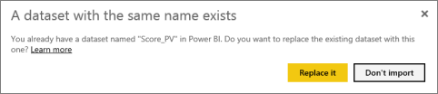

<properties 
   pageTitle="Replace an Excel, Power BI Desktop, or CSV file in Power BI"
   description="Replace an Excel, Power BI Desktop, or CSV file in Power BI"
   services="powerbi" 
   documentationCenter="" 
   authors="pcw3187" 
   manager="mblythe" 
   editor=""
   tags=""/>
 
<tags
   ms.service="powerbi"
   ms.devlang="NA"
   ms.topic="article"
   ms.tgt_pltfrm="NA"
   ms.workload="powerbi"
   ms.date="10/14/2015"
   ms.author="v-pawrig"/>
# Replace an Excel, Power BI Desktop, or CSV file in Power BI

[← Files in Power BI](https://support.powerbi.com/knowledgebase/topics/88767-files-in-power-bi)

Say you upload an Excel, Power BI Desktop, or CSV file from your computer to Power BI, and use it as a dataset for reports and dashboards in Power BI.

Now say you change the version of the file on your computer. You can upload the updated version to Power BI and it will replace the earlier version of the file, as long as the file name is the same. After you replace the earlier version of the file with the updated version, Power BI automatically redirects connections from reports and dashboards to go to the updated version of the dataset. 

**NOTES**

-   Besides having the same name, the file also has to be the same type. For example, an Excel file named Analysis won’t replace a Power BI Desktop file named Analysis.

-   Avoid changing the structure of the data.  If you rename or delete a column, any visuals based on that column will be broken. 

-   Power BI ignores format changes of existing columns – e.g., from 0.25 to 25%.

-   If you add a column, Power BI ignores the added column in existing visuals, but adds the new column to the dataset, so you can use it in creating or updating visuals.

-   Refreshing doesn't work the same way for Excel workbooks you bring intact into Power BI. Read more about [bringing whole Excel files into Power B](https://support.powerbi.com/knowledgebase/articles/640168)I. 

## Replace a file

1.  Select **Get Data** at the bottom of the left navigation pane. 

    

2.  In the **Files** box, select **Get**.

    

3.  Select **Local File**. 

    

4.  Browse to the file and select **Open**. Power BI uploads the file from your computer to Power BI.   

5.  You see a message that you already have a dataset with the same name. Select **Replace it**. 

    

 
>**NOTE**: If you already have more than one dataset with the same name, Power BI won’t upload the new dataset. You need to change the name first – or change the names of the extra existing datasets — so only one remains by that name.

