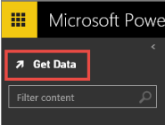

<properties 
   pageTitle="Sample datasets for Power BI" 
   description="Sample datasets for Power BI" 
   services="powerbi" 
   documentationCenter="" 
   authors="v-anpasi" 
   manager="mblythe" 
   editor=""
   tags=""/>
 
<tags
   ms.service="powerbi"
   ms.devlang="NA"
   ms.topic="article"
   ms.tgt_pltfrm="NA"
   ms.workload="powerbi"
   ms.date=""
   ms.author="v-anpasi"/>

#Sample datasets for Power BI

[← Getting Started](https://support.powerbi.com/knowledgebase/topics/63037-getting-started)

Want to try Power BI with sample data?  Use one of our sample datasets to learn how Power BI keeps you in the know and focus on what matters to run your business.

##Industry sample datasets

These samples are part of a series that illustrate how you can use Power BI with business-oriented data, reports, and dashboards.  The samples are real data from obviEnce ([www.obvience.com](http://www.obvience.com/)) that has been anonymized.
-   [Retail Analysis](http://support.powerbi.com/knowledgebase/articles/471112-sample-datasets#retail)

##To view the sample datasets available

1.  Click **Get Data**  
    
     
2.  Select the sample from the list.
3.  Click **Connect**.

### Retail Analysis
This industry sample dashboard and underlying dataset and report analyze retail sales data of items sold across multiple stores and districts. The metrics compare this year's performance to last year's in these areas: sales, units, gross margin, and variance, as well as new store analysis.

-   [Take a tour of the Retail Analysis Sample](http://support.powerbi.com/knowledgebase/articles/474807-take-a-tour-retail-analysis-sample).
-   [Download the Excel file for this sample.](http://go.microsoft.com/fwlink/?LinkId=528592)

Are you looking for a different type of sample?  [Request a new sample](http://support.powerbi.com/forums/265200-power-bi/category/91332-samples).