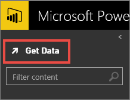

<properties pageTitle="Download the Financial Sample workbook for Power BI" description="Download the Financial Sample workbook for Power BI" services="powerbi" documentationCenter="" authors="v-anpasi" manager="mblythe" editor=""/>
<tags ms.service="powerbi" ms.devlang="NA" ms.topic="article" ms.tgt_pltfrm="NA" ms.workload="powerbi" ms.date="06/26/2015" ms.author="v-anpasi"/>
#Download the Financial Sample workbook for Power BI

[← Samples](https://support.powerbi.com/knowledgebase/topics/75672-samples)

We have a financial excel workbook sample available for download.  Here's the information on how to download it or get the data set as shown below:
-   Financial Excel workbook  
    This workbook has one table of data of sales and profit data by market segment and country/region.  You can [download the sample directly](http://go.microsoft.com/fwlink/?LinkID=521962), or: 

1.  Click **Get Data.**

    
    
2.  Select **Excel workbook**.
3.  At the bottom of the page, you'll see a link "Need a workbook to try? Download this one... "  Click the link to save the workbook to your OneDrive (recommended) or your desktop.

##See Also:

[Get Data](http://support.powerbi.com/knowledgebase/articles/434354-get-data)  
[Excel data](http://support.powerbi.com/knowledgebase/articles/424871-connect-to-excel-data)  
[Sample datasets](http://support.powerbi.com/knowledgebase/articles/471112-sample-datasets)