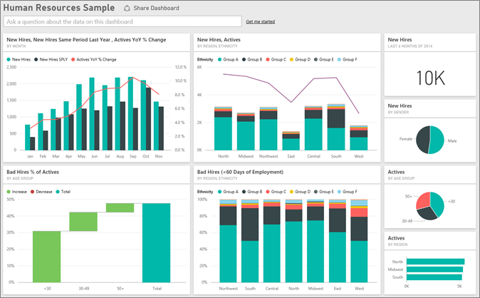
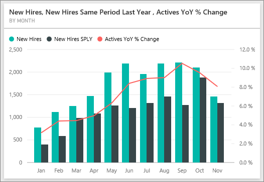
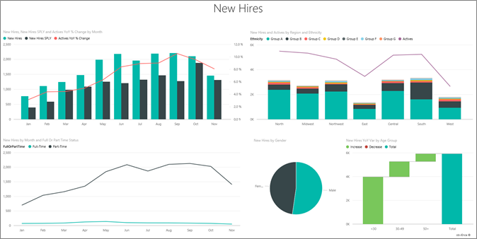
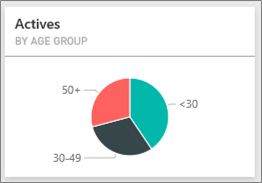
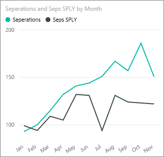
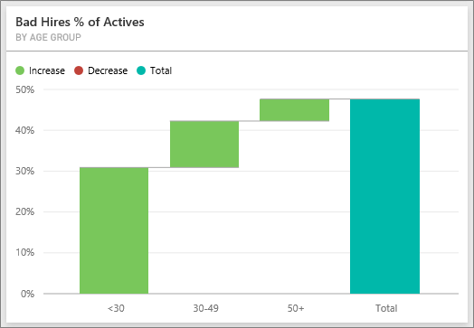
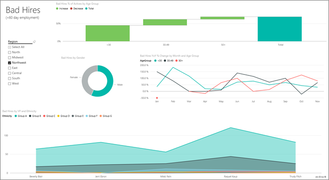
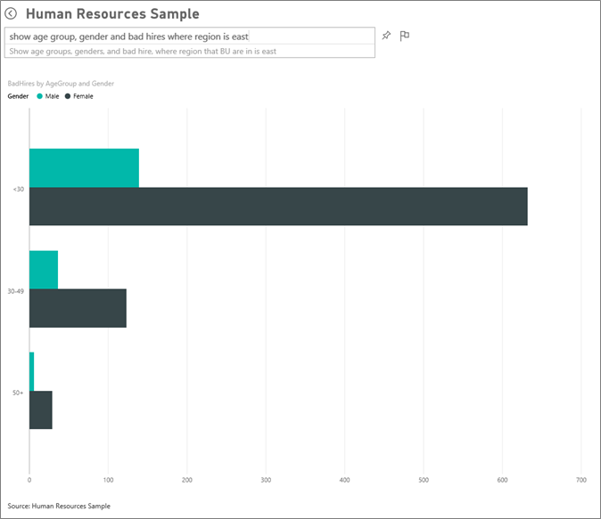

<properties 
   pageTitle="Human Resources sample for Power BI: Take a tour"
   description="Human Resources sample for Power BI: Take a tour"
   services="powerbi" 
   documentationCenter="" 
   authors="maggiesMSFT" 
   manager="mblythe" 
   editor=""
   tags=""/>
 
<tags
   ms.service="powerbi"
   ms.devlang="NA"
   ms.topic="article"
   ms.tgt_pltfrm="NA"
   ms.workload="powerbi"
   ms.date="10/16/2015"
   ms.author="maggies"/>

# Human Resources sample for Power BI: Take a tour  

The HR department has the same reporting model across different companies, even when they differ by industry or size. This sample looks at new hires, active employees, and employees who left and tries to uncover any trends in the hiring strategy. Our main objectives are to understand:

- Who we hire.
- Biases in our hiring strategy.
- Trends in voluntary separations.

This sample is part of a series that illustrates how you can use Power BI with business-oriented data, reports and dashboards. This is real data from obviEnce ([www.obvience.com)](http://www.obvience.com/) that has been anonymized.

You can also [download just the dataset (Excel workbook) for this sample](http://go.microsoft.com/fwlink/?LinkId=528592).

## New hires  
Let’s explore new hires first.
- On the dashboard, click the **New Hires, New Hires Same Period Last Year, Actives YoY % Change** **By Month** tile.  
      

    This opens the “Human Resources Sample” report to the “New Hires” page.  
    

Notice the following:

- The **New Hires, New Hires SPLY and Actives YoY % Change by Month** combo chart shows a significant growth in the number of new hires. We’re hiring lot more people this year compared to last year.

- Look at the combo chart **New Hires and Actives by Region and Ethnicity**. Notice we’re hiring fewer people in the **East** region.

- The **New Hires YoY Var by Age Group **waterfall chart shows we’re hiring mainly younger people. This may be due to the mainly part-time nature of the jobs.

- The **Gender** pie chart shows a pretty even split.

Can you find more insights – for example, a region where the gender split is not even? Click the different age groups and genders in the charts to explore the relationships between age, gender, region, and ethnicity group.

Click **Power BI** in the top navigation bar to return to the dashboard.

## Compare current active and former employees  
Let’s explore data for current active employees and employees who no longer work for the company.

On the dashboard, click the **Actives by Age Group **tile.  

This opens the report to the “Active Employees vs. Separations” page.  

Items of interest:

- Combo charts on the left show year-over-year change for active employees and separates. We have more actives this year due to rapid hiring, but also more separates than last year.

- In August we had more separates compared to other months. Click the different age groups, genders, or regions to see if you can find any outliers.

- Looking at the pie charts, we notice we have a pretty even split in our active employees by gender and age groups. Click different age groups to see the gender split by age. Do we have an even split by gender in every age group? 

## Reasons for separation  
Let’s look at the report in Editing View. Tap **Edit Report** in the upper-left corner. 

Change the pie charts to show Separates data instead of Actives.

1.  Click the **Actives by** **AgeGroup** pie chart.

2.  In **Fields**, click the **Employee** to expand the Employee table. Uncheck the box next to **Actives** to remove that field.

3.  Check the box next to **Seperations** in the Employee table to add it to the **Values** box in the field well.

4.  Click the **Voluntary** bar in the **Separations by Reason** bar chart. This filters the report showing the separations who left voluntarily.

5.  Click the 50+ slice of the AgeGroup pie chart.
    Look at the Separations by Reason line chart in the lower-right corner. This chart is filtered to show voluntary separations.  
    

    Notice the trend in the 50+ age group? During the latter part of the year more 50+ employees are leaving voluntarily. This would be an area to investigate further with more data.

6.  You can follow the same steps for the **Gender** pie chart too, changing it to separations instead of active employees. Look at the voluntary separation data by gender to see if you find any other insights.

7.  Click **Power BI** in the top navigation bar to return to the dashboard. You can save the changes you’ve made to the report or not.

## Bad hires  
The last area to explore is bad hires. Bad hires are defined as employees who didn’t last for more than 60 days. We’re hiring rapidly. Are we hiring good candidates?

1.  Click the **Bad Hires % of Actives by Age Group **dashboard tile. This opens the report to page 3, “Bad Hires”.
      

2.  Click the **Northwest** in the slicer on the left and the **Male gender** slice in the donut chart.  Look at other charts on the “Bad Hires” page. More male bad hires than females and lot of Group A bad hires.
      

3.  Looking at **Bad Hires by Gender donut** chart and clicking through the **Region** slicer we notice that East is the only region with more female bad hires than male bad hires.  

4.  Click **Power BI** in the top navigation bar to return to the dashboard.

## Asking a question in the Q&A box 
1.  Click in the Q&A question box and type the question **show age group, gender and bad hires where region is east**.  
    

    Notice most of the female bad hires are under 30.
2.  Click the back arrow  to go back to the dashboard.

This is a safe environment to play in. You can always choose not to save your changes. But if you do save them, you can always go to **Get Data** for a new copy of this sample. 

## Next steps: Connect to your data  
We hope this tour has shown how Power BI dashboards, Q&A, and reports can provide insights into human resources data. Now it is your turn — connect to your own data. With Power BI you can connect to a wide variety of data sources. Learn more about [getting started with Power BI Preview](https://support.office.com/article/Get-Started-with-Power-BI-Preview-0f0237e2-f74f-49ab-82ea-1990c3c3deb8).  