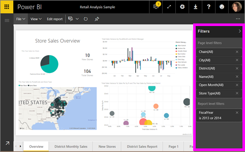

<properties
   pageTitle="Add a filter to a report in Power BI"
   description="Add a filter to a report in Power BI"
   services="powerbi"
   documentationCenter=""
   authors="mihart"
   manager="mblythe"
   backup=""
   editor=""
   tags=""
   qualityFocus="monitoring"
   qualityDate=""/>

<tags
   ms.service="powerbi"
   ms.devlang="NA"
   ms.topic="article"
   ms.tgt_pltfrm="NA"
   ms.workload="powerbi"
   ms.date="11/15/2016"
   ms.author="mihart"/>

# Add a filter to a Power BI report (in Editing view)

>[AZURE.TIP]We recommend first reading [About filters and highlighting in Power BI reports](powerbi-service-about-filters-and-highlighting-in-reports.md).

##  What is the difference between report filters in Editing View versus Reading View

There are two modes for interacting with reports: [Reading View](powerbi-service-interact-with-a-report-in-reading-view.md) and [Editing View](powerbi-service-interact-with-a-report-in-editing-view.md).  And the filtering capabilities available to you depend on which mode you're in.

-   In Editing View, you can add report, page, and visual filters. When you save the report, the filters are saved with it. People looking at the report in Reading View can interact with the filters you added, but not save their changes.

-   In Reading View, you can interact with any report, page and visual filters that already exist in the report, but you won't be able to save your filter changes.

>[AZURE.NOTE]  This article describes how to create filters in report **Editing View**.  For more information on filters in Reading VIew, see [interacting with filters in report Reading View](powerbi-service-interact-with-a-report-in-reading-view.md).

##  Visual filters, page filters, and report filters
A **page filter** applies to all the visuals on the report page. A **visual filter** applies to a single visual on a report page. And a **report filter** applies to all pages in the report.

## Add a filter to a specific visualization (aka visual filter)

### By filtering the fields already in the chart

1.  Open your [report in Editing View](powerbi-service-go-from-reading-view-to-editing-view.md).

2.  Open the Visualizations and Filters pane and the Fields pane (if they're not already open).

3.  Select a visual to make it active. All the fields being used by the visual are identified in the **Fields** pane and also listed in the **Filters** pane, under the **Visual Level Filters** heading.

4.  At this point you can either add a filter to a field already being used by the visualization, or you can use a different field as a filter. 

    **Add a filter to a field already being used by the visualization.**

    1.  Add a filter to a field already being used by the visual. Scroll down to the **Visual level filters** area and select the arrow to expand the field you'd like to filter.
   
    2.  Set either **Basic** or **Advanced** filtering controls (see [How to use report filters](powerbi-service-how-to-use-a-report-filter.md)).

         

    3.  The visual changes to reflect the new filter. If you save your report with the filter, report readers can interact with the filter in Reading View, selecting or clearing values.

    **Add a new field as a filter.**

    1.  From the Fields pane, select the field you want to add as a new visual level filter, and drag it into the **Visual level filters area**.  

    2.  Follow steps 2-3 above.

## Add a filter to an entire page (aka page view filter)

1.  Open your [report in Editing View](powerbi-service-go-from-reading-view-to-editing-view.md).

2.  Open the Visualizations and Filters pane and the Fields pane (if they're not already open).

3.  From the Fields pane, select the field you want to add as a new visual level filter, and drag it into the **Page level filters area**.  

4.  Select the values you want to filter and set either  **Basic** or **Advanced** filtering controls (see [How to use report filters](powerbi-service-how-to-use-a-report-filter.md)).

    The visualization changes to reflect the new filter. 

    

If you save your report with the filter, report readers can interact with the filter in Reading View, selecting or clearing values.

## Add a filter to an entire report (aka Report filter)

1. Open your [report in Editing View](powerbi-service-go-from-reading-view-to-editing-view.md).

2. Open the Visualizations and Filters pane and the Fields pane (if they're not already open).

3. From the Fields pane, select the field you want to add as a new visual level filter, and drag it into the **Report level filters area**.  

4. Select the values you want to filter (see [How to use report filters](powerbi-service-how-to-use-a-report-filter.md)).

The visuals on the active page, and on all pages in the report, changes to reflect the new filter. If you save your report with the filter, report readers can interact with the filter in Reading View, selecting or clearing values.

##  Troubleshooting

### Why your visual level filter and page level filter may return different results

When you add a visual level filter, Power BI filters on the aggregated results.  The default aggregation is Sum, but you can [change the aggregation type](powerbi-service-aggregates.md).  

When you add a page level filter, Power BI filters without aggregating.  It does this because a page can have many visuals which can each utilize different aggregation types.  So the filter is applied on each data row.

## See also

 [How to use report filters](powerbi-service-how-to-use-a-report-filter.md)

  [Filters and highlighting in reports](powerbi-service-about-filters-and-highlighting-in-reports.md)

[Interact with filters and highlighting in report Reading View](powerbi-service-interact-with-a-report-in-reading-view.md)

[Change how report visuals cross-filter and cross-highlight each other](powerbi-service-visual-interactions.md)

Read more about [reports in Power BI](powerbi-service-reports.md)

[Power BI - Basic Concepts](powerbi-service-basic-concepts.md)

More questions? [Try the Power BI Community](http://community.powerbi.com/)
