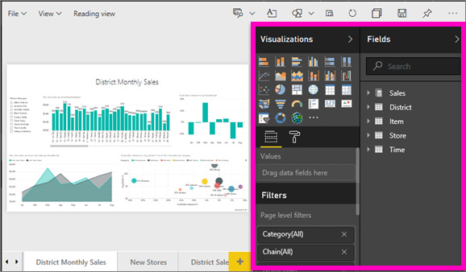
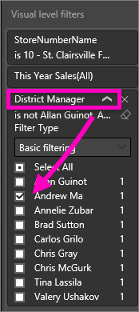
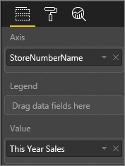

<properties
   pageTitle="Add a visualization or page or report filter to a report"
   description="Add a page filter, visualization filter, or report filter to a report in Power BI"
   services="powerbi"
   documentationCenter=""
   authors="mihart"
   manager="erikre"
   backup=""
   editor=""
   tags=""
   qualityFocus="monitoring"
   qualityDate=""/>

<tags
   ms.service="powerbi"
   ms.devlang="NA"
   ms.topic="article"
   ms.tgt_pltfrm="NA"
   ms.workload="powerbi"
   ms.date="05/03/2017"
   ms.author="mihart"/>

# Add a filter to a Power BI report (in Editing view)

>[AZURE.TIP] We recommend first reading [About filters and highlighting in Power BI reports](powerbi-service-about-filters-and-highlighting-in-reports.md).

##  What is the difference between report filters in Editing View versus Reading View

There are two modes for interacting with reports: [Reading View](powerbi-service-interact-with-a-report-in-reading-view.md) and [Editing View](powerbi-service-interact-with-a-report-in-editing-view.md).  And the filtering capabilities available to you depend on which mode you're in.

-   In Editing View, you can add report, page, and visual filters. When you save the report, the filters are saved with it. People looking at the report in Reading View can interact with the filters you added, but not save their changes.

-   In Reading View, you can interact with any report, page and visual filters that already exist in the report, but you won't be able to save your filter changes.

>[AZURE.NOTE] This article describes how to create filters in report **Editing View**.  For more information on filters in Reading VIew, see [interacting with filters in report Reading View](powerbi-service-interact-with-a-report-in-reading-view.md).

##  Visual filters, page filters, and report filters
A **page filter** applies to all the visuals on the report page. A **visual filter** applies to a single visual on a report page. And a **report filter** applies to all pages in the report.

## Add a filter to a specific visualization (aka visual filter)
There are 2 ways to do this: 
-    by filtering a field that is already being used by the visualization

-    by identifying a field that is not already being used by the visualization, and adding that field directly to the **Visual level filters** bucket.

### By filtering the fields already in the visualization

1.  Open your [report in Editing View](powerbi-service-go-from-reading-view-to-editing-view.md).

    

2.  Open the Visualizations and Filters pane and the Fields pane (if they're not already open).

    

3.  Select a visual to make it active. All the fields being used by the visual are identified in the **Fields** pane and also listed in the **Filters** pane, under the **Visual level filters** heading.

    

4.  At this point we'll add a filter to a field already being used by the visualization. 

    -  Scroll down to the **Visual level filters** area and select the arrow to expand the field you'd like to filter. In this example we'll filter **StoreNumberName**

         

    -  Set either **Basic**, **Advanced**, or **Top N** filtering controls (see [How to use report filters](powerbi-service-how-to-use-a-report-filter.md)). In this example we'll select Basic filtering and place checkmarks next to numbers 10, 11, 15, and 18.

         

    -  The visual changes to reflect the new filter. If you save your report with the filter, report readers can interact with the filter in Reading View, selecting or clearing values.

        

6.  Now let's add a totally new field, as a Visual level filter, to our visualization.

    -  From the Fields pane, select the field you want to add as a new visual level filter, and drag it into the **Visual level filters area**.  In this example we'll drag **District Manager** into the **Visual level filters** bucket and select only Andrew Ma. 

        

    -  Notice that **District Manager** is *not* added to the visualization itself. The visualization is still composed of **StoreNumberName** as the Axis and **This Year Sales** as the Value.  
    
        
    
    -    And, the visualization itself is now filtered to show only Andrew's sales this year for the specified stores.

        

## Add a filter to an entire page (aka page view filter)

1.  Open your [report in Editing View](powerbi-service-go-from-reading-view-to-editing-view.md).

2.  Open the Visualizations and Filters pane and the Fields pane (if they're not already open).

3.  From the Fields pane, select the field you want to add as a new visual level filter, and drag it into the **Page level filters** area.  

4.  Select the values you want to filter and set either  **Basic** or **Advanced** filtering controls (see [How to use report filters](powerbi-service-how-to-use-a-report-filter.md)).

    All the visualization on the page, impacted by this filter, are re-drawn to reflect the change. 

    

If you save your report with the filter, report readers can interact with the filter in Reading View, selecting or clearing values.

## Add a filter to an entire report (aka Report filter)

1. Open your [report in Editing View](powerbi-service-go-from-reading-view-to-editing-view.md).

2. Open the Visualizations and Filters pane and the Fields pane (if they're not already open).

3. From the Fields pane, select the field you want to add as a new report level filter, and drag it into the **Report level filters** area.  

4. Select the values you want to filter (see [How to use report filters](powerbi-service-how-to-use-a-report-filter.md)).

The visuals on the active page, and on all pages in the report, change to reflect the new filter. If you save your report with the filter, report readers can interact with the filter in Reading View, selecting or clearing values.

##  Troubleshooting

### Why your visual level filter and page level filter may return different results

When you add a visual level filter, Power BI filters on the aggregated results.  The default aggregation is Sum, but you can [change the aggregation type](powerbi-service-aggregates.md).  

When you add a page level filter, Power BI filters without aggregating.  It does this because a page can have many visuals which can each utilize different aggregation types.  So the filter is applied on each data row.

If you do not see the Fields pane, make sure you're in report [Editing view](powerbi-service-interact-with-a-report-in-editig-view.md)

## Next steps

 [How to use report filters](powerbi-service-how-to-use-a-report-filter.md)

  [Filters and highlighting in reports](powerbi-service-about-filters-and-highlighting-in-reports.md)

[Interact with filters and highlighting in report Reading View](powerbi-service-interact-with-a-report-in-reading-view.md)

[Change how report visuals cross-filter and cross-highlight each other](powerbi-service-visual-interactions.md)

More questions? [Try the Power BI Community](http://community.powerbi.com/)
