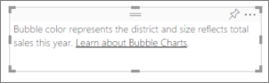
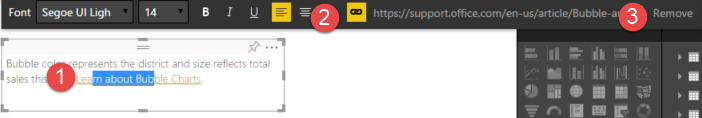

<properties
   pageTitle="Add a hyperlink to a Text Box in a Power BI report"
   description="Add a hyperlink to a Text Box in Power BI"
   services="powerbi"
   documentationCenter=""
   authors="mihart"
   manager="mblythe"
   backup=""
   editor=""
   tags=""
   featuredVideoId="_3q6VEBhGew"
   qualityFocus="no"
   qualityDate=""/>

<tags
   ms.service="powerbi"
   ms.devlang="NA"
   ms.topic="article"
   ms.tgt_pltfrm="NA"
   ms.workload="powerbi"
   ms.date="05/20/2016"
   ms.author="mihart"/>

# Add a hyperlink to a Text Box in a report

Text boxes can be added to reports, pinned to dashboards from reports, and added directly to dashboards. **This topic covers text boxes in reports.**

>**NOTE**: For information on hyperlinks in Power BI tables and matrixes, see [Hyperlinks in tables](powerbi-service-hyperlinks-in-tables.md). For information on adding text boxes to your **dashboard**, see [Add a tile directly from the dashboard ](powerbi-service-add-a-widget-to-a-dashboard.md). 

<iframe width="560" height="315" src="https://www.youtube.com/embed/_3q6VEBhGew?list=PL1N57mwBHtN0JFoKSR0n-tBkUJHeMP2cP" frameborder="0" allowfullscreen></iframe>

## To add a hyperlink to a Text Box

1.  [Create a Text Box and add some text](powerbi-service-text-boxes-in-reports.md). 

2.  Highlight existing text, or add new text to use as a hyperlink.

    

3.  Select the hyperlink icon   .

4.  Type or paste the URL in the hyperlink field, and select **Done**.

    

    

5.  Test the link.  

    -  In the Text Box, select the hyperlink to display the URL

    -  Select the URL to open the page in a new browser window.

## To remove the hyperlink but leave the text

1.  With at least a portion of the hyperlink highlighted,

2.  select the hyperlink icon and then

3.  choose **Remove**. 

    

    Alternately, to remove the hyperlink but leave the text, highlight the entire hyperlink and select Delete.

## See also

[Text Boxes in Power BI reports](powerbi-service-text-boxes-in-reports.md)

[Add a text box to a dashboard ](powerbi-service-add-a-widget-to-a-dashboard.md)

[Reports in Power BI](powerbi-service-reports.md)

[Visualizations in Power BI reports](powerbi-service-visualizations-for-reports.md)

[Power BI - Basic Concepts](powerbi-service-basic-concepts.md)
