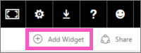
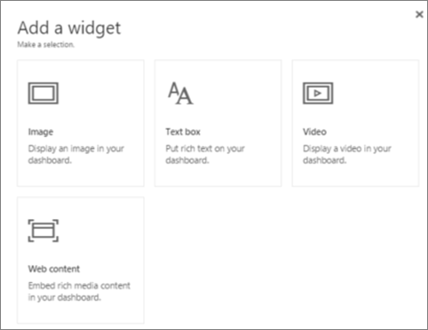
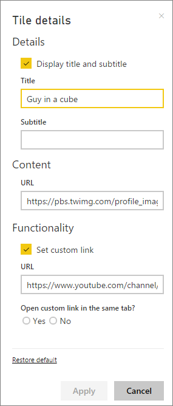

<properties
   pageTitle="Add a widget to a dashboard"
   description="Add an image, video, text box, web code widget to a dashboard."
   services="powerbi"
   documentationCenter=""
   authors="mihart"
   manager="mblythe"
   editor=""
   tags=""/>

<tags
   ms.service="powerbi"
   ms.devlang="NA"
   ms.topic="article"
   ms.tgt_pltfrm="NA"
   ms.workload="powerbi"
   ms.date="02/01/2016"
   ms.author="mihart"/>

# Dashboard widgets

## Add a widget

The **Add widget** control lets you directly add an image, text box, video, or web code to your dashboard.

1. Select **Add widget** from the menu bar.

    

2. Select which widget to add: **Image**, **Text box**, **Video**, or **Web content**.

    

## Add an image
Say you want your company logo on your dashboard, or some other image.

1. Select **Image**.

2. Add image information to the **Tile details** pane.

    

  - to display a title above the image, select *Display title and subtitle* and type a title and/or subtitle.

  - enter the image URL

  - to make the tile a hyperlink, select **Set custom link** and enter the URL.  When colleagues click this image or title, they'll be taken to this URL.

  - Select **Apply**.  On the dashboard, resize and move the image as needed.

  

##  Add a text box

1. Select **Text box**.

2. Add text box information to the **Tile details** pane.

    

  - to display a title above the text box, select **Display title and subtitle** and type a title and/or subtitle.

  - enter and format content for the text box.  

  - Optionally, set a custom link for the title.  However, in this example we've added hyperlinks within the text box itself, so leave **Set custom link** unchecked.

  - Select **Apply**.  On the dashboard, resize and move the text box as needed.

      

## Add a video

When you add a video widget to your dashboard, the video plays right on your dashboard.

1. Select **Video**.

2. Add video information to the **Tile details** pane.

    

  - to display a title and subtitle at the top of the video tile, select *Display title and subtitle* and type a title and/or subtitle. In this example, we'll add a subtitle and then turn it into a hyperlink back to the entire playlist on YouTube.

  - enter the URL for the video

  - Add a hyperlink for the title and subtitle.  Perhaps after your colleagues watch the embedded video you'd like them to view the entire playlist on YouTube -- add a link to your playlist here.

  - Select **Apply**.  On the dashboard, resize and move the video tile as needed.

    

3. Select the video widget to play the video.

4. Select the subtitle to visit the playlist on YouTube.

## Add web content

1. Select **Web content**.

2. Add video information to the **Tile details** pane.

  

  - to display a title above the video tile, select *Display title and subtitle* and type a title and/or subtitle.

  - enter the embed code. In this example we're adding a Twitter feed.

  - Select **Apply**.  On the dashboard, resize and move the web content tile as needed.

## Edit a widget

To make changes to a widget...

1. Select the ellipses in the top right corner of the tile.

    

2. Select the edit icon to re-open the **Tile details** pane and make changes.

    

## See also  

More about [creating Power BI dashboards](powerbi-service-create-a-dashboard.md).
