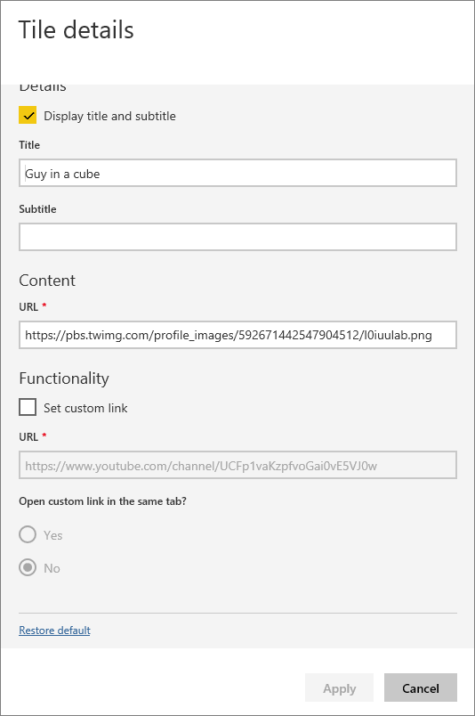
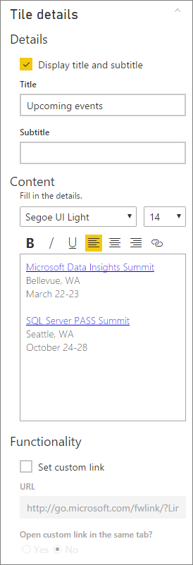
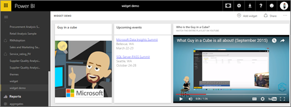
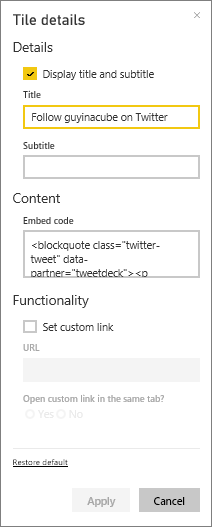
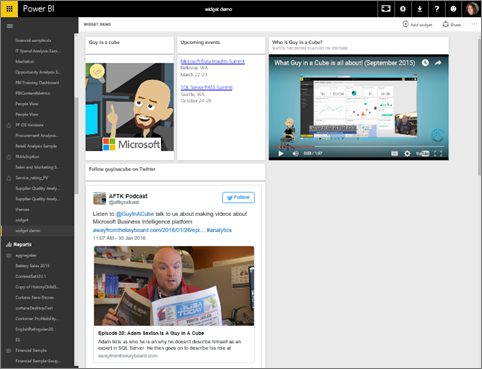

<properties
   pageTitle="Add a tile from the dashboard"
   description="Add an image, video, text box, web code tile to a dashboard."
   services="powerbi"
   documentationCenter=""
   authors="mihart"
   manager="mblythe"
   editor=""
   tags=""
   qualityFocus="no"
   qualityDate=""/>

<tags
   ms.service="powerbi"
   ms.devlang="NA"
   ms.topic="article"
   ms.tgt_pltfrm="NA"
   ms.workload="powerbi"
   ms.date="04/19/2016"
   ms.author="mihart"/>

# Add a tile directly from the dashboard itself

## Add tile

The **Add tile** control lets you directly add an image, text box, video, or web code to your dashboard.

1. Select **Add tile** from the menu bar.

    

2. Select which widget to add: **Image**, **Text box**, **Video**, or **Web content**.

    


## Add an image
Say you want your company logo on your dashboard, or some other image.

1. Select **Image**.

2. Add image information to the **Tile details** pane.

    

  - to display a title above the image, select *Display title and subtitle* and type a title and/or subtitle.

  - enter the image URL

  - to make the tile a hyperlink, select **Set custom link** and enter the URL.  When colleagues click this image or title, they'll be taken to this URL.

  - Select **Apply**.  On the dashboard, resize and move the image as needed.

      

##  Add a text box or dashboard heading

1. Select **Text box**.

      
>**NOTE**: To add a dashboard heading, type your heading in the text box and increase the font.

2. To add a regular textbox:

  - to display a title above the text box, select **Display title and subtitle** and type a title and/or subtitle.

  - enter and format content for the text box.  

  - Optionally, set a custom link for the title.  However, in this example we've added hyperlinks within the text box itself, so leave **Set custom link** unchecked.

  - Select **Apply**.  On the dashboard, resize and move the text box as needed.
  

## Add a video

When you add a YouTube or Vimeo video tile to your dashboard, the video plays right on your dashboard.

1. Select **Video**.

2. Add video information to the **Tile details** pane.

    

  - to display a title and subtitle at the top of the video tile, select *Display title and subtitle* and type a title and/or subtitle. In this example, we'll add a subtitle and then turn it into a hyperlink back to the entire playlist on YouTube.

  - enter the URL for the video

  - Add a hyperlink for the title and subtitle.  Perhaps after your colleagues watch the embedded video you'd like them to view the entire playlist on YouTube -- add a link to your playlist here.

  - Select **Apply**.  On the dashboard, resize and move the video tile as needed.
    

3. Select the video tile to play the video.

4. Select the subtitle to visit the playlist on YouTube.

## Add web content

Paste or type in any HTML content.  Power BI adds it, as a tile, to your dashboard. Enter the embed code by hand or copy/paste from sites such as Twitter, YouTube, embed.ly, and more.

1. Select **Web content**.

2. Add information to the **Tile details** pane.

    

  - to display a title above the tile, select *Display title and subtitle* and type a title and/or subtitle.

  - enter the embed code. In this example we're copying and pasting a Twitter feed.

  - Select **Apply**.  On the dashboard, resize and move the web content tile as needed.
      

### Tips for embedding web content###

- For iframes, use a secure source. If you enter your iframe embed code and get a blank tile, check to see if you're using **http** for the iframe source.  If so, change it to **https**.

  ```
  <iframe src="https://xyz.com">
  ```

- Edit width and height information. This embed code embeds a video and sets the video player to 560 x 315 pixels.  This size will not change as you resize the tile.

  ```
  <iframe width="560" height="315"
  src="https://www.youtube.com/embed/Cle_rKBpZ28" frameborder="0"
   allowfullscreen></iframe>
  ```

  If you'd like the player to resize to fit the tile size, set width and height to 100%.

  ```
  <iframe width="100%" height="100%"
  src="https://www.youtube.com/embed/Cle_rKBpZ28" frameborder="0"
   allowfullscreen></iframe>
  ```

- This code embeds a tweet and retains, as separate links on the dashboard, links for the **AFK** podcast, **@GuyInACube's Twitter page**, **Follow**, **#analytics**, **reply**, **retweet**, and **like**.  Selecting the tile itself takes you to the podcast on Twitter.

  ```
  <blockquote class="twitter-tweet" data-partner="tweetdeck">
  <p lang="en" dir="ltr">Listen to
  <a href="https://twitter.com/GuyInACube">@GuyInACube</a> talk to
  us about making videos about Microsoft Business Intelligence
  platform
  <a href="https://t.co/TmRgalz7tv">https://t.co/TmRgalz7tv </a>
  <a href="https://twitter.com/hashtag/analytics?src=hash">
  #analytics</a></p>&mdash; AFTK Podcast (@aftkpodcast) <a
  href="https://twitter.com/aftkpodcast/status/693465456531771392">
  January 30, 2016</a></blockquote>
<script async src="//platform.twitter.com/widgets.js"
charset="utf-8"></script>
```

- To make it easier to move the tile on your dashboard, add a title and/or subtitle.

- If you'd like to embed some content from a website, but the website doesn't give you embed code to copy and paste, check out embed.ly for help generating the embed code.

## Edit a tile

To make changes to a tile...

1. Hover over the top right corner of the tile and select the ellipses.

    

2. Select the edit icon to re-open the **Tile details** pane and make changes.

    

## See also  

[Creating Power BI dashboards](powerbi-service-create-a-dashboard.md)
[Dashboard tiles](powerbi-service-dashboard-tiles.md)
