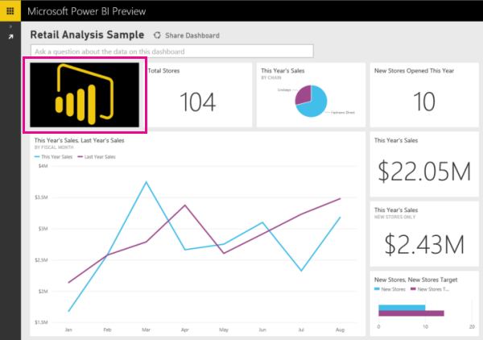
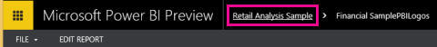

<properties pageTitle="Add an image to a dashboard" description="Add an image to a dashboard" services="powerbi" documentationCenter="" authors="v-anpasi" manager="mblythe" editor=""/>
<tags ms.service="powerbi" ms.devlang="NA" ms.topic="article" ms.tgt_pltfrm="NA" ms.workload="powerbi" ms.date="06/26/2015" ms.author="v-anpasi"/>
#Add an image to a dashboard

[← All about dashboards](https://support.powerbi.com/knowledgebase/topics/65158-all-about-dashboards)  

Say you want your company logo on your dashboard.

  

## Before you start

You need:

-   Excel 2013. The Power View add-in is only available in Excel 2013.
-   An Excel 2013 workbook that contains data in a table format or in the data model. If it doesn't contain any other data, add at least 2 rows and 2 columns of values -- any values will do. 
-   For best results, a rectangular image wider than it is tall. About 250 pixels wide by 150 pixels tall works well. A dark background will make it stand out.

Now you're ready.

1.  In the Excel workbook, add a Power View sheet: **Insert** \> **Power View**.
2.  Don't see Power View on the **Insert** tab? You may need to [turn on the Power View add-in](https://support.office.com/en-us/article/Create-a-Power-View-sheet-in-Excel-2013-b23d768d-7586-47fe-97bd-89b80967a405?ui=en-US&rs=en-US&ad=US).
3.  On the **Power View** tab \> **Insert Picture**.
4.  Browse to the picture \> **Open**.
5.  Save the workbook.
6.  In Power BI, start from the dashboard where you want the logo, or create a dashboard.
7.  Select **Get Data**, and [upload the Excel workbook](https://support.powerbi.com/knowledgebase/articles/424871-excel-data-in-power-bi) from wherever you saved it.
8.  In the navigation pane under **Reports**, select the report you just added. It has a yellow asterisk \* by its name.

    

9.  In the report, select the image, then select the pin icon.

    

    You see the message that it's pinned to the dashboard.
10. In the Power BI banner, select the dashboard name to go back to the dashboard.
  
    
    
11. On the dashboard, drag the lower-right corner to make the tile smaller, and then drag it to the place you want it.

More about [creating Power BI dashboards](https://support.powerbi.com/knowledgebase/articles/475163-create-a-power-bi-dashboard).