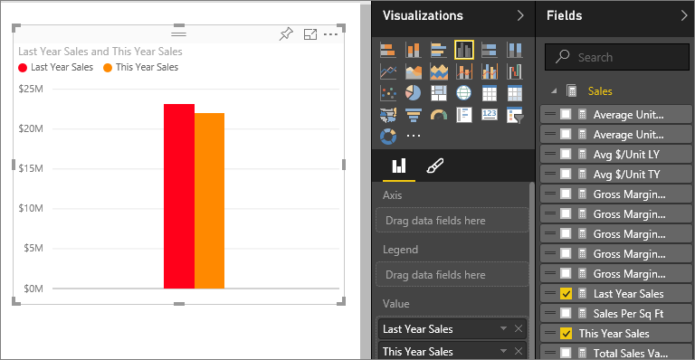
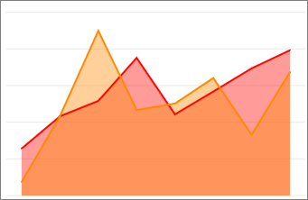
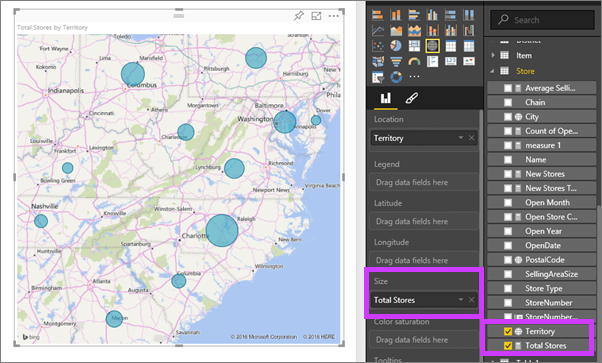
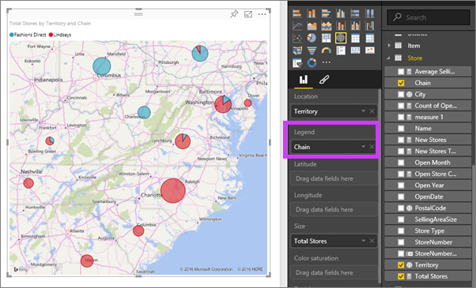

<properties
   pageTitle="Tutorial: Part 2, Add visualizations to a Power BI report"
   description="Tutorial: Part 2, Add visualizations to a Power BI report"
   services="powerbi"
   documentationCenter=""
   authors="mihart"
   manager="mblythe"
   backup=""
   editor=""
   tags=""
   qualityFocus="no"
   qualityDate=""/>

<tags
   ms.service="powerbi"
   ms.devlang="NA"
   ms.topic="article"
   ms.tgt_pltfrm="NA"
   ms.workload="powerbi"
   ms.date="05/23/2016"
   ms.author="mihart"/>

# Tutorial: Part 2, Add visualizations to a Power BI report  

In [Part 1](https://powerbi.uservoice.com/knowledgebase/articles/441777-part-i-add-visualizations-to-a-power-bi-report), you created a basic visualization by selecting checkboxes next to field names.  In Part 2 you'll learn how to use drag-and-drop and make full use of the **Fields** and **Visualizations** panes to create and modify visualizations.

## Create a new visualization  
In this tutorial we'll dig into our Retail Analysis dataset and create a few key visualizations.

### Open a report and add a new blank page.  
1.  Expand the left navigation pane, if it isn't already expanded.

2.  Under **Reports**, select **Retail Analysis Sample** to open the report in Reading View.  
    

3.  Select **Edit Report** to open the report in Editing View.  
    

4.  [Add a new page](powerbi-service-add-a-page-to-a-report.md) by selecting the yellow plus icon at the bottom of the canvas.  
    

### Add a visualization that looks at this year's sales compared to last year.  
1.  From the **Sales** table, select **This Year Sales** > **Value** and **Last Year Sales**. Power BI creates a column chart.  This is somewhat interesting, and you want to dig deeper. What do the sales look like by month?  

    

2.  From the Time table, drag **Month** into the **Axis** area.  
  

3.  [Change the visualization](powerbi-service-change-the-type-of-visualization-in-a-report.md) to an Area chart.  There are many visualization types to choose from - see [descriptions of each, tips for best practices, and tutorials](powerbi-service-visualization-types-for-reports-and-q-and-a.md) for help deciding which type to use. From the Visualizations pane, select the Area chart icon.

5.  [Resize the visualization](powerbi-service-move-and-resize-a-visualization.md) by selecting the visualization, grabbing one of the outline circles and dragging. Make it wide enough to eliminate the scrollbar and small enough to give us enough room to add another visualization.

    

6.  [Save the report](powerbi-service-save-a-report.md).

### Add a map visualization that looks at sales by location  
1.  From the **Store** table, click **Territory**. Power BI recognizes that Territory is a location, and creates a map visualization.  
    

2.  Drag **Total Stores** into the Size area.  
    

3.  Add a legend.  To see the data by store name, drag **Chain** into the Legend area.  
    

## See also  
-   For more information about the Fields pane, see [The report editor... take a tour](powerbi-service-the-report-editor-take-a-tour.md).   
-   To learn how to filter and highlight your visualizations, see [Filters and highlighting in Power BI reports](powerbi-service-about-filters-and-highlighting-in-reports.md).  
-   To learn about using and changing aggregations, see [Aggregates in reports](powerbi-service-aggregates.md).  
-   Need help understanding the building blocks that make up Power BI?  [See Power BI - Basic Concepts](powerbi-service-basic-concepts.md).  
-   More about [Visualizations in Power BI reports](powerbi-service-visualizations-for-reports.md).  
