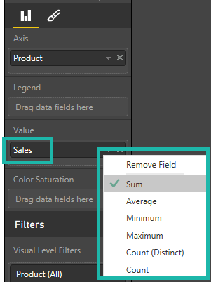

<properties 
   pageTitle="Aggregates in Power BI reports"
   description="Aggregates in Power BI reports"
   services="powerbi" 
   documentationCenter="" 
   authors="pcw3187" 
   manager="mblythe" 
   editor=""
   tags=""/>
 
<tags
   ms.service="powerbi"
   ms.devlang="NA"
   ms.topic="article"
   ms.tgt_pltfrm="NA"
   ms.workload="powerbi"
   ms.date="10/14/2015"
   ms.author="v-pawrig"/>
# Aggregates in Power BI reports

## ∑ Aggregates

A measure is a numeric value that will be aggregated in some way (summed or averaged, for example). Measures are imported with the data (defined in the data model your report is based on).

### Change how a measure is aggregated in a chart

Say you have a chart that sums the sales data for different regions, but you'd rather have the average. 

1.  Add the measure (numeric field) to a visualization.

2.  Find that field in the **Fields** pane bucket, right-click, and select the aggregate type you need.

    

### Convert a non-aggregate field to an aggregate

You can also use a non-aggregate field as an aggregate. For example, if you have a Product Name field, you can add it to a table and then set it to Count. 

For more information on aggregating values see [Change The Aggregation Used In a Visual](https://powerbi.uservoice.com/knowledgebase/articles/471200-change-the-aggregation-used-in-a-chart-sum-avera).

## See Also:

Read more about [reports in Power BI](http://support.powerbi.com/knowledgebase/articles/425684-reports-in-power-bi)

[Power BI - Basic Concepts](http://support.powerbi.com/knowledgebase/articles/487029-power-bi-preview-basic-concepts)

