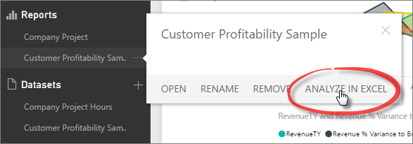
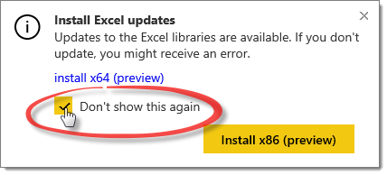

<properties
   pageTitle="Analyze in Excel"
   description="Learn about how to analyze Power BI datasets in Excel"
   services="powerbi"
   documentationCenter=""
   authors="Minewiskan"
   manager="mblythe"
   editor=""
   tags=""
   qualityFocus="complete"
   qualityDate=""/>

<tags
   ms.service="powerbi"
   ms.devlang="NA"
   ms.topic="article"
   ms.tgt_pltfrm="NA"
   ms.workload="powerbi"
   ms.date="04/01/2016"
   ms.author="owend"/>

# Analyze in Excel
Have a great dataset in Power BI, but just have to see it in Excel? With the Analyze in Excel feature, you get all the great PivotTable, Chart, and Slicer features in Excel your used to, all while connected to your data in Power BI.

## Requirements
- Analyze in Excel is supported for Microsoft Excel 2010 SP1 and later.
- Excel PivotTables do not support drag-and-drop aggregation of numeric fields. Your dataset in Power BI *must have pre-defined measures*.
- Some organizations might have Group Policy rules that prevent installing the required updates to Excel. If you’re unable to install the updates, check with your administrator.

## How does it work?
When you click Analyze in Excel for a dataset or report, Power BI creates an .ODC file and downloads it to your computer. When you open the file in Excel, you’ll see an empty PivotTable and Fields list with all the tables, fields, and measures from your dataset. You can create PivotTables, charts, and slice and dice just like you always do, right in Excel.

The .ODC file has an MSOLAP connection string, connecting to your dataset in Power BI. When you slice and dice your data, Excel queries your dataset in Power BI and returns the results right back to Excel. If your dataset connects to a live data source using DirectQuery, Power BI queries the data source and returns the result back to Excel.

Analyze in Excel is best for datasets and reports that connect to Analysis Services Tabular or Multidimensional databases, or from Power BI Desktop files or Excel workbooks with data models that have explicit measures created using Data Analysis Expressions (DAX).

## First things first, and only the first time
Okay, now that you’ve got that title figured out, let’s go over what happens the first time you use Analyze in Excel.
To get started, in Power BI, click the Open Menu icon for a report or dataset, and then click **Analyze in Excel**.

### Install Excel updates
The first time, you’ll need to install updates to the Excel libraries. You’ll be prompted to download and run the SQL_AS_OLEDDB.msi Windows installer package. This package installs Microsoft AS OLE DB Provider for SQL Server 2016 RC0 (Preview).

**Tip:** Be sure to check **Don’t show this again** in the Install Excel Updates dialog. You only need to install the update once.

### Sign in to Power BI
Even though you’re already signed in to Power BI in your browser, the first time you open a new .ODC file in Excel, you’ll need to sign in to Power BI with your Power BI account. This authenticates the connection from Excel to Power BI.

### Enable data connections
If you’ve used workbooks with connections to external data before, then you’re probably familiar with this notice. In order to analyze your Power BI data in Excel, verify the file name and path, and then click **Enable**.

## Slice and dice
Now that Excel’s open and you have an empty PivotTable, go ahead and slice and dice your data.
You can pretty much do anything you can in Excel. Add any number of PivotTables and charts. Add data from other sources. Create different sheets with all sorts of views into your data.

## Save
You can save your workbook just like any other workbook. What you can’t do is publish or import that workbook back into Power BI. That’s because you can only publish or import workbooks into Power BI that have data in tables or a data model. Because your new workbook only has a connection to the dataset in Power BI, it would be like….going in circles.

## Share
Once your workbook is saved, you can share it with other Power BI users in your organization.

When a user you’ve shared your workbook with first opens the workbook, they’ll see your PivotTables and data as it was when it was last saved, which might not be the latest version of the data. To get the latest, they’ll first need to hit the **Refresh** button on the **Data** ribbon. And, because the workbook is connecting to a dataset in Power BI, they’ll have to sign in to Power BI and install the Excel updates the first time.

Because users you’ve shared your workbook with will have to hit Refresh, and refresh for external connections is not supported in Excel Online, it’s recommended those users open the workbook in Excel on their computer.
