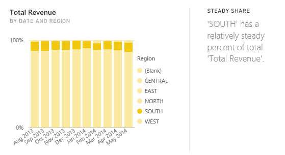

<properties
   pageTitle="Types of Quick Insights supported by Power BI"
   description="Quick Insights with Power BI."
   services="powerbi"
   documentationCenter=""
   authors="mihart"
   manager="mblythe"
   editor=""
   tags=""/>

<tags
   ms.service="powerbi"
   ms.devlang="NA"
   ms.topic="article"
   ms.tgt_pltfrm="NA"
   ms.workload="powerbi"
   ms.date="11/24/2015"
   ms.author="mihart"/>

# Types of Quick Insights supported by Power BI

## How does Quick Insights work?

Power BI quickly searches different subsets of your dataset while applying a set of sophisticated algorithms to discover potentially-interesting insights.Power BI scans as much of a dataset as possible in an allotted amount of time.  In the future, we'll allow you to control what subset of your dataset to search.

##  What types of insights can we find?
These are some of the algorithms we use:

### Majority (Major factors)
Finds cases where a majority of a total value can be attributed to a single factor when broken down by another dimension.  

## Category outliers (top/bottom)
Highlights cases where, for a measure in the model, one or two members of a dimension have much larger values than other members of the dimension.  

## Time series outliers
For data across a time series, detects when there are specific dates or times with values significantly different than the other date/time values.

## Overall trends in time series
Detects upward or downward trends in time series data.

## Seasonality in time series
Finds periodic patterns in time series data, such as weekly, monthly, or yearly seasonality.

## Steady share
Highlights cases where there is a parent-child correlation between the share of a child value in relation to the overall value of the parent across a continuous variable.

## Correlation
Detects cases where multiple measures show a correlation between each other when plotted against a dimension in the dataset.

## Change points in a time series
Highlights when there are significant changes in trends in a time series of data.

## Low variance (coming soon)
Discovers cases where all values of a measure for a given category are very close to each other when plotted against another dimension.

## See also

[Power BI Quick Insights](powerbi-service-auto-insights.md)

[Optimize your data for Power BI Quick Insights](powerbi-service-auto-insights-optimize.md)

[Power BI - Basic Concepts](powerbi-service-basic-concepts.md)

[Dashboards in Power BI](powerbi-service-dashboards.md)
