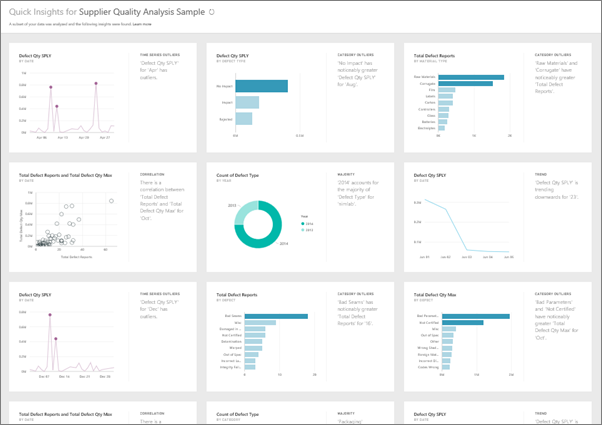
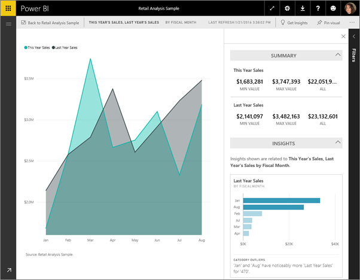

<properties
   pageTitle="Quick Insights in Power BI"
   description="Documentation for viewing Quick Insights with Power BI service."
   services="powerbi"
   documentationCenter=""
   authors="mihart"
   manager="mblythe"
   backup=""
   editor=""
   tags=""
   qualityFocus="no"
   qualityDate=""/>

<tags
   ms.service="powerbi"
   ms.devlang="NA"
   ms.topic="article"
   ms.tgt_pltfrm="NA"
   ms.workload="powerbi"
   ms.date="05/11/2016"
   ms.author="mihart"/>

# Quick Insights with Power BI

Have a new dataset and not quite sure where to start?  Need to build a dashboard fast?  Want to quickly look for insights you may have missed?

Run Quick Insights to generate interesting interactive visualizations based on your data. Quick Insights can be run on entire dataset (Quick Insights) or on a specific dashboard tile (Scoped Quick Insights).  

>**NOTE**: Quick Insights is not available in Power BI Desktop and does not work with direct query - it only works with data uploaded to Power BI. The Quick Insights feature is built on a growing [set of advanced analytical algorithms](powerbi-service-auto-insights-types.md) developed in conjunction with Microsoft Research that we’ll continue to use to allow more people to find insights in their data in new and intuitive ways.

## Run Quick Insights on a dataset

Watch Will run Quick Insights on a sample dataset, pin one of these Quick Insights as a tile on his dashboard, and open a Quick Insight in Focus mode.
<iframe width="560" height="315" src="https://www.youtube.com/embed/SCUx47AFNhw" frameborder="0" allowfullscreen></iframe>

Now it's your turn. Explore Quick Insights using the Supplier Quality Analysis sample.

1. In the left navigation pane, under **Datasets** select the ellipses (...) and choose **Quick Insights**.

    

2. Power BI uses [various algorithms](powerbi-service-auto-insights-types.md) to search for trends in your dataset.

    

3. Within seconds, your insights are ready.  Select **View Insights** to display visualizations.

    

    Or, in the leftnav, select the ellipses (...) and choose **View Insights**.

    

4. The visualizations display in a special **Quick Insights** canvas with up to 32 separate Insight Cards. Each card has a chart or graph plus a short description.

    

## Interact with the Quick Insight Cards

1. Hover over a card and select:

      - the pin icon to add the visualization to a dashboard.

      - the In-focus icon to display the card fullscreen.

          

2. In fullscreen mode you can [filter](powerbi-service-interact-with-a-report-in-reading-view.md) the visualizations.  To display the filters, in the top right corner, select the arrow.

## Run Quick Insights on a dashboard tile
Instead of searching for insights against an entire dataset, narrow your search to the data used to create a single dashboard tile. This is referred to as **Scoped Quick Insights**.

1. [Open the tile in Focus mode](/powerbi-service-display-dash-in-focus-mode.md).

2. In the top right corner, select **Get Insights**.

  

3. Power BI displays the insights along the right side of the tile.

  

4. Does one insight pique your interest? Dig down even more by selecting that insight and choosing **Get Insights based on this selection** (below the insight).

  

  The insight displays on the left and new insights, based solely on the data in that single insight, display along the right.

5. Continue digging into your data, and when you find an interesting insight, pin its visual to your dashboard by selecting **Pin visual** from the top-right corner. Also, you can send feedback to let the dataset owner know if a particular insight was helpful or not.

  

## See also

[Optimize your data for Power BI Quick Insights](powerbi-service-auto-insights-optimize.md)

[Power BI - Basic Concepts](powerbi-service-basic-concepts.md)

[Dashboards in Power BI](powerbi-service-dashboards.md)
