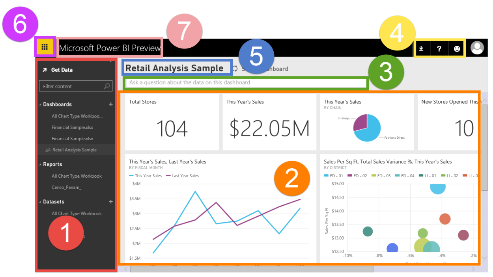
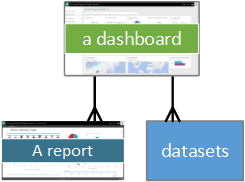
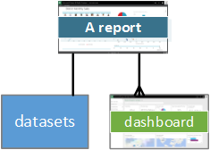
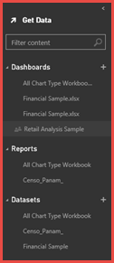
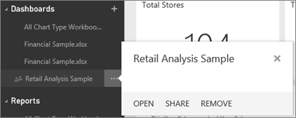
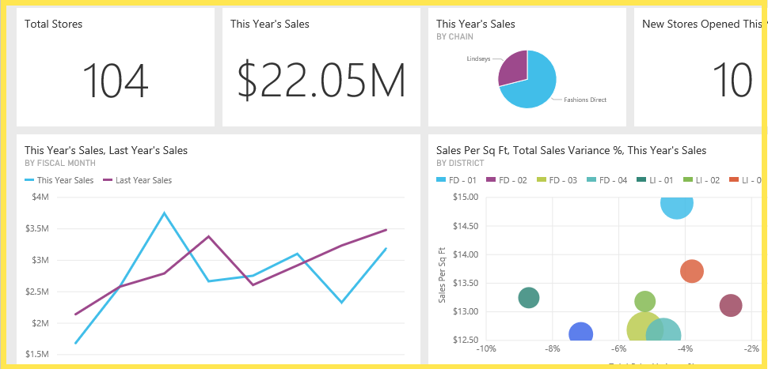
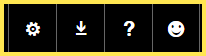

<properties pageTitle="Power BI Preview - basic concepts" description="Power BI Preview - basic concepts" services="powerbi" documentationCenter="" authors="v-anpasi" manager="mblythe" editor=""/>
<tags ms.service="powerbi" ms.devlang="NA" ms.topic="article" ms.tgt_pltfrm="NA" ms.workload="powerbi" ms.date="06/16/2015" ms.author="v-anpasi"/>
#Power BI - basic concepts

[← Getting Started](https://support.powerbi.com/knowledgebase/topics/63037-getting-started)

When you first open Power BI, you'll see:

1.  navigation pane
2.  dashboard with tiles
3.  Q&A question box
4.  help and feedback buttons
5.  dashboard title
6.  Power BI Home button
7.  Power BI version

 

[We'll dig into these later](#dig), but first let's review some Power BI concepts.

##Power BI concepts

The 3 major building blocks of Power BI are: ***dashboards***, ***reports***, and ***datasets***. You can't have dashboards or reports without data (well, you can have empty dashboards and empty reports, but they're not very useful until they have data.)

###Datasets

A *dataset* is something that you *connect* to. Use Power BI to bring all of your data together. See it all in one place and access it from all of your devices.

In the navigation pane, the datasets you've connected to are listed under the **Datasets** heading. Each listed  under the Datasets heading. Each listed dataset represents a single source of data, for example, an Excel workbook on OneDrive, or an on-premises SSAS tabular dataset, or a Salesforce database, etc. [See the list of dataset types that can be used with Power BI Preview](http://support.powerbi.com/knowledgebase/articles/434354-get-data).

**ONE** dataset...
- can be used over and over. 
- can be used in many different reports.  
- Visualizations from that one dataset can display on many different dashboards.  

  

To [connect to a dataset](http://support.powerbi.com/knowledgebase/articles/434354-get-data), click **Get Data** (at the top of the navigation pane) or click the plus sign (next to the **Datasets** heading). The work you do in Power BI does not change the underlying dataset.

###Dashboards

A *dashboard* is something you create or something a coworker creates and shares with you. It is a single canvas that contains one or more tiles. Each tile displays a single [visualization](http://support.powerbi.com/knowledgebase/topics/65160-all-about-visualizations)that was created from the data in the underlying dataset(s). To [create and add a tile](http://support.powerbi.com/knowledgebase/articles/425669-tiles-in-power-bi), you must be in report [Editing View](http://support.powerbi.com/knowledgebase/articles/443094-edit-a-report) or in [Q&A](http://support.powerbi.com/knowledgebase/articles/474566-q-a-in-power-bi). 

In the navigation pane, your dashboards are listed under the **Dashboards** heading. Each listed dashboard represents a customized view of some subset of the underlying datasets.  What this means is that someone (you or a coworker) created the dashboard and then navigated to Editing View where s/he explored the data and created visualizations and then picked some of those visualizations to display on the dashboard.

**ONE** dashboard...
- can display visualizations from many different datasets 
- can display visualizations from many different reports  

  

**A dashboard can be [created from scratch](http://support.powerbi.com/knowledgebase/articles/475163-create-a-power-bi-dashboard)** -- create a new blank dashboard and then get some data. 

**You, or a coworker, can create a dashboard and [share it](http://support.powerbi.com/knowledgebase/articles/431008-share-a-dashboard)** -  when you accept the invitation, the shared dashboard (and associated report and dataset) is added to your navigation pane. 

**Sometimes dashboards are imported with the dataset or are created as you connect to the dataset**. For example, the **Get Data** wizard for Salesforce asks you if you'd like a dashboard and/or report to be created from the dataset. 

**Why do people create dashboards?**  Here are just some of the reasons:

-   to see, in one glance, all the information needed to make decisions
-   to monitor the most-important information about their business
-   to ensure all coworkers are on the same page, viewing and using the same information
-   to monitor the health of a business or product or business unit or marketing campaign, etc.
-   to create a personalized view of a larger dashboard -- all the metrics that matter to me

###Reports

A Power BI report is one or more pages of visualizations (charts and graphs).  Reports can be created from scratch within Power BI or can be imported with datasets and with shared dashboards. This doesn't mean that you can create a Power BI report outside of Power BI.  What it means is that Power BI takes a look at data you're connecting to and, if it can, creates a report based on some or all of the data.  For example, when you connect to an Excel workbook that contains Power View sheets, Power BI creates a report based on those sheets.

In the navigation pane, your reports are listed under the **Reports** heading. Each listed report represents 1 or more pages of visualizations based on 1 or more of the underlying datasets.

There are 2 ways to view and interact with reports: [Reading View](http://support.powerbi.com/knowledgebase/articles/439920-open-a-report-in-reading-view) and [Editing View](http://support.powerbi.com/knowledgebase/articles/443094-edit-a-report).  Only the report creator can open Editing View for a report. Use Editing View to create and modify and explore your report. Reading View offers more-limited interaction; you can [interact with filters](http://support.powerbi.com/knowledgebase/articles/467092-about-filters-and-highlighting-in-reports) (if the report owner created any), dig down into visualizations, do page-level filtering and highlighting, and temporarily pin visualizations to the dashboard (the pinned tiles will not be saved when you close and reopen Power BI).

> **Note:** If a *shared* dashboard has reports, you will NOT see the report listed in the navigation pane.  To open the report, from the shared dashboard, click one of the tiles. If the report owner created the tile from a report, the report opens.  If the report owner created the tile from Q&A, the Q&A page opens.

**ONE** report...
- can be associated with multiple dashboards (tiles pinned from that one report can appear on multiple dashboards). 
- can be created using data from one dataset. (the slight exception to this is that Power BI Designer can combine more than 1 dataset into a single report and that report can be imported into Power BI  

  

<table><tr><td></td><td><b>ONE</b> report...<ul><li>can be associated with multiple dashboards (tiles pinned from that one report can appear on multiple dashboards). </li><li>can be created using data from one dataset. (the slight exception to this is that Power BI Designer can combine more than 1 dataset into a single report and that report can be imported into Power BI)</li></ul></td></tr></table>

###The Retail Analysis Sample dashboard

The first time you open Power BI, you're looking at the [sample dashboard](https://powerbi.uservoice.com/admin/faqs/487029/a%20href=%22http://support.powerbi.com/knowledgebase/articles/471115%22%3E), the ***Retail Analysis Sample***.  This sample will always be there, unless you [manually remove it](http://support.powerbi.com/knowledgebase/articles/475173-delete-or-remove-a-dashboard).

Even though it doesn't show up in the navigation pane under Reports, the Retail Analysis Sample dashboard does have a report (see **NOTE** above).The Sample report is made up of several pages of visualizations that highlight insights about the underlying dataset.  Unless you remove it, the Sample report is always available for you to use to explore and learn.  [Take a tour of the Retail Analysis Sample](http://support.powerbi.com/knowledgebase/articles/474807-take-a-tour-retail-analysis-sample).

**Because it’s a sample, you can’t save changes to the Retail Analysis Sample dashboard or report**. For a version of this sample that you can edit, in the navigation pane, click **Get Data \> Retail Analysis Sample**. Also, although you will be able to temporarily pin tiles from other datasets, you will only be able to use Q&A with the sample dataset.

###_Navigation_ Pane

Use the navigation pane to move between the Power BI building blocks: dashboards, reports, and datasets.

-   Click **Get Data** to [add datasets to Power BI](http://support.powerbi.com/knowledgebase/articles/434354-get-data).
-   Use the filter to limit what is shown on the navigation pane.
-   Click the plus icon  to create a new dashboard or get a new dataset.
-   The listed **Dashboards, Reports,** and **Datasets **are available for you to use.  Shared dashboards are read-only and display a lock icon .
-   Dashboard, report, and dataset names usually match the name of the underlying dataset file -- but you can [rename them](http://support.powerbi.com/knowledgebase/articles/475172-rename-a-dashboard).
-   Right-click a dashboard, report or dataset to display the context-sensitive menu. 

    

Single-click
-   a heading to collapse it
-   a dashboard to display it
-   a report to open it in Editing View
-   a dataset to explore it

##Dashboard tiles

Dashboards are composed of [visualization tiles](http://support.powerbi.com/knowledgebase/articles/425669-tiles-in-power-bi).  Tiles are created either in report Editing View or Q&A.  The tiles that appear on a dashboard were specifically put there by the report creator/owner.  The act of adding a tile to a dashboard is called *pinning*.

For more information, see **[Dashboards](#dashboards)** (above).

##Q&A question box

One way to explore your data is to ask a question and let Power BI Q&A give you an answer, in the form of a visualization. Q&A cannot be used to add content to a report -- only to add content, in the form of tiles, to dashboards.

Q&A looks for an answer in the dataset(s) connected to the dashboard.  A connected dataset is one that has at least one tile pinned to that dashboard.

As soon as you start to type your question, Q&A takes you to the Q&A page. As you type, Q&A helps you ask the right question and find the best answer with rephrasings, autofill, suggestions, and more. When you have a visualization (answer) you like, pin it to your dashboard.

##Help and feedback buttons

The icons in the top right corner are your resources for downloads, [getting help](http://support.powerbi.com/knowledgebase/articles/436810-get-help-and-support-with-power-bi) and providing [feedback](http://support.powerbi.com/knowledgebase/articles/436738-we-want-your-feedback) to the Power BI team.  
 

##Dashboard title (aka What dashboard is active?)

It's not always easy to figure out which dashboard is active.  The dashboard title appears on the dashboard view page, on the Q&A page, in report Editing View and report Reading View, and when you open a dataset.  This way, when you [pin a visualization](http://support.powerbi.com/knowledgebase/topics/65160-all-about-visualizations), you know which dashboard you're pinning it to.

##Home button

This powerful button is often overlooked.  In the top left corner of every screen in Power BI, click it to return to your dashboard and navigation pane.

Power BI version
----------------

Always know which version of Power BI you are using.

### 

##See Also:

[Get started with Power BI](http://support.powerbi.com/knowledgebase/articles/430814-get-started-with-power-bi)  
[Power BI videos](http://support.powerbi.com/knowledgebase/articles/475702-power-bi-preview-videos)
