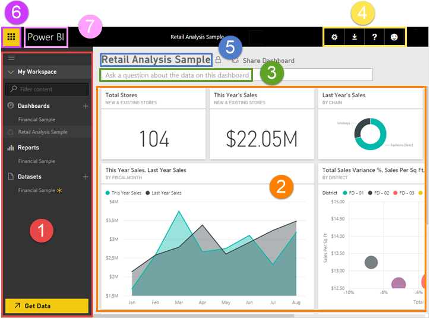

<properties
   pageTitle="Power BI - basic concepts"
   description="Power BI - basic concepts"
   services="powerbi"
   documentationCenter=""
   authors="mihart"
   manager="mblythe"
   editor=""
   tags=""/>

<tags
   ms.service="powerbi"
   ms.devlang="NA"
   ms.topic="article"
   ms.tgt_pltfrm="NA"
   ms.workload="powerbi"
   ms.date="11/06/2015"
   ms.author="mihart"/>

# Power BI - basic concepts

When you first open Power BI, you'll see:

1.  navigation pane
2.  dashboard with tiles
3.  Q&A question box
4.  help and feedback buttons
5.  dashboard title
6.  Office 365 app launcher
7.  Power BI home

We'll dig into these later, but first let's review some Power BI concepts.

## Power BI concepts

The 3 major building blocks of Power BI are: ***dashboards***, ***reports***, and ***datasets***. You can't have dashboards or reports without data (well, you can have empty dashboards and empty reports, but they're not very useful until they have data.)

### Datasets

A *dataset* is something that you *import* or *connect* to. Use Power BI to bring all of your data together. See it all in one place and access it from all of your devices.

In the navigation pane, the datasets you've connected to are listed under the **Datasets** heading. Each listed dataset represents a single source of data, for example, an Excel workbook on OneDrive, or an on-premises SSAS tabular dataset, or a Salesforce dataset. There are many different data sources supported, and we’re adding new ones all the time. [See the list of dataset types that can be used with Power BI](powerbi-service-get-data.md).

**ONE** dataset...
- can be used over and over.
- can be used in many different reports.
- Visualizations from that one dataset can display on many different dashboards.

To [connect to a dataset](powerbi-service-get-data.md), select **Get Data** (at the bottom of the navigation pane) or select the plus icon (next to the **Datasets** heading). Follow the instructions to connect to the specific source and add the dataset to your workspace. The new dataset is added to the left navigation pane with a yellow asterisk. The work you do in Power BI does not change the underlying dataset.

To explore a dataset, select that dataset.  You can explore the dataset by dragging and dropping fields from the field list and specifying what visual you'd like the data displayed in.  If you'd like to save these visuals as a report, simply select **Save**. Back in **My Workspace**, the new report is added to the left navigation pane with a yellow asterisk. 

### Dig deeper:

-   [Power BI Pro content - what is it?](powerbi-power-bi-pro-content-what-is-it.md)
-   [Get data for Power BI](powerbi-service-get-data.md)
-   [Sample datasets and content packs for Power BI](powerbi-sample-datasets.md)

## Reports

A Power BI report is one or more pages of visualizations (charts and graphs).  Reports can be created from scratch within Power BI, can be imported with dashboards that colleagues share with you, or can be created for you when you connect to datasets from Excel, Power BI Desktop, databases, and SaaS applications and [content packs](powerbi-service-organizational-content-packs-introduction.md).  For example, when you connect to an Excel workbook that contains Power View sheets, Power BI creates a report based on those sheets. And when you connect to an SaaS application, Power BI imports a pre-built report.

There are 2 ways to view and interact with reports: [Reading View](powerbi-service-open-a-report-in-reading-view.md) and [Editing View](powerbi-service-interact-with-a-report-in-editing-view.md).  Only a report creator or owner can open Editing View for a report. Use Editing View to create and modify and explore your report. Reading View offers more-limited interaction; you can [interact with filters](powerbi-service-about-filters-and-highlighting-in-reports.md) (if the report owner created any), dig down into visualizations, do page-level filtering and highlighting, and temporarily pin visualizations to the dashboard (the pinned tiles will not be saved when you close and reopen Power BI).

In the navigation pane, your reports are listed under the Reports heading. Each listed report represents 1 or more pages of visualizations based on 1 or more of the underlying datasets. All of the reports listed here can be opened in both Reading View and Editing View.To open a report, simply select it. By default, the report opens in Reading View and I select Edit Report to open it in Editing View.  If a shared dashboard has reports, you will NOT see the report listed in the navigation pane.  To open the report, from the shared dashboard, select one of the tiles. If the report owner pinned the tile from a report, the report opens.  If the report owner pinned the tile from Q&A, Q&A opens.

**NOTE**: If a *shared *dashboard has reports, you will NOT see the report listed in the navigation pane.  To open the report, from the shared dashboard, click one of the tiles. If the report owner created the tile from a report, the report opens.  If the report owner created the tile from Q&A, the Q&A page opens.

**ONE** report...
-  can be associated with multiple dashboards (tiles pinned from that one report can appear on multiple dashboards).
-  can be created using data from one dataset. (the slight exception to this is that Power BI Desktop can combine more than 1 dataset into a single report and that report can be imported into Power BI)

## Dashboards

A *dashboard* is something you create or something a colleague creates and shares with you. It is a single canvas that contains one or more tiles. Each tile displays a single [visualization](powerbi-service-visualizations-for-reports.md)that was created from the data in one of the underlying dataset(s). The only exception to this is a brand new dashboard created from scratch – if I click the plus icon next to **Dashboards**, and name it – my new dashboard has no tiles at all. To [create and add a tile](powerbi-service-dashboard-tiles.md), you must be in report [Editing View](powerbi-service-interact-with-a-report-in-editing-view.md) or in [Q&A](powerbi-service-q-and-a.md). 

In the navigation pane, your dashboards are listed under the **Dashboards** heading. Each listed dashboard represents a customized view of some subset of the underlying datasets.  What this means is that someone (you or a colleague) created the dashboard and then navigated to Editing View where s/he explored the data and created visualizations and then picked some of those visualizations to display on the dashboard.

To permanently pin a tile to a dashboard, I must a report owner.  If I’m not an owner, the dashboard will display a shared icon to the left of the name. And as we saw when we were talking about reports, when a dashboard is shared with me I’ll also be able to interact with the underlying reports using Reading View.

**ONE** dashboard...
- can display visualizations from many different datasets
- can display visualizations from many different reports

**A dashboard can be [created from scratch](powerbi-service-create-a-dashboard.md)** -- create a new blank dashboard and then get some data. 

**You, or a colleague, can create a dashboard and [share it](powerbi-service-share-unshare-dashboard.md)** -  when you accept the invitation, the shared dashboard (and associated report and dataset) is added to your navigation pane. 

**Sometimes dashboards are imported with the dataset or are created as you connect to the dataset**. For example, the **Get Data** wizard for Salesforce asks you if you'd like a dashboard and/or report to be created from the dataset. 

**Why do people create dashboards?**  Here are just some of the reasons:

-   to see, in one glance, all the information needed to make decisions
-   to monitor the most-important information about their business
-   to ensure all colleagues are on the same page, viewing and using the same information
-   to monitor the health of a business or product or business unit or marketing campaign, etc.
-   to create a personalized view of a larger dashboard -- all the metrics that matter to me

## The Retail Analysis Sample dashboard

The first time you open Power BI, you're looking at the [sample dashboard](powerbi-sample-retail-analysis-take-a-tour.md), the ***Retail Analysis Sample***.  This sample will always be there, unless you [manually remove it](powerbi-service-delete-or-remove-a-dashboard.md).

Even though it doesn't show up in the navigation pane under Reports, the Retail Analysis Sample dashboard does have a report (see **NOTE** above).The Sample report is made up of several pages of visualizations that highlight insights about the underlying dataset.  Unless you remove it, the Sample report is always available for you to use to explore and learn.  [Take a tour of the Retail Analysis Sample](powerbi-sample-retail-analysis-take-a-tour.md).

**Because it’s a sample, you can’t save changes to the Retail Analysis Sample dashboard or report**. For a version of this sample that you can edit, in the navigation pane, click **Get Data \> Samples \> Retail Analysis Sample**. Also, although you will be able to temporarily pin tiles from other datasets, you will only be able to use Q&A with the sample dataset.

## *Navigation* Pane

Use the navigation pane to move between the Power BI building blocks: dashboards, reports, and datasets.

-   Click **Get Data** to [add datasets to Power BI](powerbi-service-get-data.md).
-   Use the filter to limit what is shown on the navigation pane.
-   Click the plus icon  to create a new dashboard or get a new dataset.
-   The listed **Dashboards, Reports,** and **Datasets **are available for you to use.  Shared dashboards are read-only and display a lock icon .
-   Dashboard, report, and dataset names usually match the name of the underlying dataset file -- but you can [rename them](powerbi-service-rename-a-dashboard.md).
-   Right-click a dashboard, report or dataset to display the context-sensitive menu. 

    

Single-click

-   a heading to collapse or expand it
-   a dashboard to display it
-   a report to open it in Reading View
-   a dataset to explore it

## Dashboard tiles

Dashboards are composed of [visualization tiles](powerbi-service-dashboard-tiles.md).  Tiles are created either in report Editing View or Q&A.  The tiles that appear on a dashboard were specifically put there by a report creator/owner.  The act of adding a tile to a dashboard is called *pinning*.

For more information, see **[Dashboards](487029.html#dashboards)** (above).

## Q&A question box

One way to explore your data is to ask a question and let Power BI Q&A give you an answer, in the form of a visualization. Q&A cannot be used to add content to a report -- only to add content, in the form of tiles, to dashboards.

Q&A looks for an answer in the dataset(s) connected to the dashboard.  A connected dataset is one that has at least one tile pinned to that dashboard.

As soon as you start to type your question, Q&A takes you to the Q&A page. As you type, Q&A helps you ask the right question and find the best answer with rephrasings, autofill, suggestions, and more. When you have a visualization (answer) you like, pin it to your dashboard. For more information, see [Q&A in Power BI](powerbi-service-q-and-a.md).

## Help and feedback buttons

The icons in the top right corner are your resources for settings, downloads, getting help, and providing feedback to the Power BI team.   

## Dashboard title (aka What dashboard is active?)

It's not always easy to figure out which dashboard is active.  The dashboard title appears on the dashboard view page, on the Q&A page, in report Editing View and report Reading View, and when you open a dataset.   

## Office 365 app launcher

The app launcher is designed to help you get to your Office 365 apps.

## Power BI home

Click to return to the dashboard that you viewed most recently.

### 

## See Also:

[Get started with Power BI](powerbi-service-get-started.md)

[Power BI videos](powerbi-videos.md)
