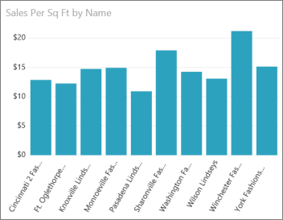
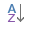
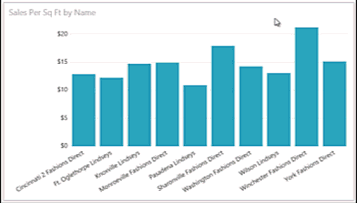

<properties
   pageTitle="Change how a chart is sorted in a Power BI report"
   description="Change how a chart is sorted in a Power BI report"
   services="powerbi"
   documentationCenter=""
   authors="mihart"
   manager="mblythe"
   editor=""
   tags=""/>

<tags
   ms.service="powerbi"
   ms.devlang="NA"
   ms.topic="article"
   ms.tgt_pltfrm="NA"
   ms.workload="powerbi"
   ms.date="10/14/2015"
   ms.author="mihart"/>

# Change how a chart is sorted in a Power BI report

In Power BI, you can sort charts alphabetically by the names of the categories in the chart, or by the numeric values of each category. For example, this chart is sorted by store name.

It's easy to sort it from highest to lowest sales per square feet instead.

1.  Select the ellipses (...) and choose **Sort by** \> **Sales Per Sq Ft**.

2.  If necessary, select the sort icon  to change to **Descending**.

    

**NOTE**: Not all visuals can be sorted.  The following visuals cannot be sorted: Treemap, Map, Filled Map, Scatter, Gauge, Card, Multi Row Card, Waterfall.

## See Also:

More about [Visualizations in Power BI reports](powerbi-service-visualizations-for-reports.md).

[Power BI - Basic Concepts](powerbi-service-basic-concepts.md)
