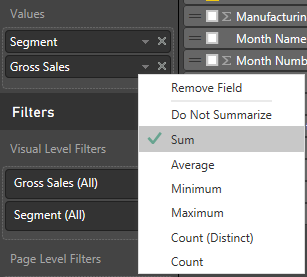

<properties
   pageTitle="Change the aggregation in a chart (sum, average, maximum, etc.) in Power BI"
   description="Change the aggregation in a chart (sum, average, maximum, etc.) in Power BI"
   services="powerbi"
   documentationCenter=""
   authors="mihart"
   manager="mblythe"
   editor=""
   tags=""/>

<tags
   ms.service="powerbi"
   ms.devlang="NA"
   ms.topic="article"
   ms.tgt_pltfrm="NA"
   ms.workload="powerbi"
   ms.date="11/15/2015"
   ms.author="mihart"/>

# Change the aggregation in a chart (sum, average, maximum, etc.) in Power BI  

A numeric field is a value that will be summed or averaged, for example. Numeric fields in Power BI are imported with the data (defined in the data model your report is based on). In the Fields list, numeric fields are shown with the ∑ symbol. If you want more information see [The report editor... take a tour](powerbi-service-the-report-editor-take-a-tour.md), and read about [aggregations in Power BI reports](powerbi-service-change-the-aggregation-in-a-chart.md).

 **Change how a numeric** **field** **is aggregated in a chart

Say you have a chart that sums the sales data for different regions, but you'd rather have the average. 

1.  Add the numeric field to a visualization.

2.  Find that field in the Visualizations pane, right-click, and select the aggregate type you need.

    

>**NOTE:**   
>**The options available in the dropdown will vary depending on the field selected.**

Some of the options that may be available for aggregating a field:

-   **Do Not Summarize**. With this option chosen, each value in that field is treated separately and not summarized. This is often used if you have a numeric ID column that shouldn't be summed.

-   **Sum**. This adds all the values in that field up.

-   **Average**. Takes an arithmetic mean of the values.

-   **Minimum**. Shows the smallest value.

-   **Maximum**. Shows the largest value.

-   **Count (Not Blanks).** This counts the number of values in that field that are not blank.

-   **Count (Distinct).** This counts the number of different values in that field.

For example, this data:

| Country   | Amount |
|:----------|:-------|
| USA       | 100    |
| UK        | 150    |
| Canada    | 100    |
| Germany   | 125    |
| France    |        |
| Japan     | 125    |
| Australia | 150    |

Would give the following results:

-   **Do Not Summarize**: Each value is shown separately

-   **Sum**: 750

-   **Average**: 125

-   **Maximum**:  150

-   **Minimum**: 100

-   **Count (Not Blanks):** 6

-   **Count (Distinct):** 4

**Use a non-aggregated field as a numeric field**

You can also use a non-aggregated field as a numeric field. For example, if you have a Product Name field, you can add it as a value and then set it to **Count**. 

## See also  
[Visualizations in Power BI reports](powerbi-service-visualizations-for-reports.md)  
[Power BI - Basic Concepts](powerbi-service-basic-concepts.md)  
