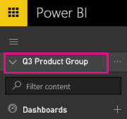
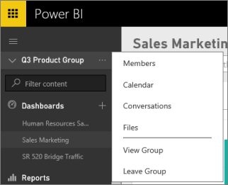

<properties 
   pageTitle="Collaborate with your Power BI group in Office 365"
   description="Read about ways you can collaborate with your Power BI group by using Office 365 group services like sharing files on OneDrive for Business, conversations in Exchange, calendar, and tasks."
   services="powerbi" 
   documentationCenter="" 
   authors="ajayan" 
   manager="erikre" 
   backup="maggiesMSFT"
   editor=""
   tags=""
   qualityFocus="no"
   qualityDate=""/>
 
<tags
   ms.service="powerbi"
   ms.devlang="NA"
   ms.topic="article"
   ms.tgt_pltfrm="NA"
   ms.workload="powerbi"
   ms.date="01/06/2017"
   ms.author="ajayan"/>
# Collaborate with your Power BI group in Office 365

Probably the main reason you created a group in Power BI was to share and collaborate on dashboards, reports, and datasets in Power BI. Collaborating on data starts with connecting to files on your group’s OneDrive for Business. [Connect to your group’s files](powerbi-service-connect-to-files-on-your-groups-onedrive-for-business.md).

>**Note**: Groups are only available with [Power BI Pro](powerbi-power-bi-pro-content-what-is-it.md).

Collaboration doesn’t end with Power BI. Office 365 offers other group services, like sharing files on OneDrive for Business, conversations in Exchange, shared calendar and tasks, and so on. Read more about [groups in Office 365](https://support.office.com/article/Create-a-group-in-Office-365-7124dc4c-1de9-40d4-b096-e8add19209e9).

Collaborating in Office 365 starts from the group’s workspace in Power BI.

1.  In Power BI, switch to the group’s workspace, so the group name is in the top-left corner. 

    

2.  Select the ellipsis (**…**) next to your group name.

    

    >**Note**: The first time you go to your group in Office 365, it may take some time. Give it 15 to 30 minutes, then refresh your browser.

## Have a group conversation

1.  Select the ellipsis (…) next to your group name \> **Conversations**. 

    This opens the email and conversation site for your group in Outlook for Office 365.

    

2.  Read more about [group conversations in Outlook for Office 365](https://support.office.com/Article/Have-a-group-conversation-a0482e24-a769-4e39-a5ba-a7c56e828b22).

## Schedule an event on the group’s calendar

1.  Select the ellipsis (**…**) next to your group name \> **Calendar**. 

    This opens the calendar for your group in Outlook for Office 365.

    

2.  Read more about [group calendars in Outlook in Office 365](https://support.office.com/Article/Add-edit-and-subscribe-to-group-events-0cf1ad68-1034-4306-b367-d75e9818376a).

## Manage a group

If you’re owner or admin for a group, you can also add or remove group members. Read more about [managing your Power BI groups](powerbi-service-manage-your-group-in-power-bi-and-office-365.md).

### See also

- [Create a group in Power BI](powerbi-service-create-a-group-in-power-bi.md)
- More questions? [Try the Power BI Community](http://community.powerbi.com/)
 

