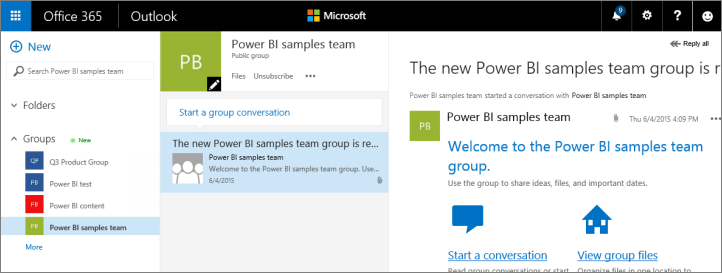

<properties 
   pageTitle="Collaborate with your Power BI group"
   description="Collaborate with your Power BI group"
   services="powerbi" 
   documentationCenter="" 
   authors="pcw3187" 
   manager="mblythe" 
   editor=""
   tags=""/>
 
<tags
   ms.service="powerbi"
   ms.devlang="NA"
   ms.topic="article"
   ms.tgt_pltfrm="NA"
   ms.workload="powerbi"
   ms.date="10/14/2015"
   ms.author="v-pawrig"/>
# Collaborate with your Power BI group

Probably the main reason you created a group in Power BI was to share and collaborate on dashboards, reports, and datasets in Power BI. Collaborating on data starts with connecting to files on your group’s OneDrive for Business. [Connect to your group’s files](https://support.powerbi.com/knowledgebase/articles/664462).

>NOTE: Groups are only available with [Power BI Pro](https://support.powerbi.com/knowledgebase/articles/685479).

Collaboration doesn’t end with Power BI. It continues with other Office 365 group services, like sharing files on OneDrive for Business, conversations in Exchange, calendar, tasks, and so on. Read more about [groups in Office 365](https://support.office.com/en-US/Article/Find-help-about-Groups-in-Office-365-7a9b321f-b76a-4d53-b98b-a2b0b7946de1).

Collaborating in Office 365 starts from the group’s workspace.

1.  In Power BI, switch to the group’s workspace, so the group name is in the top-left corner. 

    

2.  Select the ellipsis (**…**) next to your group name.

    

##Have a group conversation

1.  Select the ellipsis (…) next to your group name \> **Conversations**. 

    This opens the email and conversation site for your group in Outlook for Office 365.

    

2.  Read more about [group conversations in Outlook for Office 365](https://support.office.com/en-US/Article/Have-a-group-conversation-a0482e24-a769-4e39-a5ba-a7c56e828b22).

## Schedule an event on the group’s calendar

1.  Select the ellipsis (…) next to your group name \> Calendar. 

    This opens the calendar for your group in Outlook for Office 365.

    

2.  Read more about [group calendars in Outlook in Office 36](https://support.office.com/en-US/Article/Add-edit-and-subscribe-to-group-events-0cf1ad68-1034-4306-b367-d75e9818376a)5.

## Manage a group

If you’re owner or admin for a group, you can also add or remove group members. Read more about [managing your Power BI groups](https://support.powerbi.com/knowledgebase/articles/664471).

 

 

