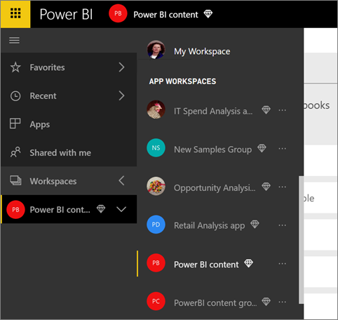

<properties 
   pageTitle="Collaborate in your Power BI app workspace"
   description="Read about collaborating on Power BI Desktop files in your app workspace, and with Office 365 services like sharing files on OneDrive for Business, conversations in Exchange, calendar, and tasks."
   services="powerbi" 
   documentationCenter="" 
   authors="maggiesMSFT" 
   manager="erikre" 
   backup="ajayan"
   editor=""
   tags=""
   qualityFocus="no"
   qualityDate=""/>
 
<tags
   ms.service="powerbi"
   ms.devlang="NA"
   ms.topic="article"
   ms.tgt_pltfrm="NA"
   ms.workload="powerbi"
   ms.date="05/01/2017"
   ms.author="maggies"/>
# Collaborate in your Power BI app workspace

> [AZURE.NOTE] Have you heard about the new *apps* yet? Apps are the new way to distribute content to large audiences in Power BI. You create apps in *app workspaces*, which replace groups and group workspaces. We recommend using apps instead of organizational content packs or read-only workspaces. Learn [more about apps](powerbi-service-what-are-apps.md).

Power BI app workspaces are great places to collaborate with your colleagues on dashboards, reports, and datasets to create *apps*. That's what workspaces are designed for -- collaboration. After you finish collaborating on your dashboards and reports with colleagues, then you package it as an app and distribute it. Read more about [creating apps and app workspaces in Power BI](powerbi-service-create-apps.md). 

Collaboration doesn’t end with workspaces in Power BI. Office 365 offers other group services such as sharing files on OneDrive for Business, conversations in Exchange, shared calendar and tasks, and so on. Read more about [groups in Office 365](https://support.office.com/article/Create-a-group-in-Office-365-7124dc4c-1de9-40d4-b096-e8add19209e9).

>**Note**: App workspaces are only available with [Power BI Pro](powerbi-power-bi-pro-content-what-is-it.md).

## Collaborate on Power BI Desktop files in your app workspace

After you create a Power BI Desktop file, if you publish it to your Power BI app workspace, then everyone in your workspace can collaborate on it.

1. In Power BI Desktop, select **Publish** on the **Home** ribbon, then in the **Select a destination** box, select your app workspace.

    

2. In the Power BI service, select the arrow next to My Workspace > select your app workspace.

    

3. Scroll to your report.

    

4. Select your report. 

    From here, it's like any other report. You and others in your app workspace can [modify the report](powerbi-service-reports.md) and save tiles to a dashboard of your choosing.

## Collaborate in Office 365

Collaborating in Office 365 starts from the app workspace in Power BI.

1.  In Power BI, switch to the app workspace, so the workspace name is in the top-left corner. 

    

2.  Select the ellipsis (**…**) next to your workspace name.

    

    >**Note**: The first time you go to your group workspace in Office 365, it may take some time. Give it 15 to 30 minutes, then refresh your browser.

## Have a group conversation in Office 365

1.  Select the ellipsis (…) next to your group workspace name \> **Conversations**. 

    This opens the email and conversation site for your group workspace in Outlook for Office 365.

    

2.  Read more about [group conversations in Outlook for Office 365](https://support.office.com/Article/Have-a-group-conversation-a0482e24-a769-4e39-a5ba-a7c56e828b22).

## Schedule an event on the group workspace calendar

1.  Select the ellipsis (**…**) next to your group workspace name \> **Calendar**. 

    This opens the calendar for your group workspace in Outlook for Office 365.

    

2.  Read more about [group calendars in Outlook in Office 365](https://support.office.com/Article/Add-edit-and-subscribe-to-group-events-0cf1ad68-1034-4306-b367-d75e9818376a).

## Manage an app workspace

If you’re owner or admin for an app workspace, you can also add or remove workspace members. Read more about [managing your Power BI app workspace](powerbi-service-manage-your-group-in-power-bi-and-office-365.md).

## Next steps

- [Create apps and app workspaces in Power BI](powerbi-service-create-apps.md)
- More questions? [Try the Power BI Community](http://community.powerbi.com/)
 

