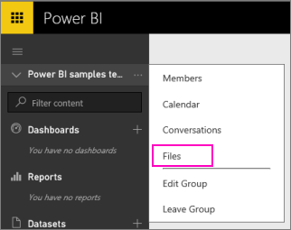
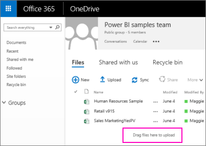

<properties 
   pageTitle="Connect to files on your group's OneDrive for Business"
   description="Connect to files on your group's OneDrive for Business"
   services="powerbi" 
   documentationCenter="" 
   authors="maggiesMSFT" 
   manager="mblythe" 
   editor=""
   tags=""/>
 
<tags
   ms.service="powerbi"
   ms.devlang="NA"
   ms.topic="article"
   ms.tgt_pltfrm="NA"
   ms.workload="powerbi"
   ms.date="10/14/2015"
   ms.author="maggies"/>

# Connect to files on your group's OneDrive for Business

Now that you have a group in Power BI, you want to take advantage of your group’s OneDrive for Business for storing your Excel, CSV, and Power BI Desktop files. Why? Because you can continue updating the files in your OneDrive for Business, and those updates are automatically reflected in the reports and dashboards based on the files. 

NOTE: Groups are only available with [Power BI Pro](powerbi-power-bi-pro-content-what-is-it.md).

To make use of OneDrive for Business, adding files to your group’s workspace is a two-step process: 

-    First you upload files to your group’s OneDrive for Business.

-   Second you connect to those files from Power BI.

## Upload files to your group’s OneDrive for Business

1.  In Power BI, switch to the group’s workspace, so the group name is in the top-left corner. 

    

2.  Select the ellipsis (**…**) next to the group name \> **Files** to open the group’s OneDrive for Business on Office 365.

    

3.  From here, you can upload your files to your Office 365 group. Drag files to the area marked **Drag files here to upload**, and release them when you see **Drop here**.

    

### Import Excel workbooks as datasets or as Excel Online workbooks

Now that your files are in your group’s OneDrive for Business, you have a choice. You can: 

-   [Import data from the Excel workbook as datasets](powerbi-service-get-data-from-files.md), and use the data to build reports and dashboards you can view in a web browser and on mobile devices.

    In step 3, select OneDrive – Business. 

-   Or [connect to whole Excel workbooks in Power BI](powerbi-bring-in-whole-excel-files.md) and display them exactly as they appear in Excel Online.

More about [groups in Power BI](powerbi-service-groups.md).
