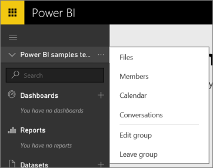
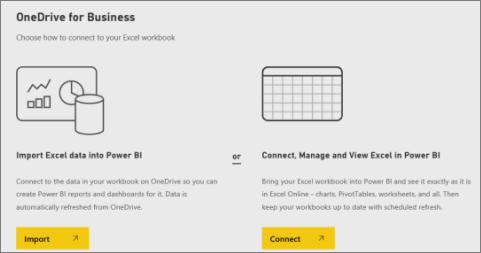

<properties 
   pageTitle="Connect to files on your group's OneDrive for Business"
   description="Read about storing and connecting to your Excel, CSV, and Power BI Desktop files on your group’s OneDrive for Business."
   services="powerbi" 
   documentationCenter="" 
   authors="ajayan" 
   manager="mblythe" 
   backup=""
   editor=""
   tags=""
   qualityFocus="no"
   qualityDate=""/>
 
<tags
   ms.service="powerbi"
   ms.devlang="NA"
   ms.topic="article"
   ms.tgt_pltfrm="NA"
   ms.workload="powerbi"
   ms.date="08/24/2016"
   ms.author="maggies"/>

# Connect to files on your group's OneDrive for Business

Now that you've [created a group in Power BI](powerbi-service-create-a-group-in-power-bi.md), you can store your Excel, CSV, and Power BI Desktop files on your group’s OneDrive for Business. You can continue updating files you store in your OneDrive for Business, and those updates are automatically reflected in the reports and dashboards based on the files. 

>**Note**: Groups are only available with [Power BI Pro](powerbi-power-bi-pro-content-what-is-it.md).

Adding files to your group’s Power BI workspace is a two-step process: 

-    First you upload files to your group’s OneDrive for Business.

-   Then you connect to those files from Power BI.

## Upload files to your group’s OneDrive for Business

1.  In Power BI, switch to the group’s workspace, so the group name is in the top-left corner. 

    

2.  Select the ellipsis (**…**) next to the group name \> **Files** to open the group’s OneDrive for Business on Office 365.

    

    >**Note**: If you don't see **Files** on the group menu, select **Members** to open the group's OneDrive for Business. There, select **Files**. Office 365 sets up a OneDrive storage location for your group files.  

3.  Here, you can upload your files to your Office 365 group's OneDrive. Select **Upload**, and navigate to your files.

    

## Import Excel files as datasets or as Excel Online workbooks

Now that your files are in your group’s OneDrive for Business, you have a choice. You can: 

-   [Import data from the Excel workbook as datasets](powerbi-service-get-data-from-files.md), and use the data to build reports and dashboards you can view in a web browser and on mobile devices.

-   Or [connect to whole Excel workbooks in Power BI](powerbi-bring-in-whole-excel-files.md) and display them exactly as they appear in Excel Online.

### Import or connect to your group's files

1.  In Power BI, switch to the group’s workspace, so the group name is in the top-left corner. 

2.  Select **Get Data** at the bottom of the left navigation pane. 

    

3.  In the **Files** box, select **Get**.

    

4. Select **OneDrive** - *Your Group Name*.

    

5. Select the file you want > **Connect**.

    This is the point where you decide whether to [import the data from the Excel workbook](powerbi-service-get-data-from-files.md), or [connect to the whole Excel workbooks](powerbi-bring-in-whole-excel-files.md).

7. Select **Import** or **Connect**.

    

    New items are marked with a yellow asterisk.  

    Excel files have an Excel icon and are under **Reports**.

    

### See also
- [Create a group in Power BI](powerbi-service-create-a-group-in-power-bi.md)
- [Import data from Excel workbooks](powerbi-service-get-data-from-files.md)
- [Connect to whole Excel workbooks](powerbi-bring-in-whole-excel-files.md)
- More questions? [Try the Power BI Community](http://community.powerbi.com/)
