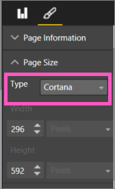
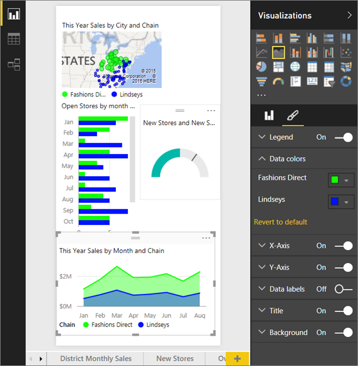
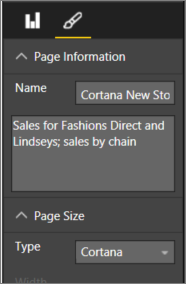
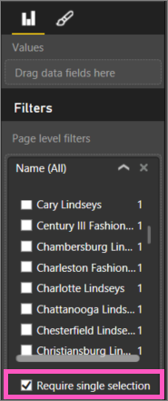

<properties
   pageTitle="Create custom Power BI answer cards for Cortana"
   description="Create custom answer cards for Cortana in Power BI Desktop"
   services="powerbi"
   documentationCenter=""
   authors="mihart"  
   manager="mblythe"
   editor=""/>

<tags
   ms.service="powerbi"
   ms.devlang="NA"
   ms.topic="article"
   ms.tgt_pltfrm="NA"
   ms.workload="powerbi"
   ms.date="12/01/2015"
   ms.author="mihart"/>

# Use Power BI Desktop to create a custom Answer Page for Cortana

Use the full capabilities of Power BI to create reports designed specifically to answer Cortana questions.

And, if the report has a filter, Cortana will understand questions that specify items in the filters' list, and apply the filter on-the-fly.

## Before you begin

Before you can begin creating custom Answer Pages for Cortana, [enable Cortana for Power BI](powerbi-service-cortana-enable.md).  

## Create an Answer Page for Cortana
An *Answer Page* in a report is sized specifically for Cortana so that Cortana can show it as an answer to a question.  To create an Answer Page for Cortana:

1. Add a page to a report and set the page size to **Cortana**.
2. Give the page a name.
3. Publish the PBIX file to Power BI.
4. Enable the dataset for Cortana.

## Create an Answer Page for Cortana (detailed steps)

2. We recommend starting with a [blank report page](powerbi-service-add-a-page-to-a-report.md).

3. In the **Visualizations** pane, select the paintbrush icon and choose **Page Size > Cortana**.

    

4. Create a visual or a set of visuals that you want to appear in Cortana in response to a particular question (or set of questions).

5. Ensure that all visuals fit within the page borders.  Optionally, modify display settings, data labels, colors, and backgrounds.  

    

4. Name the page and add alternate names.  Cortana uses these names when it searches for results.

    

6. Optionally, if your report has page level filters, you can set **Require single selection**. Cortana will only display this report as an answer if one, and only one, of the filter items is specified in the question.  For example, if you ask Cortana:

  - "show sales by store name," this Answer Page will not appear because you did not include any of the items in the required page level filter.

  - "show sales for Cary Lindseys and Charlotte Lindseys," this Answer Page will not appear because you specified more than one item from the required page level filter.

  - "show sales for Charlotte Lindseys," this Answer Page will display.

      

5. Publish the report to powerbi.com.

6. [Enable the dataset for Cortana](powerbi-service-cortana-enable.md).

Now, asking question including the name of a Cortana sized page will return results from Cortana.

## How does Cortana order the results?

Results with high scoring answers (such as a complete match of a specified page name) will appear first as a *best match* in Cortana. Multiple best matches can appear if there are multiple answers in Power BI. Medium or lower scoring answers, such as answers not based on a named page for Cortana or a question with words not understood by Power BI, are listed as links below best matches in Cortana.

>**NOTE**: When a new dataset or custom Cortana Answer Page is added to Power BI and enabled for Cortana it can take up to 30 minutes for results to begin appearing in Cortana. Logging in and out of Windows 10, or otherwise restarting the Cortana process in Windows 10, will allow new content to appear immediately.

## See also

[Tips for using Power BI with Cortana](powerbi-service-cortana-intro.md)

[Using Cortana with Power BI](powerbi-service-cortana-intro.md)

[Get started with Power BI Desktop](powerbi-desktop-getting-started.md)
