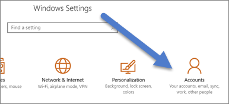
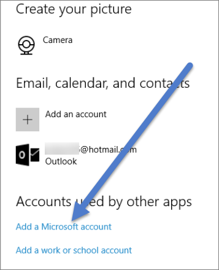

<properties
   pageTitle="Activate Cortana for Power BI"
   description="Use Cortana with Power BI to get answers from your data. Activate Cortana for each Power BI dataset and then enable Cortana to access your datasets from mobile devices."
   services="powerbi"
   documentationCenter=""
   authors="mihart"  
   manager="erikre"
   editor=""/>

<tags
   ms.service="powerbi"
   ms.devlang="NA"
   ms.topic="article"
   ms.tgt_pltfrm="NA"
   ms.workload="powerbi"
   ms.date="03/07/2017"
   ms.author="mihart"/>

# Enable Cortana for Power BI

You've read the [Introduction to Cortana and Power BI](powerbi-service-cortana-intro.md) (if not, you might want to read that first and then come back). And now you want to try it out yourself.  Before you can ask natural language questions in Cortana and find answers from data stored in Power BI, there are a few requirements. Specifically, before Cortana can look for answers in your Power BI datasets and reports, you'll need to do the following.

In Power BI service
- enable one or more datasets for Cortana

In Microsoft Windows
- Check that you are running Windows 10 version 1511 or later
- Make sure that Power BI and Windows can "talk" to each other. This means connecting your account to Windows.

>[AZURE.NOTE]Cortana for Power BI is currently only available in English. Cortana is not currently available on mobile devices.

## Use Power BI service to enable Cortana to access datasets in Power BI

Enabling data in Power BI to be accessed by Cortana is a simple process – in fact all you have to do is pick a dataset in Power BI and select “Enable Cortana to access this dataset”. After that, any user who has access to the dataset in Power BI, via regular Power BI sharing, groups and content pack features, will be able to get answers from the dataset in Cortana in Windows 10.

You'll need to sign in to Power BI service (not Power BI Desktop) and repeat these steps for each dataset that you want Cortana to be able to access.

1. In the upper right corner of Power BI service, select the cog icon and choose **Settings**.

    

3. Select the **Datasets** tab and choose the dataset to enable for Cortana from the list on the left.

4.  Select **Q&A and Cortana** > **Allow Cortana to access this dataset** > **Apply**.

    

    In this example, we're enabling Cortana on the Retail Analysis Sample dataset.

    >[AZURE.NOTE]  
    > When a new dataset or Cortana answer card is added to Power BI and enabled for Cortana, it can take up to 30 minutes for results to begin appearing. Logging in and out of Windows 10, or otherwise restarting the Cortana process in Windows 10, will allow new content to appear immediately.

    >If you enable a dataset for Cortana, and that dataset is part of a content pack you own, you will need to re-publish for your colleagues to also be able to use it with Cortana.

##  Add your Power BI credentials to Windows

You'll need to be running Windows 10 version 1511 or higher.

1.  Determine which Windows 10 version you are running. Open **Windows Settings** > **System** > **About**.

    - If you have Windows 10 version 1511 (Windows 10 November 2015 Update) up until 1607, add your work or school account and Microsoft account (complete steps 2 and 3 below).

    - If you have Windows 10 version 1607 (Windows 10 July 2016 update) or later, add your work or school account (complete only step 2 below).

2.  Add your work or school account for Cortana.

    - Open **Windows Settings** > **Accounts**.

        

    -   Scroll to the bottom and select **Add a work or school account**.

        

3.  On the **Accounts** page, scroll to the bottom where you'll see **Add a Microsoft account**

    

    Sign in with the account you use with Power BI.

Cortana will use this work or school account to check Power BI for potential answers to your questions in Cortana.

## See also
[Create Cortana *answer cards* in Power BI](powerbi-service-cortana-desktop-entity-cards.md)

[Troubleshoot Cortana and Power BI integration issues](powerbi-service-cortana-troubleshoot.md)

[Read the blog post for Power BI integration with Cortana](https://powerbi.microsoft.com/en-us/blog/announcing-power-bi-integration-with-cortana-and-new-ways-to-quickly-find-insights-in-your-data/)

[Q&A in Power BI](powerbi-service-q-and-a.md)

More questions? [Try the Power BI Community](http://community.powerbi.com/)
