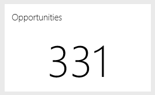
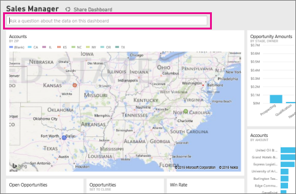
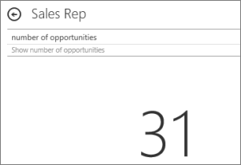

<properties pageTitle="Create a big number tile for a Power BI dashboard" description="Create a big number tile for a Power BI dashboard" services="powerbi" documentationCenter="" authors="v-anpasi" manager="mblythe" editor=""/>
<tags ms.service="powerbi" ms.devlang="NA" ms.topic="article" ms.tgt_pltfrm="NA" ms.workload="powerbi" ms.date="06/26/2015" ms.author="v-anpasi"/>
#Create a big number tile for a Power BI dashboard by asking a question
[← All about dashboards](https://support.powerbi.com/knowledgebase/topics/65158-all-about-dashboards)

Sometimes a single number is the most important thing you want to track in your Power BI dashboard, such as total sales, market share year over year, or total opportunities.

The question box is the easiest way to make a number tile like this.

1.  Create a [dashboard](http://support.powerbi.com/knowledgebase/articles/424868-dashboards-in-power-bi) and [get data](http://support.powerbi.com/knowledgebase/articles/434354-connect-to-a-data-source).
    
2.  At the top of your dashboard, start typing what you want to know about your data in the question box.
    
	
      
3.  For example, as I type "number of opportunities" in the question box on the Sales Rep dashboard...
    
	
    
    The question box suggests, auto-completes to **Show number of opportunities**, and displays the total number.  
    
4.  Click the pin in the upper-right corner to add it to the dashboard.
    
	  
5.  Back on the dashboard, you can [rename, resize, and move](http://support.powerbi.com/knowledgebase/articles/424878-edit-a-tile-resize-move-rename-delete) the pinned visualization.

 
##See Also:
[Dashboard tiles in Power BI](https://support.office.com/en-us/article/Dashboard-tiles-in-Power-BI-Preview-ae937597-64f4-4592-a375-f4028a0a9477?ui=en-US&rs=en-US&ad=US#BKMK_pin)  
[Dashboards in Power BI](http://support.powerbi.com/knowledgebase/articles/424868-dashboards-in-power-bi)  
[Power BI - Basic Concepts](http://support.powerbi.com/knowledgebase/articles/487029-power-bi-preview-basic-concepts)
