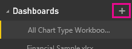

<properties pageTitle="Create a Power BI dashboard" description="Create a Power BI dashboard" services="powerbi" documentationCenter="" authors="v-anpasi" manager="mblythe" editor=""/>
<tags ms.service="powerbi" ms.devlang="NA" ms.topic="article" ms.tgt_pltfrm="NA" ms.workload="powerbi" ms.date="06/26/2015" ms.author="v-anpasi"/>
#Create a Power BI dashboard
[← All about dashboards](https://support.powerbi.com/knowledgebase/topics/65158-all-about-dashboards)

You've read [Dashboards in Power BI](http://support.powerbi.com/knowledgebase/articles/424868-dashboards-in-power-bi), and now you want to create your own. Remember that your dashboard will be blank until you [get some data](http://support.powerbi.com/knowledgebase/articles/434354-get-data) and either [pin visualizations from Q&A](http://support.powerbi.com/knowledgebase/articles/424874-pin-a-tile-to-a-dashboard-from-the-question-box) or [pin visualizations from reports](http://support.powerbi.com/knowledgebase/articles/430323-pin-a-tile-to-a-dashboard-from-a-report).

##Create an empty dashboard

1. Click the plus sign  next to the **Dashboards** heading.

	

2. Type a name for your new dashboard.

	  

3. You need at least one data source for your dashboard. You can use data from reports or datasets already in your Power BI, or you can [add a new data source](http://support.powerbi.com/knowledgebase/articles/434354-get-data).

4. Now you're ready for the fun part.  
	-   [Add a tile by typing in the question box.](http://support.powerbi.com/knowledgebase/articles/424874-add-a-tile-to-a-dashboard-from-q-a)
	-   [Add a tile from a report.](http://support.powerbi.com/knowledgebase/articles/430323-add-a-tile-to-a-dashboard-from-a-report)
	-   [Resize, move, and rename the tiles.](http://support.powerbi.com/knowledgebase/articles/424878-edit-a-tile-resize-move-rename-delete)  

**TIP**: Dashboards can be wider and longer than the browser window. If so, they have scroll bars. Because you want to show everything important at a glance, we recommend making the dashboard fit the browser window. For more tips, see [Tips for designing a great dashboard](http://support.powerbi.com/knowledgebase/articles/433616-tips-for-designing-a-great-dashboard).

##See Also:
[Power BI - Basic Concepts](http://support.powerbi.com/knowledgebase/articles/487029-power-bi-preview-basic-concepts)