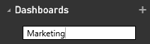

<properties
   pageTitle="Create a Power BI dashboard"
   description="Create a Power BI dashboard"
   services="powerbi"
   documentationCenter=""
   authors="mihart"
   manager="mblythe"
   editor=""
   tags=""/>

<tags
   ms.service="powerbi"
   ms.devlang="NA"
   ms.topic="article"
   ms.tgt_pltfrm="NA"
   ms.workload="powerbi"
   ms.date="03/07/2016"
   ms.author="mihart"/>

# Create a Power BI dashboard

You've read [Dashboards in Power BI](powerbi-service-dashboards.md), and now you want to create your own. There are many different ways to create a dashboard.  This article shows you how to create an empty dashboard using the Power BI left navigation pane. An empty dashboard isn't very useful though -- follow the links below, and at the bottom of the page, to learn how to add content to your dashboard.

>**NOTE**: Remember that your dashboard will be blank until you [get some data](powerbi-service-get-data.md) and [pin some tiles](powerbi-service-dashboard-tiles.md).

## Create a dashboard
### Create an empty dashboard
This method creates a new, empty, dashboard.

1. From the left navigation pane in Power BI Service (not Power BI Desktop), select the plus sign  next to the **Dashboards** heading.

	

2. Type a name for your new dashboard and select ENTER.

	

    The new dashboard is created.  See it listed under **Dashboards** in your left navigation pane.

    

3. Select the new dashboard to make it the active dashboard.  Notice that it's blank -- we haven't added any content yet.

### Add some content to the dashboard

There are many different ways to add content to your dashboard.

-  [Connect to or import at least one dataset](powerbi-service-get-data.md) and [pin content from that dataset to your dashboard](powerbi-service-dashboard-tiles.md).  

- [Add standalone content to your dashboard](powerbi-service-add-a-widget-to-a-dashboard.md). Use **Add widget** to add an image, text box, video, or web content to your dashboard.

>**TIP**: Need some help getting started adding content?  Check out the [Get started with Power BI tutorial](powerbi-service-get-started.md).

## See also

[Power BI - Basic Concepts](powerbi-service-basic-concepts.md)

[Dashboards in Power BI](powerbi-service-dashboards.md)

[Tips for designing a great dashboard](powerbi-service-tips-for-designing-a-great-dashboard.md)
