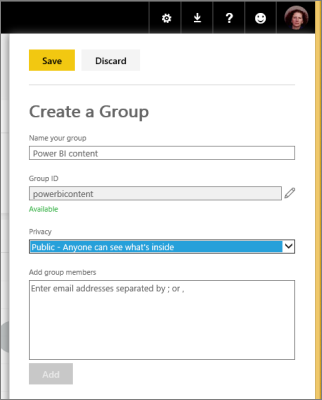

<properties 
   pageTitle="Create a group in Power BI "
   description="Create a group in Power BI"
   services="powerbi" 
   documentationCenter="" 
   authors="jastru" 
   manager="mblythe" 
   editor=""
   tags=""/>
 
<tags
   ms.service="powerbi"
   ms.devlang="NA"
   ms.topic="article"
   ms.tgt_pltfrm="NA"
   ms.workload="powerbi"
   ms.date="10/15/2015"
   ms.author="jastru"/>

# Create a group in Power BI  

Groups in Power BI bring together people and information, and connect with apps across Office 365 to foster communication and collaboration. You can create a group in Power BI, or in Office 365 -- it will have the same characteristics either way. 

>**Note:**  
>Groups are only available with [Power BI Pro](powerbi-power-bi-pro-content-what-is-it.md).

As the creator of the group, you are automatically the admin. As admin, you can add and delete members, and make a member an admin. 

Every member of the group has permissions to update, create, and delete all the content in the group.

1.  In Power BI, select the down arrow next to My Workspace, then select the plus sign (+) next to **Group Workspaces**.   
    

2.  In the **Create a Group** pane on the right, fill in a name.  
    

    Power BI suggests a Group ID and lets you know if it's available. If it's not, select the pencil to the right of the **Group ID** box to modify it.  

    >**Note:**  
    >The group ID will be the group's email address:

    *yourgroupID*@service.microsoft.com

    If you forget the group ID, you can see it by going to the group's Office 365 Outlook account.

3.  Select a privacy setting:

    **Private:** Only group members can see the group’s contents. 

    **Public:** People in your organization can see the group’s contents even if they aren’t explicitly added as members of the group. 

4.  Add members by typing in the **Add group member** box, or copying and pasting multiple email addresses from Outlook. Select **Add**. 

    >**Note:**  
    >Currently you can't add team or security group aliases to groups.  

5.  Select **Save**.

Now you have a group where you can store files, and everyone in the group can work on them.

More about [groups in Power BI](powerbi-service-groups.md).